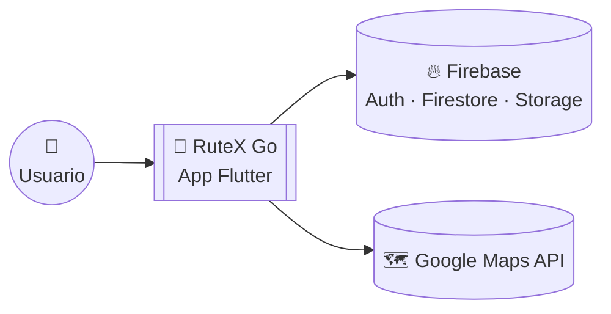
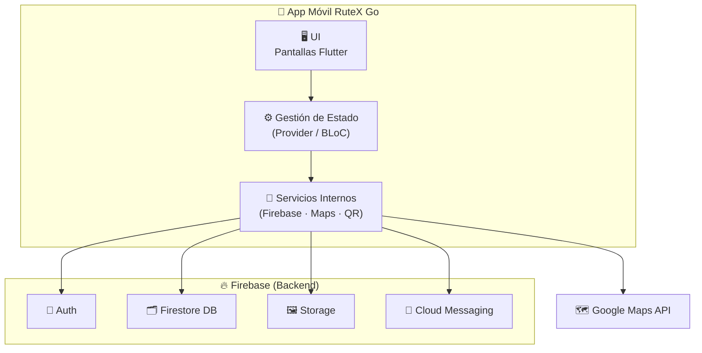

# RuteX Go 🏛️📱
### *Aplicación móvil gamificada para turismo cultural en Extremadura*


> [!TIP]
> **🚀 Despliegue Automático:** El panel de administración se despliega automáticamente en Firebase Hosting mediante GitHub Actions tras cada push a `main`.

## 👥 Equipo de Desarrollo — TurisTech Team

| Avatar | Desarrollador | GitHub | Rol |
|:---:|---------------|--------|-----|
|  | [**Andrés Fernández Expósito**](https://github.com/AndresFE0209) | [@AndresFE0209](https://github.com/AndresFE0209) | Backend & Coordinación |
|  | [**Joel Manuel García Villarino**](https://github.com/Joeljole1987) | [@Joeljole1987](https://github.com/Joeljole1987) | Backend & Diseño UX/UI |
|  | [**Diego Vivas Paredes**](https://github.com/DiegoVP963) | [@DiegoVP963](https://github.com/DiegoVP963) | Frontend & Diseño UX/UI |
|  | [**María Mercedes Martínez Fragoso**](https://github.com/MercedesOrg01) | [@MercedesOrg01](https://github.com/MercedesOrg01) | Tutora del proyecto |

**Centro:** IES Albarregas (Mérida, Badajoz)  
**Ciclo:** 2º FP Desarrollo de Aplicaciones Multiplataforma  
**Curso:** 2025/26  
**Organización GitHub:** [@TurisTechTeam-Dev](https://github.com/TurisTechTeam-Dev)

---

## 🌟 Resumen

**RuteX Go** es una plataforma móvil innovadora diseñada para transformar el turismo convencional en Extremadura en una aventura interactiva, educativa y **plenamente accesible**. A través de la **gamificación**, la app incentiva la exploración del patrimonio histórico, convirtiendo cada visita en un reto personal.

> [!TIP]
> **La Experiencia RuteX:** No es solo una guía; es un sistema de misiones donde el turista se convierte en protagonista. Al validar su presencia en monumentos reales, el usuario asciende en la jerarquía social de la antigua Roma, transformando el aprendizaje en un juego de progresión.

### 🎮 El núcleo de la aplicación
* 🗺️ **Rutas Temáticas:** Itinerarios dinámicos por enclaves estratégicos como Mérida, Cáceres y Badajoz.
* 📸 **Validación Híbrida:** Sistema de verificación física mediante **códigos QR** y geolocalización.
* 🧠 **Desafíos Históricos:** Trivias interactivas que ponen a prueba los conocimientos adquiridos *in situ*.
* 🎧 **Accesibilidad (Audioguías):** Narración automática de la historia de cada punto de interés mediante tecnología **TTS**, garantizando una experiencia inclusiva y "manos libres".
* 📖 **Diario del Explorador:** Generación automática de un **recuerdo digital en PDF** que recopila los hitos y logros de la ruta, eliminando la necesidad de guías en papel.
* 🏆 **Progresión de Rango:** Evolución del perfil de usuario, desde *Esclavo* hasta alcanzar la gloria como *Emperador*.

---

## 📑 Índice

* [🚀 Estado del Proyecto](#estado-del-proyecto)
* [✨ Características Principales](#características-principales)
* [🎯 Objetivos](#objetivos)
* [🛠️ Tecnologías Utilizadas](#tecnologías-utilizadas)
* [📁 Estructura del Repositorio](#estructura-del-repositorio)
* [⚙️ Instalación y Ejecución](#instalación-y-ejecución)
* [🏗️ Arquitectura y Decisiones Técnicas](#arquitectura-y-decisiones-técnicas)
* [📚 Documentación](#documentación)
* [🤝 Proceso de Contribución](#proceso-de-contribución)
* [📄 Licencia y Derechos](#licencia-y-derechos)
* [📞 Contacto y Soporte](#contacto-y-soporte)

---

## 🚀 Estado del Proyecto

| Fase | Estado | Detalle |
|------|--------|---------|
| **Sprint 1** – Análisis y Diseño | ✅ Finalizado | Documentación, mockups en Figma y arquitectura base. |
| **Sprint 2** – Desarrollo del PMV | ✅ Finalizado | Núcleo funcional operativo y conexión con Firebase. |
| **Sprint 3** – Finalización Técnica | ✅ Finalizado | Implementación de audioguías, generador de PDF y cierre de Roadmap. |
| **Evaluación Final** | 🟢 En revisión | Fase de documentación y correcciones finales de tutoría. |

> **🎯 Hitos Técnicos Alcanzados (100%):**
> * **Arquitectura Robusta:** Implementación final de **Clean Architecture** asegurando un código modular y mantenible.
> * **Ecosistema Firebase:** Autenticación, Firestore y Storage totalmente integrados para datos y multimedia.
> * **Geolocalización y QR:** Motor de mapas y escaneo de códigos operativos para validación de presencia física.
> * **Inclusión y Experiencia:** Motores de **Audioguía (TTS)** y **Generador del Diario del Explorador (PDF)** finalizados.
> * **Gamificación Completa:** Lógica de rangos, misiones y persistencia de progreso lista para producción.

🔮 **Últimos pasos antes de la Defensa:**
- [x] **Desarrollo técnico:** Hoja de ruta técnica cerrada y estable.
- [ ] **Documentación académica:** Redacción final de la memoria del TFG y manuales técnicos.
- [ ] **Revisión de Tutoría:** Supervisión por parte de la tutora (**Mercedes**) para ajustes de última hora.
- [ ] **Cierre del Proyecto:** Preparación de la defensa y generación de builds finales de entrega.

---

## ✨ Características Principales

RuteX Go se ha consolidado como una plataforma integral que fusiona la potencia del desarrollo multiplataforma con servicios en la nube para ofrecer una experiencia turística sin fisuras, inclusiva y memorable.

### 🚀 Funcionalidades Nucleares (100% Implementadas)
- **🔐 Ecosistema de Seguridad:** Gestión de usuarios mediante **Firebase Auth**, incluyendo persistencia de sesión, recuperación de cuentas y validación de perfiles.
- **🗺️ Exploración Dinámica:** Arquitectura basada en datos que permite cargar ciudades, rutas e historias en tiempo real desde **Cloud Firestore** sin necesidad de actualizar la app.
- **📍 Geolocalización y Mapas:** Integración avanzada con **Google Maps SDK**, permitiendo el rastreo del usuario y la visualización de puntos de interés (POIs).
- **📸 Validación Híbrida (GPS + QR):** Sistema de verificación de presencia física que combina coordenadas geográficas con escaneo de **códigos QR** para asegurar la integridad de la experiencia.
- **🎧 Accesibilidad y Audioguías:** Integración de tecnología **Text-to-Speech (TTS)** para la narración automática de contenidos históricos, permitiendo una experiencia inclusiva para personas con discapacidad visual o preferencia de consumo de audio.
- **📖 Diario del Explorador:** Motor de generación de **documentos PDF** que recopila dinámicamente el progreso del turista, sus logros y los monumentos visitados, ofreciendo un recuerdo digital tangible al finalizar la ruta.
- **🧠 Gamificación Activa:** Motor de misiones con trivias interactivas, feedback instantáneo y gestión de estados de progreso.
- **📈 Jerarquía de Usuario:** Algoritmo dinámico de experiencia que gestiona el ascenso de rangos (desde *Esclavo* hasta *Emperador*).

### 🏗️ Arquitectura y Escalabilidad
- **Clean Architecture:** Separación estricta de capas (Data, Domain, Presentation) que garantiza que la app pueda crecer con nuevas ciudades o funciones sin generar deuda técnica.
- **Infraestructura Cloud:** Base de datos NoSQL y almacenamiento multimedia en **Firebase Storage**, optimizados para latencia mínima.
- **CI/CD Integrado:** Automatización con **GitHub Actions** para el despliegue continuo del panel administrador en la nube.

### 🔮 Visiones de Futuro (Escalabilidad Post-Entrega)
Aunque el núcleo del proyecto está finalizado, RuteX Go está diseñado para integrar:
- 🛍️ **Ecosistema de Comercio Local:** Implementación de un Marketplace de recompensas donde los puntos (XP) acumulados se canjeen por **vales de descuento y promociones exclusivas** en comercios de Extremadura.
- 🏆 **Ranking Social:** Sistema de competición global entre turistas para fomentar la recurrencia y el *engagement*.
- 🔔 **Notificaciones Inteligentes:** Avisos por proximidad a eventos o monumentos mediante tecnología de *Geofencing*.
- 🌍 **Modo Multilingüe:** Preparación de la arquitectura interna para soporte de idiomas (i18n).

---

## 🎯 Objetivos del Proyecto

### 🏛️ Impacto Turístico y Cultural
- ✅ **Innovación y Gamificación:** Transformación de la visita pasiva en una experiencia inmersiva donde el usuario es el protagonista de su propio aprendizaje.
- ✅ **Accesibilidad Universal:** Eliminación de barreras sensoriales mediante **audioguías dinámicas (TTS)**, permitiendo que el patrimonio extremeño sea disfrutable para todos.
- ✅ **Sostenibilidad y Recuerdo Digital:** Sustitución de materiales físicos por el **"Diario del Explorador" en PDF**, reduciendo el impacto ambiental y ofreciendo un recuerdo personalizado permanente.
- ✅ **Valorización del Patrimonio:** Visibilización de la riqueza histórica regional mediante rutas geolocalizadas que conectan al turista con el entorno.
- 🚀 **Dinamización Socioeconómica:** Diseño de una infraestructura preparada para potenciar el comercio local de proximidad mediante un futuro sistema de recompensas.

### 💻 Excelencia Técnica (DAM)
- ✅ **Arquitectura de Alto Nivel:** Implementación rigurosa de **Clean Architecture**, garantizando un código desacoplado, testeable y fácil de mantener.
- ✅ **Interacción con el Entorno:** Uso avanzado del hardware del dispositivo (Cámara para **QR** y sensor **GPS**) como puente entre el mundo físico y el digital.
- ✅ **Gestión Cloud Eficiente:** Centralización y sincronización de datos, multimedia y perfiles de usuario a través del ecosistema **Firebase**.
- ✅ **Cultura DevOps:** Automatización de despliegues del panel administrador mediante flujos de **CI/CD con GitHub Actions**.

---

## 🛠️ Tecnologías Utilizadas

### 📱 Frontend & Core
- **Dart 3.10.x**: Lenguaje de programación con *Sound Null Safety* para un código robusto.
- **Flutter SDK**: Framework de Google para el desarrollo nativo multiplataforma (iOS/Android).
- **Provider**: Patrón de gestión de estado para una comunicación eficiente entre la lógica y la UI.
- **Clean Architecture**: Metodología de diseño de software organizada en capas (*Data, Domain, Presentation*).

### ☁️ Ecosistema Firebase (Backend)
- **Firebase Authentication & Google Sign-In**: Gestión segura de identidades y acceso social.
- **Cloud Firestore**: Base de datos NoSQL documental para la sincronización de rutas y progreso en tiempo real.
- **Firebase Storage**: Almacenamiento en la nube para la gestión de imágenes y recursos multimedia.

### 🗺️ Mapas y Geolocalización
- **Google Maps SDK**: Motor principal para la visualización de mapas y marcadores de monumentos.
- **Geolocator**: Servicio de posicionamiento GPS en tiempo real para la verificación de proximidad.
- **Flutter Map & LatLong2**: Soporte para capas cartográficas y cálculos geográficos avanzados.

### ⚙️ Funcionalidades Avanzadas e Integraciones
- **Mobile Scanner**: Motor de escaneo de **códigos QR** para la validación física de visitas.
- **Flutter TTS (Text-to-Speech)**: Motor de voz para audioguías integradas, mejorando la **accesibilidad** de la app.
- **PDF & Printing**: Generación dinámica y exportación de documentos y reportes de rutas completadas.
- **Cached Network Image**: Sistema de caché inteligente para optimizar el rendimiento y el consumo de datos.
- **Share Plus**: Integración con el sistema nativo para compartir logros y rutas en redes sociales.

### 🛠️ Herramientas & DevOps
- **GitHub Actions**: Pipeline de **CI/CD** para el despliegue automático del panel administrador en Firebase Hosting.
- **Figma**: Herramienta de diseño UI/UX para el prototipado de alta fidelidad.
- **Git & GitHub**: Control de versiones y gestión colaborativa del repositorio.
- **Trello & Excel**: Herramientas para la planificación de Sprints y seguimiento de hitos académicos.

---

## 📁 Estructura del Repositorio

```text
rutex-go-project/
├── .gitignore                          # Archivos omitidos por Git
├── LICENSE                             # Licencia del software
├── README.md                           # Descripción general
├── tablas proyecto final.jpg          # Esquema de base de datos
│
├── assets/                             # Recursos estáticos
│   └── rangos/                         # Iconografía (Esclavo a Emperador)
│
├── docs/                               # Documentación del ciclo de vida
│   ├── design/                         # Prototipos UI/UX
│   ├── images/                         # Capturas y diagramas
│   ├── pdf/                            # Entregables oficiales
│   ├── project-proposal.md             # Propuesta de viabilidad
│   └── technical_documentation.md      # Documentación técnica
│
└── mobile_app/                         # Proyecto Flutter
    ├── android/                        # Configuración nativa Android
    ├── ios/                            # Configuración nativa iOS
    ├── assets/                         # Recursos internos de la app
    ├── firebase.json                   # Vinculación con Firebase
    ├── pubspec.yaml                    # Dependencias y versiones
    │
    └── lib/                            # Núcleo del código fuente
        ├── core/                       # Elementos transversales
        │   ├── constants/
        │   ├── error/
        │   ├── map/
        │   ├── routes/
        │   ├── theme/
        │   ├── utils/
        │   └── widgets/
        │
        └── features/                   # Módulos funcionales
            ├── auth/                   # Login y Registro
            ├── mission/                # QR, Mapa y Quiz
            ├── profile/                # Rangos y Puntos
            ├── routes/                 # Selección de rutas
            └── splash/                 # Pantalla de carga
```

---

## ⚙️ Instalación y Ejecución

### 📌 Requisitos previos

Para ejecutar o compilar **RuteX Go** en un entorno local, es necesario disponer de:

- **Flutter SDK 3.x** y **Dart SDK** (Canal estable).
- **IDE**: Android Studio (con SDK de Android 11+ / API 30+) o Visual Studio Code con extensiones de Flutter/Dart.
- **Dispositivo**: Emulador con Google Play Services o dispositivo físico con depuración USB activada.

---

1. **Clonar el proyecto desde GitHub:**

```bash
git clone [https://github.com/TurisTechTeam-Dev/rutex-go-project.git](https://github.com/TurisTechTeam-Dev/rutex-go-project.git)

cd rutex-go-project/mobile_app
```

---

### 📦 Instalar dependencias

Ejecuta el siguiente comando para descargar los paquetes y librerías necesarios definidos en el `pubspec.yaml`:

```bash
flutter pub get
```

---

### ▶️ Ejecutar la app

```bash
flutter run
```

---

### ⚠️ Notas importantes

> [!IMPORTANT]
> **Seguridad de Firebase:** No subir el archivo `google-services.json` al repositorio público. Este archivo debe solicitarse al equipo de desarrollo o generarse desde la consola de Firebase del proyecto.

- 🗺️ **Google Maps:** Es necesario configurar una API Key válida en la ruta:
  `mobile_app/android/app/src/main/AndroidManifest.xml`
  
- 📦 **Dependencias:** El archivo `pubspec.yaml` contiene todas las librerías necesarias (Firebase, Google Maps, QR Scanner, etc.). Asegúrate de no modificar las versiones manualmente para evitar conflictos.

- 🩺 **Diagnóstico:** Si encuentras errores al compilar, ejecuta el siguiente comando para verificar que tu entorno esté correctamente configurado:
```bash
  flutter doctor
```

---

### 📌 Comandos útiles

- **Ver dispositivos disponibles:** (Detectar emuladores o móviles conectados)
```bash
  flutter devices
```

- **Ejecutar en modo release:** (Probar el rendimiento real de la app sin debug)
```bash
flutter run --release
```

- **Formatear el código:** (Mantener el estilo visual y limpieza del código Dart)
```bash
flutter format lib
```

- **Construir APK:** (Generar instalador para dispositivos Android)
```bash
flutter build apk
```

- **Construir AppBundle:** (Generar el archivo optimizado para subir a Google Play)
```bash
flutter build appbundle
```

---

## 📅 Cronograma de Desarrollo (Metodología Ágil)

| Sprint | Fechas | Objetivos Principales | Estado | Responsable |
|--------|--------|-----------------------|--------|-------------|
| **Sprint 1** | 15/12 | Definición, Análisis y Diseño | ✅ Finalizado | Todos |
| **Sprint 2** | 16/03 | Desarrollo del MVP y Core de la App | 🔄 En curso | Equipo Dev |
| **Sprint 3** | **/06 | Pulido, Testing y Documentación Final | ⏳ Pendiente | Todos |

### Entregables por Evaluación
- **1ª Evaluación (15/12):** Propuesta de viabilidad, análisis de requisitos, mockups (Figma) y arquitectura base.
- **2ª Evaluación (15/03):** MVP funcional: Autenticación, Mapas interactivos y lógica de rutas básica.
- **3ª Evaluación (01/06):** Aplicación completa (Gamificación y QR), documentación técnica final y presentación oficial.

## 📱 Capturas de Pantalla

> [!NOTE]
> Las capturas reales de la interfaz y los mockups finales se añadirán al concluir la fase de desarrollo y pruebas de la entrega final.

---

## 🏗️ Arquitectura y Decisiones Técnicas

RuteX Go está construida con una arquitectura moderna, modular y escalable. El objetivo es garantizar un desarrollo ágil, una experiencia fluida y la posibilidad de ampliar el proyecto a nuevas ciudades y funcionalidades en el futuro.

### 🧩 Patrones y Organización
- **Arquitectura Basada en Características (Features):** El proyecto se divide en módulos independientes (`auth`, `mission`, `routes`, `profile`). Esto permite que cada funcionalidad sea autónoma, facilitando el mantenimiento y la escalabilidad.
- **Gestión de Estado:** Uso de **Providers** para manejar de forma eficiente el flujo de datos entre la lógica de negocio y la interfaz de usuario.
- **Capa de Servicios (Services):** Desacoplamiento total de la infraestructura externa (Firebase, Google Maps) para que el núcleo de la aplicación no dependa directamente de proveedores específicos.

### 🛠️ Stack Tecnológico
- **Frontend:** Flutter (Dart) para un despliegue multiplataforma nativo.
- **Backend & Database:** Firebase (Firestore) para la sincronización de datos en tiempo real.
- **Autenticación:** Firebase Auth (Email/Password y Google).
- **Geolocalización:** Google Maps Platform para el renderizado de mapas y rutas.
- **Hardware:** Integración nativa con cámara para escaneo de códigos QR.

---

### 📌 Decisiones Técnicas Clave (ADRs)

- **ADR-001 — Firebase como BaaS**
- Se elige Firebase para simplificar el backend, aumentar la seguridad y acelerar el desarrollo del ecosistema en tiempo real.

- **ADR-002 — Flutter como base tecnológica**
- Permite crear una aplicación rápida, moderna y multiplataforma con un único código base, garantizando un rendimiento nativo.

- **ADR-003 — Firestore como base de datos NoSQL**
- Estructura ideal para manejar datos flexibles y escalables como ciudades, rutas, monumentos, misiones y rankings.

---

### 🧱 Vista general de la arquitectura (C1)



---

### 🧩 Vista de Contenedores (C2)



---

### 📚 Colecciones Firestore

El backend está estructurado en **Cloud Firestore** mediante las siguientes colecciones clave:

- **`/usuarios`**: Almacena el perfil del turista, progreso (puntos, rango), rutas completadas y permisos.
- **`/config_rangos`**: Define los umbrales de puntos, nombres de rangos (ej. Esclavo, Emperador) e iconos de la gamificación.
- **`/ciudades`**: Catálogo de localidades disponibles para segmentar la oferta turística.
- **`/rutas`**: Itinerarios temáticos con su dificultad, duración y vinculación a puntos de interés.
- **`/puntos_interes`**: Información detallada de monumentos, incluyendo coordenadas (Geopoint) y códigos de validación QR.
- **`/misiones`**: Lógica de los desafíos (quizzes), preguntas, opciones y respuestas correctas.
- **`/resultado`**: Registro histórico de actividades finalizadas para control de recompensas y analítica.

---

## 🔗 Integraciones del Sistema

RuteX Go utiliza un ecosistema de herramientas avanzadas para garantizar una experiencia de usuario fluida, segura y centrada en la geolocalización, tal y como se detalla en la documentación técnica.

---

### 🔥 Firebase (Ecosistema Backend)

* **Firebase Authentication:** Gestión de acceso mediante email y contraseña, garantizando sesiones persistentes y seguridad en los perfiles de usuario.
* **Cloud Firestore:** Base de datos NoSQL para la gestión en tiempo real de las colecciones clave:
> * `/usuarios`
> * `/config_rangos`
> * `/ciudades`
> * `/rutas`
> * `/puntos_interes`
> * `/misiones`
> * `/resultado`
* **Firebase Storage:** Almacenamiento optimizado de recursos multimedia e imágenes de los monumentos.

---

### 🗺️ Servicios de Localización y Mapas

* **Google Maps Platform:** Renderizado de mapas interactivos y visualización de marcadores de puntos de interés (POIs).
* **Geolocator:** Obtención de la ubicación exacta en tiempo real del usuario para su representación y orientación sobre el mapa.

---

### 📸 Validación y Hardware

* **Mobile Scanner:** Integración con el hardware de la cámara del dispositivo para el escaneo de códigos QR, vinculando la presencia física en el monumento con la validación de la llegada y el desbloqueo de misiones.

---

### 🚀 Mejoras Futuras (Roadmap Técnico)

Basado en el plan de optimización del manual de cara a la defensa final:
- **Sincronización:** Refuerzo de la actualización de puntos acumulados y datos del perfil.
- **Analítica:** Registro completo de rutas finalizadas para control y seguimiento.
- **Interfaz:** Optimización de la navegación entre pantallas y mejora visual del flujo de misiones y elementos de gamificación.

---

## 📚 Documentación Académica

Toda la documentación generada durante el desarrollo del proyecto se encuentra centralizada para su consulta técnica y académica.

Incluye:

- **Memoria del Proyecto (0492 · Proyecto DAM):** Documento oficial que recoge el análisis de viabilidad, definición del problema, requisitos y conclusiones finales.
- **Manual Técnico (V1):** Explicación detallada de la arquitectura (Clean Architecture), módulos funcionales, modelo de datos en Firestore, integraciones de hardware (QR/Cámara) y requisitos no funcionales.
- **Análisis de Requisitos:** Historias de usuario, backlog del producto, casos de uso y criterios de aceptación definidos para el PMV.
- **Diseño UI/UX:** Prototipos de alta fidelidad, mockups y guía de estilos (colores, tipografía y componentes) desarrollados en Figma.
- **Plan de Pruebas y Calidad:** Estrategia de testing, casos de prueba realizados sobre el MVP y evaluación de KPIs de rendimiento.
- **Diagramas del Sistema:** - Diagrama Estructurado (Flujo Lineal).
    - Mapa de navegación de la aplicación.
    - Diagrama de la base de datos (Colecciones Firestore).
    - Esquema de arquitectura y servicios externos.

---

## 🤝 Proceso de Contribución

Este repositorio contiene el código fuente de **RuteX Go**, un proyecto desarrollado por **TurisTech Team** para el módulo de Proyecto de 2º de DAM (I.E.S. Albarregas). Para garantizar la calidad del software y la integridad de la arquitectura, seguimos un flujo de trabajo estructurado.

### 🧭 Flujo de trabajo del equipo

1. **Planificación (Trello):** Las tareas se dividen por Sprints. Ninguna funcionalidad se desarrolla sin estar previamente definida en el backlog.
   
2. **Gestión de Ramas (GitFlow simplificado):**
   - `main`: Código estable y listo para entrega/producción.
   - `develop`: Rama de integración para nuevas funcionalidades.
   - `feature/nombre-tarea`: Ramas temporales para el desarrollo de módulos específicos.

3. **Estándares de Commit:**
   - `feat:` Para nuevas implementaciones (ej: login, mapas).
   - `fix:` Para corrección de errores detectados en el testing.
   - `docs:` Cambios en la documentación o manual técnico.
   - `refactor:` Mejoras en la estructura del código sin cambiar su funcionalidad.

4. **Pull Requests y Code Review:**
   - Todo cambio en `feature/*` debe integrarse mediante un PR hacia `develop`.
   - Se verifica el cumplimiento de la **Clean Architecture** y la correcta gestión de estados.
   - Al menos un compañero debe validar el código antes del merge.

5. **Validación:** Antes de pasar a `main`, se realizan pruebas en dispositivos reales para asegurar que la integración con Firebase y el escaneo QR funcionan correctamente.

---

### 📌 Buenas prácticas

- **Sincronización:** Mantén tu rama actualizada con `git pull origin develop` para evitar conflictos de fusión.
- **Seguridad:** Nunca subir archivos de configuración sensible como `google-services.json` o claves de API (ver `.gitignore`).
- **Documentación:** Acompaña cada nueva funcionalidad con su actualización correspondiente en el manual técnico o la carpeta `/docs`.
- **Consistencia:** Usa nombres descriptivos y coherentes en ramas, commits y Pull Requests.
- **Limpieza:** Elimina las ramas locales y remotas una vez hayan sido integradas en `develop`.

### 🧪 Control de Calidad y Pruebas
Antes de solicitar la integración de un cambio (PR):
- **Despliegue:** Ejecutar la aplicación en un dispositivo físico o emulador para verificar el rendimiento.
- **Regresión:** Validar que las nuevas funcionalidades no afectan a los módulos ya operativos (Login, Mapas, Perfil).
- **Depuración:** Revisar que no existan errores críticos o fugas de memoria en la consola de Flutter.
- **Validación de Datos:** Comprobar que la lectura/escritura en las colecciones de Firestore se realiza según el esquema definido.

---

## 📄 Licencia y Derechos

Este proyecto es propiedad exclusiva de **TurisTechTeam-Dev**. Todos los derechos reservados. El código y los recursos están protegidos por una **Licencia Propietaria**, lo que prohíbe su copia, distribución o uso comercial sin autorización expresa.

Para más detalles sobre los términos de uso, consulta las versiones oficiales de la licencia:
* 🇪🇸 [Licencia en Español (LICENSE_ES.md)](LICENSE_ES.md)
* 🇬🇧 [Proprietary License in English (LICENSE.md)](LICENSE.md)

© 2025-2026 **TurisTechTeam-Dev**: Andrés Fernández Expósito • Diego Vivas Paredes • Joel Manuel García Villarino

---

## 📞 Contacto y Soporte

Si deseas contactar con el equipo para resolver dudas, reportar incidencias o proponer mejoras, puedes hacerlo a través de nuestro canal oficial:

📧 **Correo Electrónico:** [turistechteam@gmail.com](mailto:turistechteam@gmail.com)  
📍 **Institución:** I.E.S. Albarregas (Mérida)  
💻 **Organización:** TurisTech Team - Desarrollo de Software Turístico

---

> [!IMPORTANT]
> Este proyecto ha sido desarrollado como parte del módulo **0492 · Proyecto DAM** del Ciclo de Grado Superior en Desarrollo de Aplicaciones Multiplataforma.

---

### 📡 Canales Oficiales

- 🐙 **Organización GitHub:** [TurisTech Team](https://github.com/TurisTechTeam-Dev)
- 📂 **Repositorio Principal:** [rutex-go-project](https://github.com/TurisTechTeam-Dev/rutex-go-project)
- 🎫 **Issues y Soporte:** [GitHub Issues](https://github.com/TurisTechTeam-Dev/rutex-go-project/issues)
- 📧 **Email del Equipo:** [turistechteam@gmail.com](mailto:turistechteam@gmail.com)
- 🏫 **Centro Académico:** I.E.S. Albarregas (Mérida)

### 👥 Contacto individual

- **Andrés Fernández Expósito:** [@AndresFE0209](https://github.com/AndresFE0209) — *Backend & Coordinación*
- **Joel Manuel García Villarino:** [@Joeljole1987](https://github.com/Joeljole1987) — *Backend & Diseño UX/UI*
- **Diego Vivas Paredes:** [@DiegoVP963](https://github.com/DiegoVP963) — *Frontend & Diseño UX/UI*

---

**⭐ Si te gusta nuestro proyecto, no olvides darle una estrella en GitHub**

*Desarrollado con ❤️ por **TurisTech Team** para impulsar el turismo cultural en Extremadura.*

---

**IES Albarregas** | **Desarrollo de Aplicaciones Multiplataforma** | **Curso 2024/25 - 2025/26**


