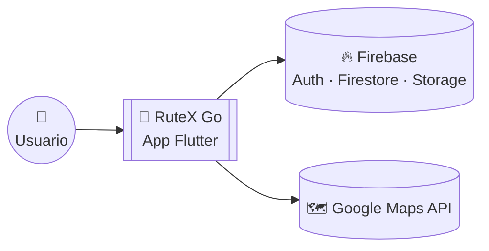
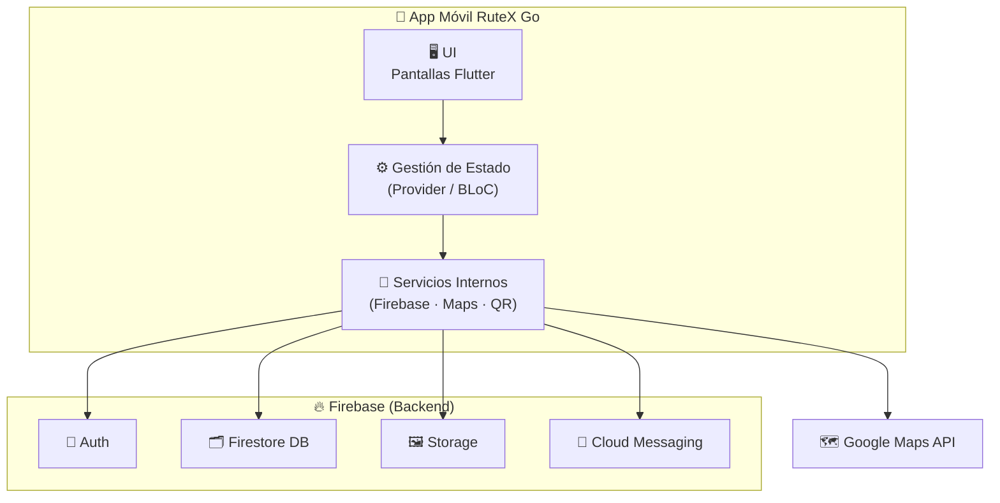

# RuteX Go 🏛️📱
### *Aplicación móvil gamificada para turismo cultural en Extremadura*


[](https://github.com/TurisTechTeam-Dev/rutex-go-project/issues)
[](https://developer.android.com)
[](https://firebase.google.com)

## 👥 Equipo de Desarrollo — TurisTech Team

| Desarrollador | GitHub | Rol |
|---------------|--------|-----|
| **Andrés Fernández Expósito** | [@AndresFE0209](https://github.com/AndresFE0209) | Backend & Coordinación |
| **Joel Manuel García Villarino** | [@Joeljole1987](https://github.com/Joeljole1987) | Backend & Diseño UX/UI |
| **Diego Vivas Paredes** | [@DiegoVP963](https://github.com/DiegoVP963) | Frontend & Diseño UX/UI |
| **María Mercedes Martínez Fragoso** | [@MercedesOrg01](https://github.com/MercedesOrg01) | Tutora del proyecto |

**Centro:** IES Albarregas (Mérida, Badajoz)  
**Ciclo:** 2º FP Desarrollo de Aplicaciones Multiplataforma  
**Curso:** 2025/26  
**Organización GitHub:** [@TurisTechTeam-Dev](https://github.com/TurisTechTeam-Dev)

---

## 🌟 Resumen

**RuteX Go** es una aplicación móvil gamificada orientada a potenciar el turismo cultural en Extremadura.  
Permite recorrer rutas temáticas, escanear códigos QR en monumentos, resolver trivias y ganar puntos para ascender de rango.  
El objetivo principal es transformar la visita turística en una experiencia educativa, interactiva y accesible.

---

## 📑 Índice

- [🚀 Estado del Proyecto](#-estado-del-proyecto)
- [✨ Características Principales](#-características-principales)
- [🎯 Objetivos](#-objetivos)
- [🛠️ Tecnologías Utilizadas](#️-tecnologías-utilizadas)
- [📁 Estructura del Repositorio](#-estructura-del-repositorio)
- [⚙️ Instalación y Ejecución](#️-instalación-y-ejecución)
- [🏗️ Arquitectura y Decisiones Técnicas](#️-arquitectura-y-decisiones-técnicas)
- [📚 Documentación](#-documentación)
- [🤝 Contribución](#-contribución)
- [📄 Licencia](#-licencia)
- [📞 Contacto](#-contacto)

---

## 🚀 Estado del proyecto
| Fase | Estado |
|------|--------|
| **Sprint 1** – Análisis y Diseño | 🟡 En progreso |
| **Entregable E1** | Prototipo funcional centrado en Mérida (auth, rutas, trivial básico, puntos/rangos) |

🔮 **Próximos pasos del roadmap:**
- Integración del mapa en Flutter
- Validación por QR en monumentos
- Misiones y trivias
- Sistema de rangos y ranking
- Optimización visual según diseño Figma
- Pruebas y despliegue

---

## ✨ Características Principales

- 🗺️ Rutas culturales geolocalizadas
- 🧭 Mapa interactivo con marcadores
- 📌 Validación de monumentos mediante códigos QR
- 🎯 Misiones y trivias educativas
- 🏅 Sistema de puntos, rangos y recompensas
- 🏆 Ranking por ciudad
- 👤 Autenticación y gestión de usuario
- 🖼️ Contenido multimedia
- 🔔 Futuro: notificaciones push, recompensas locales y realidad aumentada

---

## 🎯 Objetivos del Proyecto

- ✅ **Innovación Turística:** Ofrecer una experiencia turística gamificada única en Extremadura
- ✅ **Valorización Patrimonial:** Potenciar la apreciación del patrimonio cultural extremeño
- ✅ **Educación Interactiva:** Integrar dinámicas educativas para turistas de todas las edades
- ✅ **Impacto Económico:** Impulsar el comercio local mediante sistema de recompensas
- ✅ **Sostenibilidad:** Promover turismo responsable alineado con los ODS 2030
- ✅ **Formación Académica:** Aplicar conocimientos DAM en proyecto real con impacto social

---

## 🛠️ Tecnologías Utilizadas

### Frontend (Tecnología principal)
- **Flutter (Dart)** — Framework principal para el desarrollo de la aplicación móvil.
  - Multiplataforma (Android / iOS)
  - UI declarativa y moderna
  - Rápido desarrollo y mantenimiento
  - Ecosistema amplio de librerías (QR, Maps, Providers, etc.)

### Backend
- **Firebase Authentication** — Registro, inicio de sesión y seguridad.
- **Cloud Firestore** — Base de datos NoSQL para usuarios, rutas, monumentos y misiones.
- **Firebase Storage** — Imágenes y recursos multimedia.
- **Firebase Cloud Messaging** — Notificaciones push (para fases futuras).
- **Firebase Analytics** — Métricas y análisis de uso.
- **Firebase Hosting / Functions (futuro)** — Para administración o lógica backend avanzada.

### Servicios Integrados
- **Google Maps API** — Mapa interactivo, marcadores y orientación del usuario.
- **QR Scanner (mobile_scanner / qr_code_scanner)** — Validación de monumentos por código QR.

### Herramientas de Desarrollo
- **Visual Studio Code** — Editor principal para desarrollo Flutter.
- **Android Studio** — Herramientas Android (AVD, SDK, firma, builds nativas).
- **Git + GitHub** — Control de versiones y colaboración.
- **GitHub Projects / Issues** — Gestión del proyecto y tareas.
- **Firebase Console** — Configuración del backend, reglas, analíticas y despliegues.

---

## 📁 Estructura del Repositorio

```text
rutex-go-project/
├─ docs/                          # Documentación técnica y académica
│  ├─ technical_documentation.md  # Documentación técnica del sistema
│  └─ memoria.md                  # Memoria académica del proyecto
│
├─ mobile-app/                    # Proyecto principal en Flutter
│  ├─ lib/                        # Código fuente (UI, lógica, providers, servicios)
│  ├─ ios/                        # Configuración iOS generada por Flutter
│  ├─ android/                    # Configuración Android generada por Flutter
│  ├─ assets/                     # Imágenes y recursos gráficos
│  └─ pubspec.yaml                # Dependencias del proyecto Flutter
│
├─ backend/                       # Configuración y reglas de Firebase
│  ├─ firestore.rules             # Reglas de seguridad de Firestore
│  ├─ storage.rules               # Reglas de seguridad de Storage
│  └─ firebase.json               # Configuración del proyecto Firebase
│
├─ tests/                         # Pruebas unitarias e integración
│
├─ scripts/                       # Scripts de automatización (si aplica)
│
└─ README.md                      # Descripción general del proyecto
```

---

## ⚙️ Instalación y Ejecución

### 📌 Requisitos previos

Para ejecutar RuteX Go necesitas:

- Flutter SDK 3.x
- Dart SDK (incluido con Flutter)
- Android Studio o Visual Studio Code con extensiones Flutter/Dart
- Emulador Android o dispositivo físico
- Proyecto Firebase configurado
- Archivo `google-services.json`
- Google Maps API Ke

---

### 📥 Clonar el repositorio

```
git clone https://github.com/TurisTechTeam-Dev/rutex-go-project.git

cd rutex-go-project/mobile-app
```

---

### 📦 Instalar dependencias

```
flutter pub get
```

---

### ▶️ Ejecutar la app

```
flutter run
```

---

### ⚠️ Notas importantes

NO subir google-services.json al repositorio.

Configurar la Google Maps API Key en:
android/app/src/main/AndroidManifest.xml

pubspec.yaml contiene todas las dependencias del proyecto.

Ejecutar flutter doctor para verificar la configuración del entorno.

---

### 📌 Comandos útiles

Ver dispositivos disponibles
```
flutter devices
```

Ejecutar en modo release
```
flutter run --release
```

Formatear el código
```
flutter format lib
```

Construir APK
```
flutter build apk
```

Construir AppBundle
```
flutter build appbundle
```

---

## 📅 Cronograma de Desarrollo (Metodología Ágil)

| Sprint | Fechas | Objetivos Principales | Estado | Responsable |
|--------|--------|-----------------------|--------|-------------|
| **Sprint 1** | 17/10 - 15/12 | Definición, Análisis y Diseño | 🔄 Finalizado | Todos |

### Entregables por Evaluación
- **1ª Evaluación (15/12):** Propuesta, análisis de requisitos, mockups y arquitectura
- **2ª Evaluación (**/03):** MVP funcional con características principales implementadas
- **3ª Evaluación (**/06):** Aplicación completa, documentación final y presentación

## 📱 Capturas de Pantalla

*[Pendiente - Se añadirán mockups en Sprint 1 y capturas reales en Sprint 6]*
2]

---

## 🏗️ Arquitectura y Decisiones Técnicas

RuteX Go está construida con una arquitectura moderna, modular y escalable.  
El objetivo es garantizar un desarrollo ágil, una experiencia fluida y la posibilidad de ampliar el proyecto a nuevas ciudades y funcionalidades en el futuro.

---

### ⚙️ Stack Tecnológico

- **Flutter (Dart)** → Framework principal para la app móvil  
- **Firebase** → Autenticación, base de datos, almacenamiento y analíticas  
- **Google Maps API** → Mapas interactivos y ubicación del usuario  
- **QR Scanner** → Validación de llegada a monumentos  

---

### 📌 Decisiones Técnicas Clave (ADRs)

- **ADR-001 — Firebase como BaaS**  
  Se elige Firebase para simplificar backend, aumentar seguridad y acelerar el desarrollo.

- **ADR-002 — Flutter como base tecnológica**  
  Permite crear una app rápida, moderna y multiplataforma, con un único código.

- **ADR-003 — Firestore como base de datos NoSQL**  
  Ideal para datos flexibles: ciudades, rutas, monumentos, misiones y rankings.

---

### 🧱 Vista general de la arquitectura (C1)



---

### 🧩 Vista de Contenedores (C2)



---

### 📚 Colecciones Firestore

/users  
/cities  
/routes  
/monuments  
/missions  
/rankings


## 🔗 Integraciones del Sistema

RuteX Go combina varios servicios cloud y APIs externas para ofrecer una experiencia turística precisa, fluida y segura.  
Estas son las integraciones que componen el núcleo del sistema:

---

### 🧩 Firebase (Backend Principal)

#### ✔ Firebase Authentication  
Gestión segura de usuarios:  
- Registro  
- Login  
- Recuperación de contraseña  
- Sesiones persistentes  

#### ✔ Firestore Database  
Base de datos NoSQL utilizada para almacenar:  
- Usuarios  
- Rutas  
- Monumentos  
- Misiones  
- Rankings  

Ventajas clave: escalabilidad, tiempo real y reglas de seguridad integradas.

#### ✔ Firebase Storage  
Almacenamiento de imágenes y contenido multimedia ligero, manteniendo la app rápida y optimizada.

---

### 🗺️ Google Maps Platform

#### ✔ Google Maps API  
Usado para:  
- Mostrar la ubicación aproximada del usuario  
- Renderizar el mapa de la ciudad  
- Mostrar marcadores de monumentos  
- Facilitar la orientación durante la ruta  

⚠️ *La validación de llegada no depende del GPS, solo de la visualización.*

---

### 📸 Lector QR

#### ✔ mobile_scanner / qr_code_scanner  
Tecnología empleada para validar físicamente la llegada al monumento:  
- Escaneo del QR en el punto de interés  
- Verificación del monumento correspondiente  
- Desbloqueo de la misión asociada  

Este método sustituye a la detección por proximidad GPS, aumentando la precisión y fiabilidad.

---

### 🟡 Integraciones Recomendadas (Futuras Iteraciones)

- **Firebase Cloud Messaging** → Notificaciones push  
- **Firebase Analytics** → Métricas de uso y eventos  
- **Google Directions API** → Navegación paso a paso  

---

### 🟣 Integraciones Futuras (Visión a Largo Plazo)

- **NFC / Beacons** → Validación automática sin escaneo  
- **Realidad Aumentada (ARCore)** → Información histórica superpuesta  
- **Integración con comercios locales** → Recompensas y promociones  

---

## 📚 Documentación Académica

Toda la documentación generada durante el desarrollo del proyecto se encuentra en la carpeta: /docs/

Incluye:

- **Memoria del Proyecto**  
  Documento completo con análisis, requisitos, diseño y conclusiones.

- **Documentación Técnica**  
  Explicación detallada de la arquitectura, módulos funcionales, modelo de datos, integraciones, requisitos no funcionales y plan de pruebas.  
  👉 Archivo principal: `docs/technical_documentation.md`

- **Análisis de Requisitos**  
  Historias de usuario, backlog, casos de uso y criterios de aceptación.

- **Diseño UI/UX**  
  Enlaces a prototipos, mockups y componentes definidos en Figma.

- **Plan de Pruebas**  
  Estrategia de test, casos de prueba, KPIs y evaluaciones realizadas.

- **Diagramas**  
  - Arquitectura (C1, C2)  
  - Modelo de datos (ERD)  
  - Diagramas de flujo y navegación  
  - Estructura del sistema  

Esta carpeta reúne toda la documentación necesaria para entender el proyecto y su desarrollo.

---

## 🤝 Proceso de Contribución

Este repositorio forma parte del proyecto académico RuteX Go (DAM – IES Albarregas).  
Para mantener una estructura clara y un flujo de trabajo organizado, seguimos una metodología basada en ramas, revisiones y control de calidad.

### 🧭 Flujo de trabajo del equipo

1. **Asignación de tareas por sprint**  
   Cada tarea se define en reuniones de planificación y se registra en GitHub Projects o Trello.
   
2. **Crear una rama para cada nueva funcionalidad**
  `git checkout -b feature/nueva-funcionalidad`

3. **Desarrollar en la rama creada**  
- Commits pequeños y descriptivos  
- Mensajes claros con prefijos recomendados:
  - `feat:` Nueva funcionalidad  
  - `fix:` Corrección de errores  
  - `refactor:` Mejora de código  
  - `docs:` Actualización de documentación

4. **Subir cambios al repositorio remoto**
  `git push origin feature/nombre-funcionalidad`

5. **Crear un Pull Request (PR)**  
  - Comparar con la rama `develop`  
  - Descripción clara del cambio  
  - Adjuntar capturas o referencias si es necesario  
  - Esperar revisión de al menos 1 miembro del equipo

6. **Revisión de código**  
  El equipo revisa:
    - Correcta implementación  
    - Legibilidad del código  
    - Estándares de arquitectura  
    - Posibles errores o mejoras  

7. **Aprobación y merge a `develop`**  
  Solo se integra cuando está probado y revisado.

8. **Merge a `main` para versiones estables**  
  La rama `main` representa el estado estable del proyecto (entregas, demos, releases).

### 📌 Buenas prácticas

- Mantén tu rama actualizada con: `git pull origin develop`
- Nunca subir `google-services.json` ni claves sensibles.  
- Acompaña cada nueva funcionalidad con su documentación correspondiente en `/docs`.  
- Usa nombres consistentes en ramas, commits y PRs.  
- Borra ramas ya integradas para mantener limpio el repositorio.

### 🧪 Pruebas antes de entregar
Antes de solicitar un PR:
- Ejecutar la aplicación en un dispositivo/emulador.  
- Validar que las funcionalidades nuevas no rompen módulos existentes.  
- Revisar errores en consola. 

---

## 📄 Licencia y Derechos

Este proyecto está protegido por una **Licencia Propietaria**.  
No se permite la copia, distribución, modificación ni uso comercial sin autorización expresa del equipo desarrollador.

Consulta el archivo [LICENSE](LICENSE) para más detalles.

© 2025 TurisTechTeam-Dev  
Andrés Fernández Expósito · Joel Manuel García Villarino · Diego Vivas Paredes

---

## 📞 Contacto y Soporte

Si deseas contactar con el equipo, resolver dudas o proponer mejoras, puedes hacerlo a través de los siguientes canales.

**TurisTech Team - Desarrollo de Software Turístico**

### 📡 Canales Oficiales

- 🐙 **Organización GitHub:** [@TurisTechTeam-Dev](https://github.com/TurisTechTeam-Dev)
- 📂 **Repositorio Principal:** [rutex-go-project](https://github.com/TurisTechTeam-Dev/rutex-go-project)
- 🎫 **Issues y Soporte:** [GitHub Issues](https://github.com/TurisTechTeam-Dev/rutex-go-project/issues)
- 📧 **Email del Equipo:** turistechteam@gmail.com
- 🏫 **Centro Académico:** IES Albarregas — Mérida (Badajoz)


### 👥 Contacto individual
- **Andrés Fernández:** [@AndresFE0209](https://github.com/AndresFE0209) — *Backend & Coordinación*
- **Joel García:** [@Joeljole1987](https://github.com/Joeljole1987) — *Backend & Diseño UX/UI*
- **Diego Vivas:** [@DiegoVP963](https://github.com/DiegoVP963) — *Frontend & Diseño UX/UI*

---

**⭐ Si te gusta nuestro proyecto, no olvides darle una estrella en GitHub**

*Desarrollado con ❤️ por TurisTech Team para impulsar el turismo cultural en Extremadura*

---

**IES Albarregas** | **Desarrollo de Aplicaciones Multiplataforma** | **Curso 2025/26**


