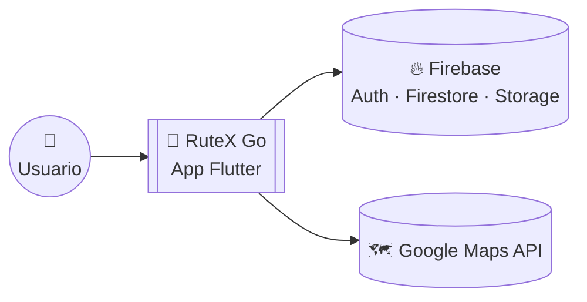
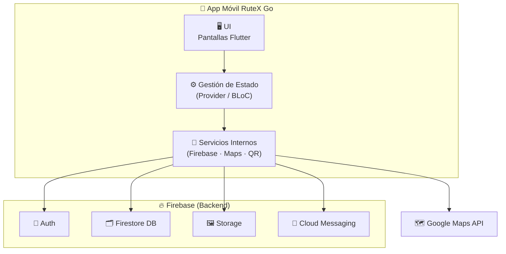

# RuteX Go 🏛️📱
### *Aplicación móvil gamificada para turismo cultural en Extremadura*


[](https://github.com/TurisTechTeam-Dev/rutex-go-project/issues)

## 👥 Equipo de Desarrollo — TurisTech Team

| Avatar | Desarrollador | GitHub | Rol |
|:---:|---------------|--------|-----|
|  | [**Andrés Fernández Expósito**](https://github.com/AndresFE0209) | [@AndresFE0209](https://github.com/AndresFE0209) | Backend & Coordinación |
|  | [**Joel Manuel García Villarino**](https://github.com/Joeljole1987) | [@Joeljole1987](https://github.com/Joeljole1987) | Backend & Diseño UX/UI |
|  | [**Diego Vivas Paredes**](https://github.com/DiegoVP963) | [@DiegoVP963](https://github.com/DiegoVP963) | Frontend & Diseño UX/UI |
|  | [**María Mercedes Martínez Fragoso**](https://github.com/MercedesOrg01) | [@MercedesOrg01](https://github.com/MercedesOrg01) | Tutora del proyecto |

**Centro:** IES Albarregas (Mérida, Badajoz)  
**Ciclo:** 2º FP Desarrollo de Aplicaciones Multiplataforma  
**Curso:** 2025/26  
**Organización GitHub:** [@TurisTechTeam-Dev](https://github.com/TurisTechTeam-Dev)

---

## 🌟 Resumen

**RuteX Go** es una aplicación móvil gamificada orientada a potenciar el turismo cultural en Extremadura.  
Permite recorrer rutas temáticas, escanear códigos QR en monumentos, resolver trivias y ganar puntos para ascender de rango.  
El objetivo principal es transformar la visita turística en una experiencia educativa, interactiva y accesible.

---

## 📑 Índice

- [🚀 Estado del Proyecto](#-estado-del-proyecto)
- [✨ Características Principales](#-características-principales)
- [🎯 Objetivos](#-objetivos)
- [🛠️ Tecnologías Utilizadas](#️-tecnologías-utilizadas)
- [📁 Estructura del Repositorio](#-estructura-del-repositorio)
- [⚙️ Instalación y Ejecución](#️-instalación-y-ejecución)
- [🏗️ Arquitectura y Decisiones Técnicas](#️-arquitectura-y-decisiones-técnicas)
- [📚 Documentación](#-documentación)
- [🤝 Contribución](#-contribución)
- [📄 Licencia](#-licencia)
- [📞 Contacto](#-contacto)

---

## 🚀 Estado del proyecto

| Fase | Estado | Detalle |
|------|--------|---------|
| **Sprint 1** – Análisis y Diseño | ✅ Finalizado | Documentación, mockups en Figma y arquitectura base. |
| **Sprint 2** – Desarrollo del PMV | 🟢 Operativo | Implementación del núcleo funcional y conexión con Firebase. |
| **Entregable E2** (Actual) | 🏆 **MVP Funcional** | Flujo completo: Auth → Selección de Ruta → Validación QR → Quiz. |

> **🎯 Hitos alcanzados en esta evaluación:**
> * **Arquitectura Profesional:** Implementación de **Clean Architecture** para separar la lógica de negocio (Domain) de la infraestructura (Data/Firebase).
> * **Backend Integrado:** Conexión real con **Cloud Firestore** y **Firebase Auth** para persistencia de usuarios y datos de rutas.
> * **Motor de Validación QR:** Lógica funcional de escaneo de códigos para verificar la presencia física del turista en los monumentos.
> * **Gamificación Operativa:** Sistema de Quizzes dinámicos que consumen datos en tiempo real y gestionan el progreso del usuario.

🔮 **Próximos pasos del roadmap:**
- **Navegación con Google Maps:** Integración de la API de Google Directions para guiar al usuario en tiempo real entre los puntos de la ruta.
- **Perfil Detallado:** Historial de rutas completadas y visualización de logros/insignias.
- **Pulido UI/UX:** Ajuste final de la interfaz siguiendo el diseño de alta fidelidad.
- **Notificaciones:** Sistema de avisos para eventos culturales cercanos.
- **Pruebas y QA:** Fase intensiva de testeo en dispositivos reales (Android/iOS) para garantizar estabilidad y rendimiento.
- **Despliegue:** Preparación de builds de producción y configuración de entornos finales para la puesta en marcha.

---

## ✨ Características Principales (Estado del PMV)

### 🚀 Funcionalidades 100% Operativas
- **🔐 Gestión de Acceso:** Sistema de autenticación robusto con **Firebase Auth** (Registro, Login y persistencia de sesión).
- **🗺️ Exploración Inteligente:** Visualización de ciudades y rutas dinámicas cargadas en tiempo real desde **Cloud Firestore**.
- **📸 Validación de Presencia Física:** Motor de escaneo de **códigos QR** integrado con la cámara para asegurar la visita real a los monumentos.
- **🧠 Motor de Trivias:** Sistema de misiones interactivas con validación de respuestas y feedback inmediato al usuario.
- **📈 Sistema de Progresión:** Algoritmo de cálculo de puntos y actualización dinámica de **rangos de usuario** (de Esclavo a Emperador).

### 🛠️ Integraciones Técnicas
- **Google Maps API:** Renderizado de mapas con marcadores personalizados para puntos de interés (POIs).
- **Cloud Firestore:** Base de datos NoSQL con arquitectura de colecciones optimizada para escalabilidad.

### 🔮 Roadmap (Próximas Implementaciones)
- 🧭 **Navegación GPS:** Guiado paso a paso entre monumentos.
- 🏆 **Ranking Social:** Tabla de clasificación global para fomentar la competitividad.
- 🔔 **Notificaciones Push:** Avisos sobre eventos cercanos y recordatorios de rutas.

---

## 🎯 Objetivos del Proyecto

### 🏛️ Impacto Turístico y Cultural
- ✅ **Innovación Turística:** Transformar la visita pasiva en una experiencia activa mediante mecánicas de juego (gamificación).
- ✅ **Valorización Patrimonial:** Visibilizar monumentos menos conocidos de Extremadura a través de rutas temáticas dinámicas.
- ✅ **Educación Interactiva:** Fomentar el aprendizaje histórico mediante un motor de trivias y misiones vinculado a cada punto de interés.
- ✅ **Sostenibilidad:** Reducir el uso de guías de papel y promover rutas peatonales, alineando el proyecto con los **ODS 2030**.

### 💻 Objetivos Técnicos
- ✅ **Arquitectura Escalable:** Implementar **Clean Architecture** para permitir que la app crezca a más ciudades sin rehacer código.
- ✅ **Interacción con el Entorno:** Utilizar el hardware del dispositivo (Cámara/QR) como puente entre el mundo físico y digital.
- ✅ **Gestión de Datos en Tiempo Real:** Garantizar la sincronización instantánea de progresos y perfiles mediante **Firebase Cloud Firestore**.
- ✅ **UX/UI Nativa:** Ofrecer una interfaz fluida y moderna utilizando las capacidades de renderizado de **Flutter**.

---

## 🛠️ Tecnologías Utilizadas

### Frontend & Lenguaje
- **Dart 3.11.0**: Lenguaje de programación optimizado para aplicaciones cliente.
- **Flutter 3.41.2**: Framework de UI para el desarrollo nativo multiplataforma.
- **Provider**: Patrón de gestión de estado para la sincronización de datos entre la UI y la lógica de negocio.
- **Clean Architecture**: Estructura de software dividida en capas (Data, Domain, Presentation) para asegurar la escalabilidad.

### Backend (Firebase Ecosystem)
- **Firebase Authentication**: Gestión de identidad y seguridad de sesiones de usuario.
- **Cloud Firestore**: Base de datos NoSQL documental utilizada para el almacenamiento jerárquico de ciudades, rutas, monumentos y misiones.
- **Firebase Core**: Integración base para la comunicación entre Flutter y los servicios de Google Cloud.

### Servicios e Integraciones de Hardware
- **Google Maps SDK for Flutter**: Motor de renderizado de mapas e interacción con coordenadas geográficas.
- **Mobile Scanner (QR)**: Uso de la cámara nativa para la validación lógica de llegada a los puntos de interés.
- **Geolocalización**: Servicios de ubicación para posicionar al usuario en el mapa interactivo.

### Herramientas de Desarrollo y DevOps
- **IDE**: Visual Studio Code & Android Studio (para gestión de SDKs y AVD).
- **Control de Versiones**: Git con flujo de trabajo basado en ramas en GitHub.
- **Gestión Ágil**: Trello y GitHub Projects para el seguimiento del backlog y Sprints.
- **Diseño UI/UX**: Figma para la creación de prototipos de alta fidelidad y manual de estilo.

---

## 📁 Estructura del Repositorio

```text
rutex-go-project/
├── .gitignore                          # Archivos omitidos por Git
├── LICENSE                             # Licencia del software
├── README.md                           # Descripción general
├── tablas proyecto final.jpg          # Esquema de base de datos
│
├── assets/                             # Recursos estáticos
│   └── rangos/                         # Iconografía (Esclavo a Emperador)
│
├── docs/                               # Documentación del ciclo de vida
│   ├── design/                         # Prototipos UI/UX
│   ├── images/                         # Capturas y diagramas
│   ├── pdf/                            # Entregables oficiales
│   ├── project-proposal.md             # Propuesta de viabilidad
│   └── technical_documentation.md      # Documentación técnica
│
└── mobile_app/                         # Proyecto Flutter
    ├── android/                        # Configuración nativa Android
    ├── ios/                            # Configuración nativa iOS
    ├── assets/                         # Recursos internos de la app
    ├── firebase.json                   # Vinculación con Firebase
    ├── pubspec.yaml                    # Dependencias y versiones
    │
    └── lib/                            # Núcleo del código fuente
        ├── core/                       # Elementos transversales
        │   ├── constants/
        │   ├── error/
        │   ├── map/
        │   ├── routes/
        │   ├── theme/
        │   ├── utils/
        │   └── widgets/
        │
        └── features/                   # Módulos funcionales
            ├── auth/                   # Login y Registro
            ├── mission/                # QR, Mapa y Quiz
            ├── profile/                # Rangos y Puntos
            ├── routes/                 # Selección de rutas
            └── splash/                 # Pantalla de carga
```

---

## ⚙️ Instalación y Ejecución

### 📌 Requisitos previos

Para ejecutar o compilar **RuteX Go** en un entorno local, es necesario disponer de:

- **Flutter SDK 3.x** y **Dart SDK** (Canal estable).
- **IDE**: Android Studio (con SDK de Android 11+ / API 30+) o Visual Studio Code con extensiones de Flutter/Dart.
- **Dispositivo**: Emulador con Google Play Services o dispositivo físico con depuración USB activada.

---

1. **Clonar el proyecto desde GitHub:**

```bash
git clone [https://github.com/TurisTechTeam-Dev/rutex-go-project.git](https://github.com/TurisTechTeam-Dev/rutex-go-project.git)

cd rutex-go-project/mobile_app
```

---

### 📦 Instalar dependencias

Ejecuta el siguiente comando para descargar los paquetes y librerías necesarios definidos en el `pubspec.yaml`:

```bash
flutter pub get
```

---

### ▶️ Ejecutar la app

```bash
flutter run
```

---

### ⚠️ Notas importantes

> [!IMPORTANT]
> **Seguridad de Firebase:** No subir el archivo `google-services.json` al repositorio público. Este archivo debe solicitarse al equipo de desarrollo o generarse desde la consola de Firebase del proyecto.

- 🗺️ **Google Maps:** Es necesario configurar una API Key válida en la ruta:
  `mobile_app/android/app/src/main/AndroidManifest.xml`
  
- 📦 **Dependencias:** El archivo `pubspec.yaml` contiene todas las librerías necesarias (Firebase, Google Maps, QR Scanner, etc.). Asegúrate de no modificar las versiones manualmente para evitar conflictos.

- 🩺 **Diagnóstico:** Si encuentras errores al compilar, ejecuta el siguiente comando para verificar que tu entorno esté correctamente configurado:
```bash
  flutter doctor
```

---

### 📌 Comandos útiles

- **Ver dispositivos disponibles:** (Detectar emuladores o móviles conectados)
```bash
  flutter devices
```

- **Ejecutar en modo release:** (Probar el rendimiento real de la app sin debug)
```bash
flutter run --release
```

- **Formatear el código:** (Mantener el estilo visual y limpieza del código Dart)
```bash
flutter format lib
```

- **Construir APK:** (Generar instalador para dispositivos Android)
```bash
flutter build apk
```

- **Construir AppBundle:** (Generar el archivo optimizado para subir a Google Play)
```bash
flutter build appbundle
```

---

## 📅 Cronograma de Desarrollo (Metodología Ágil)

| Sprint | Fechas | Objetivos Principales | Estado | Responsable |
|--------|--------|-----------------------|--------|-------------|
| **Sprint 1** | 15/12 | Definición, Análisis y Diseño | ✅ Finalizado | Todos |
| **Sprint 2** | 16/03 | Desarrollo del MVP y Core de la App | 🔄 En curso | Equipo Dev |
| **Sprint 3** | **/06 | Pulido, Testing y Documentación Final | ⏳ Pendiente | Todos |

### Entregables por Evaluación
- **1ª Evaluación (15/12):** Propuesta de viabilidad, análisis de requisitos, mockups (Figma) y arquitectura base.
- **2ª Evaluación (15/03):** MVP funcional: Autenticación, Mapas interactivos y lógica de rutas básica.
- **3ª Evaluación (01/06):** Aplicación completa (Gamificación y QR), documentación técnica final y presentación oficial.

## 📱 Capturas de Pantalla

> [!NOTE]
> Las capturas reales de la interfaz y los mockups finales se añadirán al concluir la fase de desarrollo y pruebas de la entrega final.

---

## 🏗️ Arquitectura y Decisiones Técnicas

RuteX Go está construida con una arquitectura moderna, modular y escalable. El objetivo es garantizar un desarrollo ágil, una experiencia fluida y la posibilidad de ampliar el proyecto a nuevas ciudades y funcionalidades en el futuro.

### 🧩 Patrones y Organización
- **Arquitectura Basada en Características (Features):** El proyecto se divide en módulos independientes (`auth`, `mission`, `routes`, `profile`). Esto permite que cada funcionalidad sea autónoma, facilitando el mantenimiento y la escalabilidad.
- **Gestión de Estado:** Uso de **Providers** para manejar de forma eficiente el flujo de datos entre la lógica de negocio y la interfaz de usuario.
- **Capa de Servicios (Services):** Desacoplamiento total de la infraestructura externa (Firebase, Google Maps) para que el núcleo de la aplicación no dependa directamente de proveedores específicos.

### 🛠️ Stack Tecnológico
- **Frontend:** Flutter (Dart) para un despliegue multiplataforma nativo.
- **Backend & Database:** Firebase (Firestore) para la sincronización de datos en tiempo real.
- **Autenticación:** Firebase Auth (Email/Password y Google).
- **Geolocalización:** Google Maps Platform para el renderizado de mapas y rutas.
- **Hardware:** Integración nativa con cámara para escaneo de códigos QR.

---

### 📌 Decisiones Técnicas Clave (ADRs)

- **ADR-001 — Firebase como BaaS**
- Se elige Firebase para simplificar el backend, aumentar la seguridad y acelerar el desarrollo del ecosistema en tiempo real.

- **ADR-002 — Flutter como base tecnológica**
- Permite crear una aplicación rápida, moderna y multiplataforma con un único código base, garantizando un rendimiento nativo.

- **ADR-003 — Firestore como base de datos NoSQL**
- Estructura ideal para manejar datos flexibles y escalables como ciudades, rutas, monumentos, misiones y rankings.

---

### 🧱 Vista general de la arquitectura (C1)



---

### 🧩 Vista de Contenedores (C2)



---

### 📚 Colecciones Firestore

El backend está estructurado en **Cloud Firestore** mediante las siguientes colecciones clave:

- **`/usuarios`**: Almacena el perfil del turista, progreso (puntos, rango), rutas completadas y permisos.
- **`/config_rangos`**: Define los umbrales de puntos, nombres de rangos (ej. Esclavo, Emperador) e iconos de la gamificación.
- **`/ciudades`**: Catálogo de localidades disponibles para segmentar la oferta turística.
- **`/rutas`**: Itinerarios temáticos con su dificultad, duración y vinculación a puntos de interés.
- **`/puntos_interes`**: Información detallada de monumentos, incluyendo coordenadas (Geopoint) y códigos de validación QR.
- **`/misiones`**: Lógica de los desafíos (quizzes), preguntas, opciones y respuestas correctas.
- **`/resultado`**: Registro histórico de actividades finalizadas para control de recompensas y analítica.

---

## 🔗 Integraciones del Sistema

RuteX Go utiliza un ecosistema de herramientas avanzadas para garantizar una experiencia de usuario fluida, segura y centrada en la geolocalización, tal y como se detalla en la documentación técnica.

---

### 🔥 Firebase (Ecosistema Backend)

* **Firebase Authentication:** Gestión de acceso mediante email y contraseña, garantizando sesiones persistentes y seguridad en los perfiles de usuario.
* **Cloud Firestore:** Base de datos NoSQL para la gestión en tiempo real de las colecciones clave:
> * `/usuarios`
> * `/config_rangos`
> * `/ciudades`
> * `/rutas`
> * `/puntos_interes`
> * `/misiones`
> * `/resultado`
* **Firebase Storage:** Almacenamiento optimizado de recursos multimedia e imágenes de los monumentos.

---

### 🗺️ Servicios de Localización y Mapas

* **Google Maps Platform:** Renderizado de mapas interactivos y visualización de marcadores de puntos de interés (POIs).
* **Geolocator:** Obtención de la ubicación exacta en tiempo real del usuario para su representación y orientación sobre el mapa.

---

### 📸 Validación y Hardware

* **Mobile Scanner:** Integración con el hardware de la cámara del dispositivo para el escaneo de códigos QR, vinculando la presencia física en el monumento con la validación de la llegada y el desbloqueo de misiones.

---

### 🚀 Mejoras Futuras (Roadmap Técnico)

Basado en el plan de optimización del manual de cara a la defensa final:
- **Sincronización:** Refuerzo de la actualización de puntos acumulados y datos del perfil.
- **Analítica:** Registro completo de rutas finalizadas para control y seguimiento.
- **Interfaz:** Optimización de la navegación entre pantallas y mejora visual del flujo de misiones y elementos de gamificación.

---

## 📚 Documentación Académica

Toda la documentación generada durante el desarrollo del proyecto se encuentra centralizada para su consulta técnica y académica.

Incluye:

- **Memoria del Proyecto (0492 · Proyecto DAM):** Documento oficial que recoge el análisis de viabilidad, definición del problema, requisitos y conclusiones finales.
- **Manual Técnico (V1):** Explicación detallada de la arquitectura (Clean Architecture), módulos funcionales, modelo de datos en Firestore, integraciones de hardware (QR/Cámara) y requisitos no funcionales.
- **Análisis de Requisitos:** Historias de usuario, backlog del producto, casos de uso y criterios de aceptación definidos para el PMV.
- **Diseño UI/UX:** Prototipos de alta fidelidad, mockups y guía de estilos (colores, tipografía y componentes) desarrollados en Figma.
- **Plan de Pruebas y Calidad:** Estrategia de testing, casos de prueba realizados sobre el MVP y evaluación de KPIs de rendimiento.
- **Diagramas del Sistema:** - Diagrama Estructurado (Flujo Lineal).
    - Mapa de navegación de la aplicación.
    - Diagrama de la base de datos (Colecciones Firestore).
    - Esquema de arquitectura y servicios externos.

---

## 🤝 Proceso de Contribución

Este repositorio contiene el código fuente de **RuteX Go**, un proyecto desarrollado por **TurisTech Team** para el módulo de Proyecto de 2º de DAM (I.E.S. Albarregas). Para garantizar la calidad del software y la integridad de la arquitectura, seguimos un flujo de trabajo estructurado.

### 🧭 Flujo de trabajo del equipo

1. **Planificación (Trello):** Las tareas se dividen por Sprints. Ninguna funcionalidad se desarrolla sin estar previamente definida en el backlog.
   
2. **Gestión de Ramas (GitFlow simplificado):**
   - `main`: Código estable y listo para entrega/producción.
   - `develop`: Rama de integración para nuevas funcionalidades.
   - `feature/nombre-tarea`: Ramas temporales para el desarrollo de módulos específicos.

3. **Estándares de Commit:**
   - `feat:` Para nuevas implementaciones (ej: login, mapas).
   - `fix:` Para corrección de errores detectados en el testing.
   - `docs:` Cambios en la documentación o manual técnico.
   - `refactor:` Mejoras en la estructura del código sin cambiar su funcionalidad.

4. **Pull Requests y Code Review:**
   - Todo cambio en `feature/*` debe integrarse mediante un PR hacia `develop`.
   - Se verifica el cumplimiento de la **Clean Architecture** y la correcta gestión de estados.
   - Al menos un compañero debe validar el código antes del merge.

5. **Validación:** Antes de pasar a `main`, se realizan pruebas en dispositivos reales para asegurar que la integración con Firebase y el escaneo QR funcionan correctamente.

---

### 📌 Buenas prácticas

- **Sincronización:** Mantén tu rama actualizada con `git pull origin develop` para evitar conflictos de fusión.
- **Seguridad:** Nunca subir archivos de configuración sensible como `google-services.json` o claves de API (ver `.gitignore`).
- **Documentación:** Acompaña cada nueva funcionalidad con su actualización correspondiente en el manual técnico o la carpeta `/docs`.
- **Consistencia:** Usa nombres descriptivos y coherentes en ramas, commits y Pull Requests.
- **Limpieza:** Elimina las ramas locales y remotas una vez hayan sido integradas en `develop`.

### 🧪 Control de Calidad y Pruebas
Antes de solicitar la integración de un cambio (PR):
- **Despliegue:** Ejecutar la aplicación en un dispositivo físico o emulador para verificar el rendimiento.
- **Regresión:** Validar que las nuevas funcionalidades no afectan a los módulos ya operativos (Login, Mapas, Perfil).
- **Depuración:** Revisar que no existan errores críticos o fugas de memoria en la consola de Flutter.
- **Validación de Datos:** Comprobar que la lectura/escritura en las colecciones de Firestore se realiza según el esquema definido.

---

## 📄 Licencia y Derechos

Este proyecto es propiedad exclusiva de **TurisTechTeam-Dev**. Todos los derechos reservados. El código y los recursos están protegidos por una **Licencia Propietaria**, lo que prohíbe su copia, distribución o uso comercial sin autorización expresa.

Para más detalles sobre los términos de uso, consulta las versiones oficiales de la licencia:
* 🇪🇸 [Licencia en Español (LICENSE_ES.md)](LICENSE_ES.md)
* 🇬🇧 [Proprietary License in English (LICENSE.md)](LICENSE.md)

© 2025-2026 **TurisTechTeam-Dev**: Andrés Fernández Expósito • Diego Vivas Paredes • Joel Manuel García Villarino

---

## 📞 Contacto y Soporte

Si deseas contactar con el equipo para resolver dudas, reportar incidencias o proponer mejoras, puedes hacerlo a través de nuestro canal oficial:

📧 **Correo Electrónico:** [turistechteam@gmail.com](mailto:turistechteam@gmail.com)  
📍 **Institución:** I.E.S. Albarregas (Mérida)  
💻 **Organización:** TurisTech Team - Desarrollo de Software Turístico

---

> [!IMPORTANT]
> Este proyecto ha sido desarrollado como parte del módulo **0492 · Proyecto DAM** del Ciclo de Grado Superior en Desarrollo de Aplicaciones Multiplataforma.

---

### 📡 Canales Oficiales

- 🐙 **Organización GitHub:** [TurisTech Team](https://github.com/TurisTechTeam-Dev)
- 📂 **Repositorio Principal:** [rutex-go-project](https://github.com/TurisTechTeam-Dev/rutex-go-project)
- 🎫 **Issues y Soporte:** [GitHub Issues](https://github.com/TurisTechTeam-Dev/rutex-go-project/issues)
- 📧 **Email del Equipo:** [turistechteam@gmail.com](mailto:turistechteam@gmail.com)
- 🏫 **Centro Académico:** I.E.S. Albarregas (Mérida)

### 👥 Contacto individual

- **Andrés Fernández Expósito:** [@AndresFE0209](https://github.com/AndresFE0209) — *Backend & Coordinación*
- **Joel Manuel García Villarino:** [@Joeljole1987](https://github.com/Joeljole1987) — *Backend & Diseño UX/UI*
- **Diego Vivas Paredes:** [@DiegoVP963](https://github.com/DiegoVP963) — *Frontend & Diseño UX/UI*

---

**⭐ Si te gusta nuestro proyecto, no olvides darle una estrella en GitHub**

*Desarrollado con ❤️ por **TurisTech Team** para impulsar el turismo cultural en Extremadura.*

---

**IES Albarregas** | **Desarrollo de Aplicaciones Multiplataforma** | **Curso 2024/25 - 2025/26**


