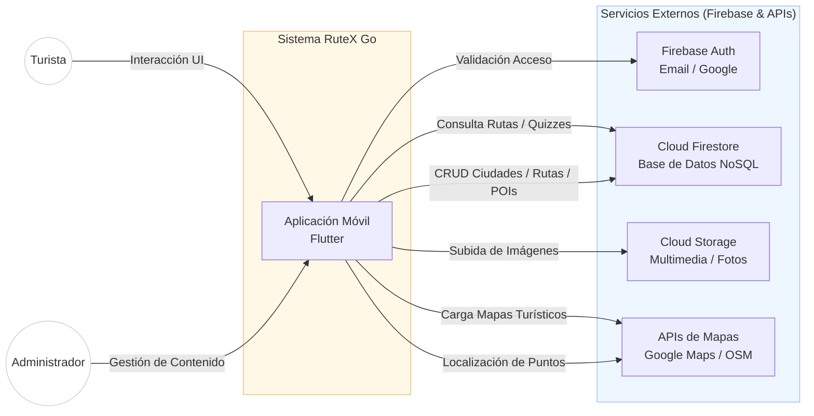
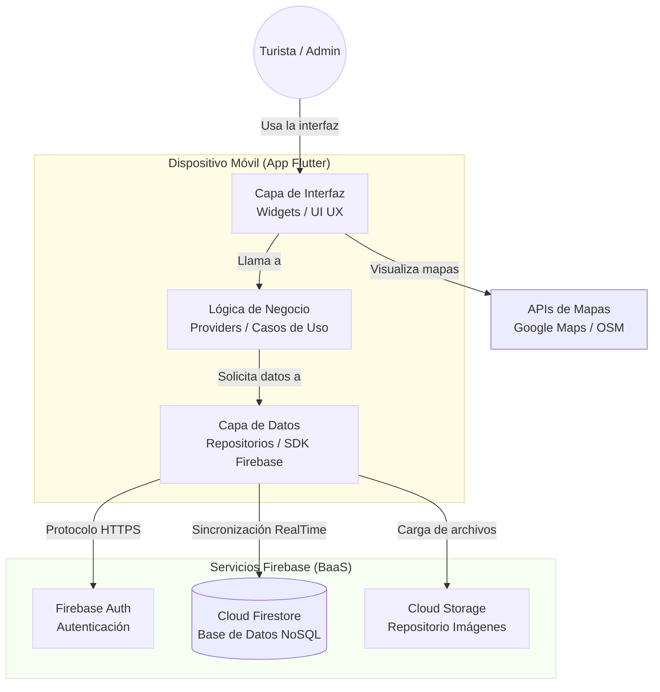

# RuteX Go 🏛️📱
### *Aplicación móvil gamificada para turismo cultural en Extremadura*


> [!TIP]
> **🚀 Despliegue Automático:** El panel de administración se despliega automáticamente en Firebase Hosting mediante GitHub Actions tras cada push a `main`.

## 👥 Equipo de Desarrollo — TurisTech Team

| Avatar | Desarrollador | GitHub | Rol |
|:---:|---------------|--------|-----|
|  | [**Andrés Fernández Expósito**](https://github.com/AndresFE0209) | [@AndresFE0209](https://github.com/AndresFE0209) | Backend & Coordinación |
|  | [**Joel Manuel García Villarino**](https://github.com/Joeljole1987) | [@Joeljole1987](https://github.com/Joeljole1987) | Backend & Diseño UX/UI |
|  | [**Diego Vivas Paredes**](https://github.com/DiegoVP963) | [@DiegoVP963](https://github.com/DiegoVP963) | Frontend & Diseño UX/UI |
|  | [**María Francisca Roncero Holgado**](https://github.com/mfronceroh01-hash) | [@MercedesOrg01](https://github.com/mfronceroh01-hash) | Tutora y Amada Lider del proyecto  |

**Centro:** IES Albarregas (Mérida, Badajoz)  
**Ciclo:** 2º FP Desarrollo de Aplicaciones Multiplataforma  
**Curso:** 2025/26  
**Organización GitHub:** [@TurisTechTeam-Dev](https://github.com/TurisTechTeam-Dev)

---

## 🌟 Resumen

**RuteX Go** es una plataforma móvil innovadora diseñada para transformar el turismo convencional en Extremadura en una aventura interactiva, educativa y **plenamente accesible**. A través de la **gamificación**, la app incentiva la exploración del patrimonio histórico, convirtiendo cada visita en un reto personal.

> [!TIP]
> **La Experiencia RuteX:** No es solo una guía; es un sistema de misiones donde el turista se convierte en protagonista. Al validar su presencia en monumentos reales, el usuario asciende en la jerarquía social de la antigua Roma, transformando el aprendizaje en un juego de progresión.

### 🎮 El núcleo de la aplicación
* 🗺️ **Rutas Temáticas:** Itinerarios dinámicos por enclaves estratégicos como Mérida, Cáceres y Badajoz.
* 📸 **Validación Híbrida:** Sistema de verificación física mediante **códigos QR** y geolocalización.
* 🧠 **Desafíos Históricos:** Trivias interactivas que ponen a prueba los conocimientos adquiridos *in situ*.
* 🎧 **Accesibilidad (Audioguías):** Narración automática de la historia de cada punto de interés mediante tecnología **TTS**, garantizando una experiencia inclusiva y "manos libres".
* 📖 **Diario del Explorador:** Generación automática de un **recuerdo digital en PDF** que recopila los hitos y logros de la ruta, eliminando la necesidad de guías en papel.
* 🏆 **Progresión de Rango:** Evolución del perfil de usuario, desde *Esclavo* hasta alcanzar la gloria como *Emperador*.

---

## 📑 Índice

* [🚀 Estado del Proyecto](#estado-del-proyecto)
* [✨ Características Principales](#características-principales)
* [🎯 Objetivos](#objetivos)
* [🛠️ Tecnologías Utilizadas](#tecnologías-utilizadas)
* [📁 Estructura del Repositorio](#estructura-del-repositorio)
* [⚙️ Instalación y Ejecución](#instalación-y-ejecución)
* [🏗️ Arquitectura y Decisiones Técnicas](#arquitectura-y-decisiones-técnicas)
* [📚 Documentación](#documentación)
* [🤝 Proceso de Contribución](#proceso-de-contribución)
* [📄 Licencia y Derechos](#licencia-y-derechos)
* [📞 Contacto y Soporte](#contacto-y-soporte)

---

## 🚀 Estado del Proyecto

| Fase | Estado | Detalle |
|------|--------|---------|
| **Sprint 1** – Análisis y Diseño | ✅ Finalizado | Documentación, mockups en Figma y arquitectura base. |
| **Sprint 2** – Desarrollo del PMV | ✅ Finalizado | Núcleo funcional operativo y conexión con Firebase. |
| **Sprint 3** – Finalización Técnica | ✅ Finalizado | Implementación de audioguías, generador de PDF y cierre de Roadmap. |
| **Evaluación Final** | 🟢 En revisión | Fase de documentación y correcciones finales de tutoría. |

> **🎯 Hitos Técnicos Alcanzados (100%):**
> * **Arquitectura Robusta:** Implementación final de **Clean Architecture** asegurando un código modular y mantenible.
> * **Ecosistema Firebase:** Autenticación, Firestore y Storage totalmente integrados para datos y multimedia.
> * **Geolocalización y QR:** Motor de mapas y escaneo de códigos operativos para validación de presencia física.
> * **Inclusión y Experiencia:** Motores de **Audioguía (TTS)** y **Generador del Diario del Explorador (PDF)** finalizados.
> * **Gamificación Completa:** Lógica de rangos, misiones y persistencia de progreso lista para producción.

🔮 **Últimos pasos antes de la Defensa:**
- [x] **Desarrollo técnico:** Hoja de ruta técnica cerrada y estable.
- [ ] **Documentación académica:** Redacción final de la memoria del TFG y manuales técnicos.
- [ ] **Revisión de Tutoría:** Supervisión por parte de la tutora (**Mercedes**) para ajustes de última hora.
- [ ] **Cierre del Proyecto:** Preparación de la defensa y generación de builds finales de entrega.

---

## ✨ Características Principales

RuteX Go se ha consolidado como una plataforma integral que fusiona la potencia del desarrollo multiplataforma con servicios en la nube para ofrecer una experiencia turística sin fisuras, inclusiva y memorable.

### 🚀 Funcionalidades Nucleares (100% Implementadas)
- **🔐 Ecosistema de Seguridad:** Gestión de usuarios mediante **Firebase Auth**, incluyendo persistencia de sesión, recuperación de cuentas y validación de perfiles.
- **🗺️ Exploración Dinámica:** Arquitectura basada en datos que permite cargar ciudades, rutas e historias en tiempo real desde **Cloud Firestore** sin necesidad de actualizar la app.
- **📍 Geolocalización y Mapas:** Integración avanzada con **Google Maps SDK**, permitiendo el rastreo del usuario y la visualización de puntos de interés (POIs).
- **📸 Validación Híbrida (GPS + QR):** Sistema de verificación de presencia física que combina coordenadas geográficas con escaneo de **códigos QR** para asegurar la integridad de la experiencia.
- **🎧 Accesibilidad y Audioguías:** Integración de tecnología **Text-to-Speech (TTS)** para la narración automática de contenidos históricos, permitiendo una experiencia inclusiva para personas con discapacidad visual o preferencia de consumo de audio.
- **📖 Diario del Explorador:** Motor de generación de **documentos PDF** que recopila dinámicamente el progreso del turista, sus logros y los monumentos visitados, ofreciendo un recuerdo digital tangible al finalizar la ruta.
- **🧠 Gamificación Activa:** Motor de misiones con trivias interactivas, feedback instantáneo y gestión de estados de progreso.
- **📈 Jerarquía de Usuario:** Algoritmo dinámico de experiencia que gestiona el ascenso de rangos (desde *Esclavo* hasta *Emperador*).

### 🏗️ Arquitectura y Escalabilidad
- **Clean Architecture:** Separación estricta de capas (Data, Domain, Presentation) que garantiza que la app pueda crecer con nuevas ciudades o funciones sin generar deuda técnica.
- **Infraestructura Cloud:** Base de datos NoSQL y almacenamiento multimedia en **Firebase Storage**, optimizados para latencia mínima.
- **CI/CD Integrado:** Automatización con **GitHub Actions** para el despliegue continuo del panel administrador en la nube.

### 🔮 Visiones de Futuro (Escalabilidad Post-Entrega)
Aunque el núcleo del proyecto está finalizado, RuteX Go está diseñado para integrar:
- 🛍️ **Ecosistema de Comercio Local:** Implementación de un Marketplace de recompensas donde los puntos (XP) acumulados se canjeen por **vales de descuento y promociones exclusivas** en comercios de Extremadura.
- 🏆 **Ranking Social:** Sistema de competición global entre turistas para fomentar la recurrencia y el *engagement*.
- 🔔 **Notificaciones Inteligentes:** Avisos por proximidad a eventos o monumentos mediante tecnología de *Geofencing*.
- 🌍 **Modo Multilingüe:** Preparación de la arquitectura interna para soporte de idiomas (i18n).

---

## 🎯 Objetivos del Proyecto

### 🏛️ Impacto Turístico y Cultural
- ✅ **Innovación y Gamificación:** Transformación de la visita pasiva en una experiencia inmersiva donde el usuario es el protagonista de su propio aprendizaje.
- ✅ **Accesibilidad Universal:** Eliminación de barreras sensoriales mediante **audioguías dinámicas (TTS)**, permitiendo que el patrimonio extremeño sea disfrutable para todos.
- ✅ **Sostenibilidad y Recuerdo Digital:** Sustitución de materiales físicos por el **"Diario del Explorador" en PDF**, reduciendo el impacto ambiental y ofreciendo un recuerdo personalizado permanente.
- ✅ **Valorización del Patrimonio:** Visibilización de la riqueza histórica regional mediante rutas geolocalizadas que conectan al turista con el entorno.
- 🚀 **Dinamización Socioeconómica:** Diseño de una infraestructura preparada para potenciar el comercio local de proximidad mediante un futuro sistema de recompensas.

### 💻 Excelencia Técnica (DAM)
- ✅ **Arquitectura de Alto Nivel:** Implementación rigurosa de **Clean Architecture**, garantizando un código desacoplado, testeable y fácil de mantener.
- ✅ **Interacción con el Entorno:** Uso avanzado del hardware del dispositivo (Cámara para **QR** y sensor **GPS**) como puente entre el mundo físico y el digital.
- ✅ **Gestión Cloud Eficiente:** Centralización y sincronización de datos, multimedia y perfiles de usuario a través del ecosistema **Firebase**.
- ✅ **Cultura DevOps:** Automatización de despliegues del panel administrador mediante flujos de **CI/CD con GitHub Actions**.

---

## 🛠️ Tecnologías Utilizadas

### 📱 Frontend & Core
- **Dart 3.10.x**: Lenguaje de programación con *Sound Null Safety* para un código robusto.
- **Flutter SDK**: Framework de Google para el desarrollo nativo multiplataforma (iOS/Android).
- **Provider**: Patrón de gestión de estado para una comunicación eficiente entre la lógica y la UI.
- **Clean Architecture**: Metodología de diseño de software organizada en capas (*Data, Domain, Presentation*).

### ☁️ Ecosistema Firebase (Backend)
- **Firebase Authentication & Google Sign-In**: Gestión segura de identidades y acceso social.
- **Cloud Firestore**: Base de datos NoSQL documental para la sincronización de rutas y progreso en tiempo real.
- **Firebase Storage**: Almacenamiento en la nube para la gestión de imágenes y recursos multimedia.

### 🗺️ Mapas y Geolocalización
- **Google Maps SDK**: Motor principal para la visualización de mapas y marcadores de monumentos.
- **Geolocator**: Servicio de posicionamiento GPS en tiempo real para la verificación de proximidad.
- **Flutter Map & LatLong2**: Soporte para capas cartográficas y cálculos geográficos avanzados.

### ⚙️ Funcionalidades Avanzadas e Integraciones
- **Mobile Scanner**: Motor de escaneo de **códigos QR** para la validación física de visitas.
- **Flutter TTS (Text-to-Speech)**: Motor de voz para audioguías integradas, mejorando la **accesibilidad** de la app.
- **PDF & Printing**: Generación dinámica y exportación de documentos y reportes de rutas completadas.
- **Cached Network Image**: Sistema de caché inteligente para optimizar el rendimiento y el consumo de datos.
- **Share Plus**: Integración con el sistema nativo para compartir logros y rutas en redes sociales.

### 🛠️ Herramientas & DevOps
- **GitHub Actions**: Pipeline de **CI/CD** para el despliegue automático del panel administrador en Firebase Hosting.
- **Figma**: Herramienta de diseño UI/UX para el prototipado de alta fidelidad.
- **Git & GitHub**: Control de versiones y gestión colaborativa del repositorio.
- **Trello & Excel**: Herramientas para la planificación de Sprints y seguimiento de hitos académicos.

---

## 📁 Estructura del Repositorio

El proyecto está estructurado siguiendo los principios de **Clean Architecture** combinados con un enfoque **Feature-Driven** (orientado a características o módulos). Esta división garantiza un desacoplamiento total entre la lógica de negocio, la infraestructura de datos y la interfaz de usuario, facilitando la escalabilidad del sistema.

### 🏢 Estructura General del Proyecto
En la raíz del repositorio se diferencia claramente la aplicación móvil de las configuraciones globales, recursos de diseño y flujos de automatización:

```text
RuteX-Go-App/
├── .github/ workflows/         # Automatizaciones de CI/CD (GitHub Actions)
├── assets/                     # Recursos globales y branding del proyecto
├── docs/                       # Documentación complementaria y memorias
└── mobile_app/                 # Contenedor principal del proyecto Flutter
    ├── android/ ios/ web/...   # Directorios de configuración nativa por plataforma
    ├── assets/                 # Fuentes, imágenes y recursos locales de la app
    ├── lib/                    # Código fuente de la aplicación (Dart)
    ├── test/                   # Batería de pruebas unitarias y de integración
    ├── firebase.json           # Configuración del ecosistema Firebase
    └── pubspec.yaml            # Gestor de dependencias y versiones (Dart/Flutter)
```

### 🎯 Organización Interna (lib/)
Dentro del núcleo de la aplicación (lib/), el código se distribuye de manera modular para evitar el código espagueti y asegurar un mantenimiento eficiente:

```text
lib/
├── app/                        # Configuraciones globales de la aplicación
│   ├── navigation/             # Enrutamiento y control de flujos de pantallas
│   └── widgets/                # Componentes de UI globales (ej. AuthWrapper)
├── core/                       # Núcleo transversal reutilizable
│   ├── config/ theme/          # Configuraciones base y manual de estilo (colores/fuentes)
│   ├── constants/ utils/       # Constantes del sistema y funciones utilitarias
│   └── widgets/                # Componentes comunes (audio_guide, buttons, cards, etc.)
├── features/                   # Módulos de funcionalidad independientes
│   ├── admin_panel/            # Panel de administración interno (WEB)
│   ├── auth/                   # Autenticación y registro de usuarios
│   ├── explorer_diary/         # Gestión del "Diario del Explorador" y generacion en PDF
│   ├── mission/                # Navegacion, QR, missiones, monumentos
│   ├── profile/                # Progreso del usuario, ediccion del perfil
│   ├── routes/                 # Seleccion de ciudades y rutas
│   └── splash/                 # Flujo de carga e inicialización de la app
├── firebase_options.dart       # Inicialización automatizada de servicios Firebase
├── injection_container.dart    # Contenedor de Inyección de Dependencias (Service Locator)
└── main.dart                   # Punto de entrada oficial de la aplicación
```

### 🛡️ Arquitectura Limpia Modular: Enfoque por Características
Para asegurar el principio de responsabilidad única, cada módulo dentro de features/ contiene de forma interna e independiente las tres capas de Clean Architecture.

Tomando como referencia el módulo de mission, la estructura interna se despliega de la siguiente manera:

```text
features/mission/
├── data/                         # Capa de Infraestructura y Datos
│   ├── datasources/              # Consultas directas a Cloud Firestore (remoto/local)
│   ├── models/                   # Mapeo y serialización de Trivias/Misiones (JSON)
│   └── repositories/             # Implementación de los contratos de datos
├── domain/                       # Capa de Lógica de Negocio Pura (Independiente)
│   ├── entities/                 # Entidades esenciales (Misión, Pregunta, Respuesta)
│   ├── repositories/             # Interfaces/Contratos que definen el comportamiento
│   └── usecases/                 # Casos de uso puros (ej. ValidarTrivia, ObtenerRecompensa)
└── presentation/                 # Capa de Interfaz de Usuario e Interacción
    ├── monument_detail/          # Vistas detalladas del monumento vinculado a la misiones
    ├── navigation/               # Gestión de rutas lógicas dentro del flujo de la misión
    ├── qr_scanner/               # Controladores y vistas del escáner QR para desbloqueo
    ├── quiz/                     # Interfaz de las trivias interactivas
    └── mission_flow_result.dart  # Pantalla de feedback inmediato y asignación de XP
```

---

## ⚙️ Instalación y Ejecución

### 📋 Requisitos Previos

Para ejecutar, depurar o compilar **RuteX Go** en un entorno local, asegúrate de contar con el siguiente entorno configurado:

- **Flutter SDK** (Canal estable compatible con Dart `^3.10.4`).
- **Entorno de Desarrollo (IDE):** Visual Studio Code o Android Studio con las extensiones oficiales de Flutter/Dart instaladas.
- **Android SDK:** Configurado con API 30+ (Android 11 o superior).
- **Entorno de Pruebas:** Emulador con *Google Play Services* habilitados o dispositivo físico con la Depuración USB activada (imprescindible para el renderizado del mapa).

---

### 🛠️ Pasos para la Configuración Local

#### 1. Clonar el repositorio
Abre la terminal y descarga el código fuente del proyecto:
```bash
git clone [https://github.com/TurisTechTeam-Dev/rutex-go-project.git](https://github.com/TurisTechTeam-Dev/rutex-go-project.git)
cd rutex-go-project/mobile_apptex-go-project/mobile_app
```

---

### 📦 Instalar dependencias

Ejecuta el siguiente comando para descargar los paquetes y librerías necesarios definidos en el `pubspec.yaml`:

```bash
flutter pub get
```

---

### ▶️ Ejecutar la app

```bash
flutter run
```

---

### ⚠️ Notas importantes

> [!IMPORTANT]
> **Seguridad de Firebase:** No subir el archivo `google-services.json` al repositorio público. Este archivo debe solicitarse al equipo de desarrollo o generarse desde la consola de Firebase del proyecto.

- 🗺️ **Google Maps:** Es necesario configurar una API Key válida en la ruta:
  `mobile_app/android/app/src/main/AndroidManifest.xml`
  
- 📦 **Dependencias:** El archivo `pubspec.yaml` contiene todas las librerías necesarias (Firebase, Google Maps, QR Scanner, etc.). Asegúrate de no modificar las versiones manualmente para evitar conflictos.

- 🩺 **Diagnóstico:** Si encuentras errores al compilar, ejecuta el siguiente comando para verificar que tu entorno esté correctamente configurado:
```bash
  flutter doctor
```

---

### 📌 Comandos útiles

- **Ver dispositivos disponibles:** (Detectar emuladores o móviles conectados)
```bash
  flutter devices
```

- **Ejecutar en modo release:** (Probar el rendimiento real de la app sin debug)
```bash
flutter run --release
```

- **Formatear el código:** (Mantener el estilo visual y limpieza del código Dart)
```bash
flutter format lib
```

- **Construir APK:** (Generar instalador para dispositivos Android)
```bash
flutter build apk
```

- **Construir AppBundle:** (Generar el archivo optimizado para subir a Google Play)
```bash
flutter build appbundle
```

---

## 🚀 Roadmap de Producto & Ciclo de Vida

El desarrollo de **RuteX Go** se ha estructurado en fases incrementales bajo metodologías ágiles, evolucionando desde un prototipo conceptual hasta una plataforma comercializable y preparada para producción.

### 📈 Hitos Alcanzados
* **Fase 1 — Arquitectura Base y Viabilidad:** Modelado del ecosistema de software en Figma, auditoría de requisitos técnicos y diseño estructural de la arquitectura desacoplada (*Clean Architecture*).
* **Fase 2 — Núcleo Funcional (MVP):** Despliegue de la infraestructura Cloud (Firebase), sincronización asíncrona de datos en tiempo real y motor cartográfico operativo con el SDK de Google Maps.
* **Fase 3 — Plataforma Comercial (Estado Actual):** Integración completa de hardware (Validación Híbrida GPS + QR), motores de gamificación activa por rangos, sistema de accesibilidad universal mediante **Audioguías (TTS)** y automatización del **Diario del Explorador** con exportación a PDF.

---

### 🔮 Próximos Pasos (Estrategia de Expansión Comercial)
Tras la consolidación y el despliegue técnico de la **Versión 1.0 (Producción)**, la estrategia de **RuteX Go** evoluciona hacia un modelo de negocio sostenible, la diversificación de mecánicas inmersivas y la internacionalización del producto. 

Este plan estratégico define las fases de escalabilidad y monetización proyectadas para la plataforma:

### 🛍️ 1. Ecosistema de Comercios Locales (Modelo B2B & Monetización)
Diseñado para dinamizar la economía de proximidad y generar flujos de ingresos recurrentes:
* **Sistema de Fidelización Cruzada:** Integración de un monedero digital (*Wallet*) nativo en la app para que los usuarios canjeen los puntos acumulados por misiones (XP) en descuentos directos dentro de la red de establecimientos y hostelería adheridos.
* **Publicidad Geo-cercada (Geofencing):** Implementación de disparadores de proximidad que lancen notificaciones *push* contextuales no intrusivas, promocionando comercios de restauración y artesanía en el momento exacto en que el turista pasa cerca.
* **Panel de Analítica B2B:** Panel de administración avanzado (*Dashboard*) para los negocios asociados, permitiendo medir métricas clave en tiempo real: flujo de visitantes, perfiles de consumo turístico e impacto directo de sus campañas de fidelización.

### 🥽 2. Tecnologías Inmersivas (Evolución del Producto)
Elevación del engagement del turista mediante la fusión del entorno físico y componentes digitales avanzados:
* **Realidad Aumentada (RA):** Desarrollo de una capa visual interactiva sobre la cámara del dispositivo para superponer recreaciones históricas en 3D sobre monumentos reales o yacimientos arqueológicos actuales.
* **Visitas Virtuales (VR):** Integración de módulos inmersivos de realidad virtual para smartphones, sirviendo como canal de preventa turística y captación de visitantes antes del viaje físico.

### 🌍 3. Internacionalización y Accesibilidad Universal
Ampliación masiva de la cuota de mercado útil del sistema:
* **Motor de Localización Dinámica (i18n):** Implementación de una arquitectura multilingüe nativa para ofrecer la interfaz completa y las narrativas culturales en inglés, francés, alemán y portugués, captando el turismo internacional e interfronterizo.
* **Accesibilidad Avanzada:** Adaptación exhaustiva de la interfaz de usuario bajo el estándar internacional **WCAG**, garantizando que la usabilidad sea inclusiva para personas con diversidad funcional o sensorial.

### 🏆 4. Funcionalidades Sociales Avanzadas
Fomento de la retención de usuarios y el crecimiento orgánico de la comunidad:
* **Rutas Colaborativas Descentralizadas:** Herramienta interna para que la propia comunidad de usuarios pueda trazar, valorar y compartir sus propias rutas patrimoniales o gastronómicas, enriqueciendo el catálogo sin coste de infraestructura.
* **Leaderboards Globales e Interactivos:** Rankings competitivos a nivel regional para incentivar la exploración profunda y la gamificación continua a lo largo de todo el mapa histórico del territorio.

---

## 🏗️ Arquitectura y Decisiones Técnicas

**RuteX Go** se ha diseñado e implementado bajo estándares profesionales de ingeniería de software. No se trata de un prototipo monolítico o acoplado, sino de una plataforma completamente modular, desacoplada y escalable, preparada para el mercado real y con capacidad nativa para expandirse a nuevos territorios o integrar modelos de negocio B2B sin comprometer el núcleo del sistema.

### 🧩 Patrones de Diseño y Filosofía Core
* **Feature-Driven Clean Architecture:** La aplicación se organiza en módulos independientes por características (`auth`, `mission`, `explorer_diary`, etc.). Cada una de ellas encapsula de forma aislada sus propias capas de datos, lógica de negocio y presentación. Esto reduce a cero los efectos colaterales ante refactorizaciones y agiliza el desarrollo en paralelo.
* **Gestión de Estado Reactiva:** Implementación del patrón **Provider** para orquestar los flujos de datos de manera eficiente, garantizando una separación limpia entre los cambios de estado del negocio y el renderizado de la interfaz de usuario.
* **Inversión de Dependencias (Service Locator):** Uso de un contenedor centralizado (`injection_container.dart`) para desacoplar las infraestructuras de terceros (Firebase, Mapas) de las reglas de negocio. Esto asegura que la app sea inmune a futuros cambios de proveedores técnicos.

### 🛠️ Stack Tecnológico de Producción
* **Frontend Mobile:** **Flutter & Dart** para un rendimiento nativo de alta fidelidad con base de código única.
* **Ecosistema Backend (BaaS):** **Firebase** para una infraestructura cloud escalable globalmente, segura y con persistencia reactiva en tiempo real.
* **Cartografía Avanzada:** **Google Maps Platform** junto a **Geolocator** para el rastreo posicional interactivo de los usuarios sobre mapas de alta precisión.
* **Integración de Hardware:** **Mobile Scanner** para la explotación nativa de la cámara del dispositivo enfocada a la verificación de presencia física mediante códigos QR.

---

### 📌 Decisiones Arquitectónicas Clave (ADRs)

* **ADR-001 — Firebase como Infraestructura Cloud Centralizada**
  Se selecciona este entorno gestionado para eliminar costes operativos de mantenimiento de servidores propios, garantizando seguridad bancaria en el control de sesiones y un backend inmediato con latencias mínimas de conectividad móvil.
* **ADR-002 — Flutter como Motor de Despliegue Multiplataforma**
  Permite maximizar el alcance de mercado de la aplicación al compilar directamente para entornos Android e iOS con la máxima tasa de frames por segundo (FPS) y acceso directo a los sensores de hardware sin puentes (*bridges*) pesados.
* **ADR-003 — Firestore como Persistencia NoSQL Documental**
  Esquema óptimo para el manejo dinámico de catálogos turísticos vivos (monumentos con localizaciones variables, misiones interactivas parametrizables y flujos masivos de datos concurrentes en rankings).

---

### 🧱 Vista general de la arquitectura (C1)



---

### 🧩 Vista de Contenedores (C2)



---

### 🗂️ Arquitectura de Datos (Estructura de Cloud Firestore)

Para dar soporte a las lógicas de gamificación, seguridad y monetización B2B sin penalizar la latencia en redes móviles, la base de datos documental se organiza a través de las siguientes colecciones raíz en el servidor:

* **`/usuarios`**: Fichas de perfil de los turistas. Almacena de forma segura su progreso (XP acumulada, rango actual), el histórico de monumentos validados y los tokens de sesión.
* **`/config_rangos`**: Tabla maestra de la gamificación. Define de forma dinámica los umbrales de experiencia necesarios para ascender en la jerarquía (de *Esclavo* a *Emperador*) y las URLs de sus insignias visuales.
* **`/ciudades`**: Catálogo de municipios que actúa como segmentador geográfico del contenido para optimizar las consultas y la descarga selectiva de datos.
* **`/rutas`**: Itinerarios turísticos temáticos equipados con sus metadatos de rendimiento (dificultad estimada, tiempos medios de paso y la secuencia ordenada de paradas).
* **`/puntos_interes`**: Fichas enriquecidas de los monumentos (POIs). Contiene textos históricos, recursos multimedia almacenados en *Cloud Storage*, coordenadas geográficas reales (`GeoPoint`) y los identificadores para la validación por QR.
* **`/misiones`**: El núcleo del motor de desafíos. Almacena las trivias, preguntas configurables, matrices de opciones y las soluciones validadas para la concesión automática de puntos de experiencia.
* **`/resultado`**: Registro histórico e inmutable de auditoría donde se graban las transacciones de rutas completadas para el análisis de métricas B2B y el control anti-fraude del progreso del usuario.

---

## 🔗 Integraciones del Sistema

RuteX Go utiliza un ecosistema de herramientas avanzadas para garantizar una experiencia de usuario fluida, segura y centrada en la geolocalización, tal y como se detalla en la documentación técnica.

---

### 🔥 Firebase (Ecosistema Backend)

* **Firebase Authentication:** Gestión de acceso mediante email y contraseña, garantizando sesiones persistentes y seguridad en los perfiles de usuario.
* **Cloud Firestore:** Base de datos NoSQL para la gestión en tiempo real de las colecciones clave:
> * `/usuarios`
> * `/config_rangos`
> * `/ciudades`
> * `/rutas`
> * `/puntos_interes`
> * `/misiones`
> * `/resultado`
* **Firebase Storage:** Almacenamiento optimizado de recursos multimedia e imágenes de los monumentos.

---

## 📚 Documentación Técnica y Comercial

Para garantizar la transparencia en los procesos de auditoría, facilitar la transferencia de conocimiento y atraer a socios estratégicos, clientes o inversores, toda la base documental de **RuteX Go** se encuentra centralizada y disponible dentro del directorio `/docs/pdf/`.

Este ecosistema documental recoge desde la validación del modelo de negocio hasta las guías operativas de despliegue en producción:

### 📝 1. Memoria del Proyecto
El documento estratégico y de viabilidad de la plataforma:
* **Alcance y Justificación:** Resumen ejecutivo, beneficios esperados y análisis competitivo de productos similares en el sector turístico.
* **Impacto y Sostenibilidad:** Integración con la industria extremeña y participación activa en los Objetivos de Desarrollo Sostenible (ODS).
* **Evaluación de Ingeniería:** Metodología de organización del equipo, temporalización del desarrollo, autocrítica y lecciones aprendidas tras las pruebas en dispositivos reales.

### ⚙️ 2. Manual Técnico
El núcleo de conocimiento para ingenieros de software y arquitectos de sistemas:
* **Arquitectura de Software:** Especificación profunda del sistema mediante el Modelo C4 (Contexto, Contenedores, Componentes) y diagramas de flujo y secuencia.
* **Modelo de Persistencia:** Estructuración detallada de la base de datos NoSQL (Cloud Firestore), colecciones jerárquicas y diseño de seguridad perimetral.
* **Gestión de Hardware e Integraciones:** Documentación técnica para el control nativo de la cámara (Mobile Scanner), geolocalización asíncrona (GPS/Geolocator) y sistemas de caché gráfico.

### 🎨 3. Manual de Branding (Identidad Corporativa)
El libro de estilo y la propuesta de valor visual de la marca:
* **Filosofía de Marca:** Significado conceptual del nombre RuteX Go, simbología del logotipo y variantes visuales en positivo y negativo.
* **Guía de Estilo UI/UX:** Paleta cromática oficial, psicología del color aplicada al turismo y especificación de la familia tipográfica (Montserrat) para garantizar legibilidad en movilidad.

### 👤 4. Manual de Usuario
Guía interactiva orientada al cliente final (Turista):
* **Flujo de Navegación Móvil:** Procesos paso a paso de registro, control de acceso y gestión del perfil del explorador.
* **Mecánicas de Juego:** Funcionamiento del mapa interactivo, sistema de validación de monumentos por proximidad GPS y escaneo QR, resolución de misiones (quizzes) y exportación automatizada del historial en formato PDF.

### 🖥️ 5. Manual del Administrador
Guía operativa para la gestión y explotación comercial del panel de control:
* **Administración Web:** Gestión de la infraestructura de contenidos mediante el panel web adaptivo desarrollado en Flutter Web.
* **Mantenimiento del Catálogo Turístico:** Operaciones CRUD para la actualización en tiempo real de ciudades, itinerarios (rutas) y puntos de interés (POIs).
* **Gestión de Desafíos:** Configuración del motor de misiones, asignación de trivias por monumento y validación de respuestas correctas en la base de datos.

### 🚀 6. Manual de Despliegue
Documentación de operaciones (DevOps) para la puesta en producción y auditoría del sistema:
* **Infraestructura Cloud:** Guía para el aprovisionamiento de servicios en la consola de Firebase y hosting automático mediante flujos de CI/CD con GitHub Actions.
* **Distribución de Binarios:** Configuración de la Landing Page en Angular (desplegada en Vercel) para la canalización y descarga de la APK de producción alojada en los Releases de GitHub.
* **Entorno de Simulación:** Suministro de credenciales de prueba de nivel administrador que permiten evaluar la lógica cartográfica en remoto sin necesidad de realizar los desplazamientos a pie.

---

## 🤝 Proceso de Contribución y Flujo de Trabajo

Para garantizar la estabilidad de la plataforma en entornos de producción, agilizar la incorporación de nuevos desarrolladores al equipo y mantener la trazabilidad de los cambios, el desarrollo de **RuteX Go** sigue estrictos estándares de la industria del software.

### 🌿 1. Modelo de Ramas (GitFlow Simplificado)
El ciclo de vida del código se organiza mediante una estructura limpia de ramas aisladas para mitigar conflictos y blindar el producto comercial activo:
* **`main`**: Rama protegida e inmutable que aloja únicamente código de producción en estado de distribución (*Stable Release*). Todo merge aquí dispara la actualización de la documentación de entrega.
* **`develop`**: Eje central de integración. Concentra el código consolidado y probado de la fase actual de desarrollo antes de dar el salto a producción.
* **`feature/nombre-caracteristica`**: Ramas efímeras creadas exclusivamente para la construcción de nuevas funciones o módulos (ej. `feature/audio-guides`). Nacen de `develop` y vuelven a ella mediante un proceso formal de integración.

### 📝 2. Estándares de Commit (Conventional Commits)
Con el fin de mantener la trazabilidad del repositorio y agilizar las auditorías de código, se exige que cada confirmación siga la convención semántica:
* `feat:` Para nuevas implementaciones y características del sistema (ej: `feat(auth): login`, `feat(maps): render-routes`).
* `fix:` Para la corrección de errores o bugs detectados durante la fase de testing (ej: `fix(qr): camera-permission`).
* `docs:` Cambios exclusivos en la documentación del repositorio, *Changelog* o manuales técnicos.
* `refactor:` Mejoras e ingeniería sobre la estructura del código existente sin alterar su funcionalidad.

### 🔍 3. Pull Requests y Code Review
Ningún cambio impacta en el núcleo del proyecto de forma directo, protegiendo la integridad del software mediante control de pares:
* Todo desarrollo completado en una rama `feature/*` debe integrarse obligatoriamente mediante una *Pull Request (PR)* con destino a `develop`.
* Durante la revisión se verifica exhaustivamente el estricto cumplimiento de las capas de **Clean Architecture** y la correcta gestión de estados globales.
* Al menos un miembro del equipo de ingeniería debe auditar visualmente y validar el código antes de permitir el merge final.

### 🧪 4. Validación en Entornos Reales
Como paso crítico previo al paso a la rama `main` (producción), el equipo realiza despliegues de prueba en smartphones físicos. Esto asegura que la sincronización asíncrona con Firebase, el rastreo posicional por GPS y el escaneo nativo de códigos QR funcionen de forma impecable en condiciones de movilidad real antes de su empaquetado.

### 🚀 5. Flujo Integrado y Despliegue Automatizado (CI/CD)
La infraestructura está diseñada para operar bajo principios DevOps modernos, eliminando las tareas manuales de despliegue mediante automatizaciones basadas en eventos:
* **Integración Continua (CI):** Cada vez que se aprueba una *Pull Request* o se realiza un *merge* hacia la rama `develop`, se disparan los flujos de trabajo automatizados a través de **GitHub Actions**.
* **Despliegue Continuo (CD):** Las *actions* se encargan de compilar automáticamente la versión del Panel Web de Administración (desarrollado en *Flutter Web*) y desplegar el resultado final de forma inmediata en el **Hosting de Firebase**.
* **Canalización de Descargas:** La Landing Page del proyecto (construida en *Angular* y alojada en *Vercel*) se conecta directamente con el repositorio para centralizar y facilitar la descarga de la última versión estable de la APK generada en la pestaña de *Releases* de GitHub.

---

## ⚖️ Licencia

Este proyecto está protegido bajo una **Licencia de Software Propietario y Derechos de Autor (Copyright)**. Todos los derechos sobre el código fuente, la lógica de negocio, el diseño de la interfaz, las bases de datos y la documentación adjunta quedan estrictamente reservados a sus autores.

Se otorga una licencia limitada, revocable y no exclusiva exclusivamente para la instalación y ejecución del software con fines de **evaluación académica y personal**. Queda totalmente prohibida la explotación comercial, redistribución, modificación o ingeniería inversa del sistema sin el consentimiento previo y por escrito de los titulares.

El repositorio cuenta con la documentación legal completa en dos idiomas:
* 🇪🇸 **Versión en Español:** Consulta el archivo [`LICENSE_ES`](./LICENSE_ES) para leer los términos legales detallados.
* 🇬🇧 **Versión Internacional:** Consulta el archivo [`LICENSE`](./LICENSE) para la especificación legal equivalente.

Para consultas sobre la adquisición de licencias comerciales, alianzas de negocio o despliegues institucionales (GovTech), puede ponerse en contacto con el equipo en: **turistechteam@gmail.com**

---

## 📞 Contacto y Soporte

Si deseas contactar con el equipo para resolver dudas, reportar incidencias o proponer mejoras, puedes hacerlo a través de nuestro canal oficial:

* 📧 **Correo Electrónico:** [turistechteam@gmail.com](mailto:turistechteam@gmail.com)  
* 📍 **Institución:** I.E.S. Albarregas (Mérida)  
* 💻 **Organización:** TurisTech Team - Desarrollo de Software Turístico

---

> [!IMPORTANT]
> Este proyecto ha sido desarrollado como parte del módulo **0492 · Proyecto DAM** del Ciclo de Grado Superior en Desarrollo de Aplicaciones Multiplataforma.

---

### 📡 Canales Oficiales

* 🐙 **Organización GitHub:** [TurisTech Team](https://github.com/TurisTechTeam-Dev)
* 📂 **Repositorio Principal:** [rutex-go-project](https://github.com/TurisTechTeam-Dev/rutex-go-project)
* ⚙️ **Automatización y Despliegue:** [GitHub Actions](https://github.com/TurisTechTeam-Dev/rutex-go-project/actions) *(Enlace de integración continua con Firebase Hosting)*
* 📧 **Email del Equipo:** [turistechteam@gmail.com](mailto:turistechteam@gmail.com)
* 🏫 **Centro Académico:** I.E.S. Albarregas (Mérida)

### 👥 Contacto Individual y Roles

* **Andrés Fernández Expósito:** [@AndresFE0209](https://github.com/AndresFE0209) — *Backend & Coordinación*
* **Joel Manuel García Villarino:** [@Joeljole1987](https://github.com/Joeljole1987) — *Backend & Diseño UX/UI*
* **Diego Vivas Paredes:** [@DiegoVP963](https://github.com/DiegoVP963) — *Frontend & Diseño UX/UI*

---

**⭐ Si te gusta nuestro proyecto, no olvides darle una estrella en GitHub**

*Desarrollado con ❤️ por **TurisTech Team** para impulsar el turismo cultural en Extremadura.*

---

**IES Albarregas** | **Desarrollo de Aplicaciones Multiplataforma** | **Curso 2024/25 - 2025/26**


