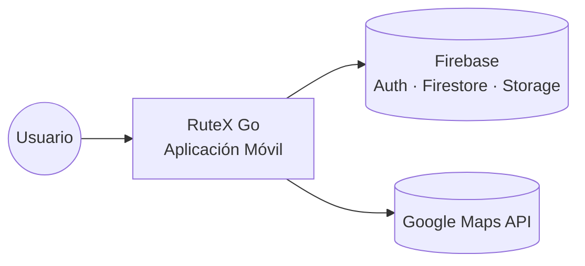
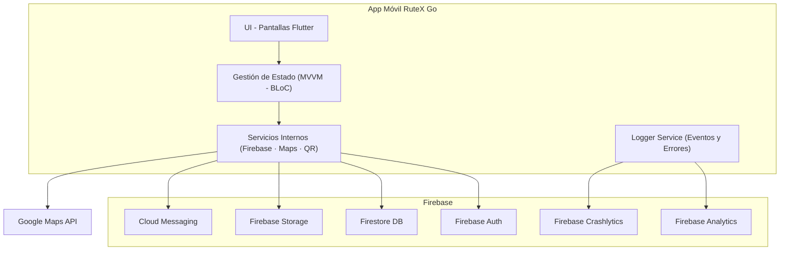
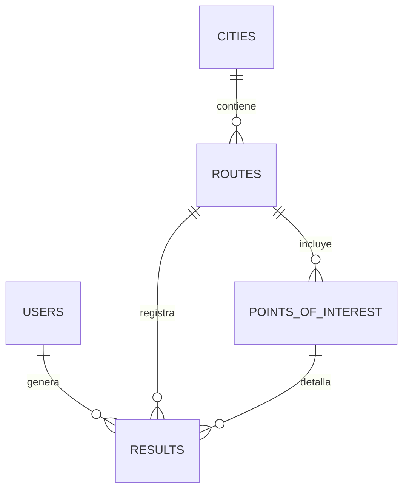
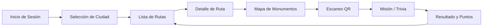

# RuteX Go – Documentación Técnica
**TurisTech Team – Proyecto DAM 2024/2025**  
**Stack principal:** Flutter · Firebase · Google Maps API

---

# 📑 Índice

1. [Introducción](#1-introducción)  
2. [Arquitectura](#2-arquitectura)  
   - 2.1 [Vista de Contexto (C1)](#21-vista-de-contexto-c1)  
   - 2.2 [Vista de Contenedores (C2)](#22-vista-de-contenedores-c2)  
   - 2.3 [Decisiones de Arquitectura (ADR)](#23-decisiones-de-arquitectura-adr)  
3. [Módulos Funcionales](#3-módulos-funcionales)  
4. [Modelo de Datos](#4-modelo-de-datos)  
5. [Integraciones y Dependencias](#5-integraciones-y-dependencias)  
6. [Requisitos No Funcionales (NFR)](#6-requisitos-no-funcionales-nfr)  
7. [Diseño UI/UX](#7-diseño-uiux)  
8. [Plan de Pruebas y KPIs](#8-plan-de-pruebas-y-kpis)  
9. [Conclusiones Técnicas](#9-conclusiones-técnicas)  
10. [Roadmap y Evolución del Sistema](#10-roadmap-y-evolución-del-sistema)

---

# 1. Introducción

RuteX Go es una aplicación móvil gamificada diseñada para transformar la experiencia turística en ciudades con un alto valor patrimonial. La app guía al usuario a través de rutas culturales, combina navegación mediante mapa con la validación de llegada a monumentos mediante códigos QR y ofrece misiones educativas que otorgan puntos y rangos dentro del sistema de gamificación.

El propósito de esta documentación es describir de forma clara y estructurada la arquitectura del proyecto, sus módulos funcionales, el modelo de datos utilizado, las integraciones que emplea, los requisitos no funcionales y el plan de pruebas realizado. Está orientada a evaluadores académicos y desarrolladores que requieran entender la base técnica del sistema.

## Objetivos Técnicos Principales

- Implementar una arquitectura modular, escalable y mantenible.  
- Utilizar Firebase como backend para autenticación, base de datos y almacenamiento.  
- Integrar Google Maps API para ayudar al usuario a orientarse durante las rutas.  
- Diseñar un modelo de datos flexible para permitir la expansión a nuevas ciudades y contenidos.  
- Garantizar un rendimiento estable y una experiencia intuitiva en dispositivos móviles.  

RuteX Go se sustenta sobre **Firebase** como Backend-as-a-Service, lo que permite un desarrollo rápido y seguro, y sobre **Google Maps API**, que facilita la visualización del mapa y la ubicación aproximada del usuario durante las rutas.

---

# 2. Arquitectura

La arquitectura de RuteX Go está diseñada para ser ligera, escalable y fácil de mantener.  
El proyecto combina Flutter como framework de desarrollo móvil y Firebase como backend principal, junto con Google Maps API para funcionalidades de orientación en el mapa.

A continuación se describen las vistas arquitectónicas principales del sistema.

---

## 2.1 Vista de Contexto (C1)

Representa el sistema desde una perspectiva de alto nivel, mostrando cómo interactúan los usuarios y los servicios externos.



- **Usuario** → interactúa con la app móvil.
- **App móvil RuteX Go (Flutter/Kotlin)** → UI, lógica de presentación y orquestación.
- **Firebase** → Auth, Firestore, Storage, Messaging.
- **Google Maps API** → mapas, geolocalización y cálculo de distancias.

### 2.2 Vista de Contenedores (C2)

La vista C2 muestra los principales contenedores lógicos que forman el sistema, así como sus relaciones. Representa cómo se divide la aplicación internamente y qué servicios externos utiliza para funcionar.



**Descripción de los contenedores principales:**

- **App móvil RuteX Go**
  - *UI:* pantallas desarrolladas en Flutter.  
  - *Gestión de Estado:* coordinación entre UI y lógica de negocio mediante MVVM/BLoC.  
  - *Servicios internos:* módulos que gestionan Firestore, Auth, el lector QR, el mapa y el GPS.  
  - *Logger Service:* centraliza el envío de eventos (Analytics) y errores (Crashlytics).

- **Firebase**
  - *Auth:* gestiona el inicio de sesión y el registro.  
  - *Firestore:* almacena ciudades, rutas, monumentos, misiones, usuarios y rankings.  
  - *Storage:* almacén para imágenes (cuando se habilite).  
  - *Cloud Messaging:* previsto para notificaciones futuras.  
  - *Analytics:* registra eventos clave de uso para mejorar la aplicación.  
  - *Crashlytics:* recopila errores y fallos de ejecución en tiempo real.

- **Google Maps API**
  - Ofrece el mapa interactivo y la posición aproximada del usuario para navegación visual.

---

### 2.3 Decisiones de Arquitectura (ADR)

### ADR-001 – Firebase como BaaS  
Firebase permite autenticación segura, base de datos en tiempo real, almacenamiento, analíticas y despliegue sin necesidad de servidores propios. Reduce coste y complejidad.

### ADR-002 – Flutter + Kotlin  
Permite desarrollar interfaces modernas y multiplataforma, acelerando el desarrollo y asegurando consistencia visual. 
Kotlin se usa en funcionalidades que requieran acceso directo al hardware o SDKs específicos del sistema operativo.

### ADR-003 – Firestore como base de datos NoSQL  
Ideal para estructuras dinámicas, consultas rápidas y sincronización en tiempo real. La app puede escalar fácilmente añadiendo nuevas rutas, ciudades y contenido sin reestructurar la base.

Ofrece sincronización en tiempo real y reglas de seguridad integradas con Firebase Auth.

---

# 3. Módulos Funcionales

RuteX Go se estructura en una serie de módulos funcionales que trabajan de manera conjunta para ofrecer una experiencia turística gamificada.  
El GPS se utiliza únicamente para orientar al usuario en el mapa, mientras que la validación de llegada a los monumentos se realiza mediante códigos QR, garantizando precisión y fiabilidad.

Los módulos principales son:

- Autenticación
- Selección de ciudad
- Rutas
- Escaneo QR
- Misiones y trivias
- Rankings
- Perfil del usuario

---

## 3.1 Módulo de Autenticación

Gestionado mediante Firebase Authentication.

**Funciones:**
- Registro con email y contraseña  
- Inicio de sesión  
- Recuperación de contraseña  
- Manejo de errores comunes  
- Creación del documento `users/{uid}` en Firestore  

---

## 3.2 Módulo de Selección de Ciudad

Permite al usuario elegir en qué ciudad quiere realizar las rutas.

**Funciones:**
- Cargar ciudades desde Firestore (`cities`)  
- Mostrar ciudades disponibles  
- Filtrar rutas según ciudad seleccionada  
- Guardar selección en `users.city`  

Este módulo hace posible escalar a más ciudades sin cambiar la estructura de la app.

---

## 3.3 Módulo de Rutas

Presenta las rutas disponibles en cada ciudad y permite iniciar su recorrido.

**Funciones principales:**
- Mostrar lista de rutas con:  
  - Nombre  
  - Duración  
  - Dificultad  
  - Puntos totales  
- Navegación por mapa usando GPS  
- Visualización de monumentos sobre el mapa  
- Indicador del monumento actual y los siguientes  
- Acceso directo al escáner QR  
- Seguimiento visual del progreso del usuario  

---

### Uso del GPS (solo navegación)
El GPS no activa misiones ni valida llegada.  
Se utiliza únicamente para:

- Mostrar la ubicación aproximada del usuario  
- Ayudarle a orientarse  
- Calcular distancia aproximada a monumentos  

Cumple con los requisitos funcionales (HU-014) y no funcionales (NFR-005).

---

### Validación del monumento (QR)

La llegada al monumento se confirma mediante un código QR.

**Proceso:**
1. El usuario llega al monumento.  
2. Escanea el QR asociado.  
3. La app obtiene el ID del monumento desde el QR.  
4. Si coincide con el monumento que corresponde en la ruta → se desbloquea la misión.  

**Ventajas:**
- Precisión total  
- Sin errores por señal GPS baja  
- Evita trampas de ubicación simulada  
- Flujo claro para el usuario  

---

## 3.4 Módulo de Escaneo QR

Módulo encargado de validar la llegada al monumento.

**Características:**
- Escáner QR integrado  
- Validación del ID del monumento  
- Bloqueo si el QR no corresponde al punto actual  
- Desbloqueo automático de la misión asociada  
- Manejo de errores: QR inválido, cámara sin permisos, etc.  

Dependencias usadas (según la implementación elegida):  
`qr_code_scanner` o `mobile_scanner`.

---

## 3.5 Módulo de Misiones y Trivias

Cada monumento incluye una misión con preguntas educativas.

**Características:**
- 3 preguntas tipo test por misión  
- 4 opciones por pregunta  
- Corrección automática  
- Puntuación basada en aciertos  
- Bonus por completar sin errores  
- Guardado del progreso en Firestore  

Actualiza:  
- `users.points`  
- `users.rank`  
- `rankings`  

---

## 3.6 Módulo de Rankings

Tabla de puntuaciones por ciudad.

**Funciones:**
- Actualización automática tras cada misión  
- Vista ordenada por puntos  
- Ranking por ciudad  

Extensible a versiones futuras:  
- Ranking semanal/mensual  
- Ranking global  
- Ranking entre amigos  

---

## 3.7 Módulo de Perfil del Usuario

Muestra información principal:

- Nombre  
- Email  
- Ciudad activa  
- Rango actual  
- Puntos totales  
- Rutas completadas  

Futuras mejoras posibles:
- Personalización de avatar  
- Historial de misiones  
- Logros y badges  

---

# 4. Modelo de Datos

El modelo de datos de **RuteX Go** está construido sobre **Firebase Firestore**, una base de datos NoSQL orientada a documentos. Esta estructura está diseñada para minimizar las lecturas de red, permitiendo que la aplicación funcione de manera fluida y escalable.

Las colecciones principales son:

- `users`: Perfiles de usuario y estadísticas globales.
- `cities`: Catálogo de ciudades disponibles.
- `routes`: Guías de los recorridos turísticos.
- `points_of_interest`: Puntos de interés (POI) con misiones y trivias integradas.
- `results`: Historial detallado de rutas completadas para el resumen final.

---

## 4.1 Colección: `users`

Almacena la información principal y el progreso acumulado de cada usuario registrado.

| Campo | Tipo | Descripción |
| :--- | :--- | :--- |
| name | string | Nombre completo del usuario. |
| email | string | Correo electrónico asociado a la cuenta. |
| rank | string | Título obtenido basado en puntos (ej: "Explorador", "Legionario"). |
| points | number | Total de puntos acumulados globalmente. |
| routesCompleted | array<string> | Lista de identificadores de las rutas finalizadas. |
| createdAt | timestamp | Fecha de creación del perfil. |
| lastLogin | timestamp | Registro del último acceso a la aplicación. |

---

## 4.2 Colección: `cities`

Define las ciudades disponibles donde se pueden realizar rutas.

| Campo | Tipo | Descripción |
| :--- | :--- | :--- |
| name | string | Nombre de la ciudad (ej: "Mérida"). |
| isActive | boolean | Determina si la ciudad es visible y seleccionable. |
| imageURL | string(url) | Imagen representativa de la ciudad para la UI. |

---

## 4.3 Colección: `routes`

Define las plantillas de los recorridos culturales en cada ciudad.

| Campo | Tipo | Descripción |
| :--- | :--- | :--- |
| cityId | string | Referencia al ID del documento de la ciudad. |
| name | string | Título visible de la ruta turística. |
| durationEst | string | Tiempo aproximado de recorrido (ej: "1h 30min"). |
| difficulty | string | Nivel de dificultad (Fácil, Media, Difícil). |
| poiIds | array<string> | Lista ordenada de IDs de puntos de interés que componen la ruta. |
| totalRewardPoints | number | Suma total de puntos que otorga la ruta al finalizar. |
| isActive | boolean | Estado operativo de la ruta. |

---

## 4.4 Colección: `points_of_interest`

Contiene la información histórica, ubicación geográfica y la lógica de la misión/trivia.

| Campo | Tipo | Descripción |
| :--- | :--- | :--- |
| name | string | Nombre del punto de interés (museo, monumento, etc.). |
| description | string | Información histórica o curiosidades del lugar. |
| location | geopoint | Coordenadas GPS (Latitud/Longitud) para el mapa y geovallas. |
| imageURL | string(url) | URL de la fotografía del POI. |
| mission | map | Objeto que encapsula la gamificación. |

**Estructura interna de `mission`:**
- `title` (string): Título de la misión específica.
- `pointsReward` (number): Puntos obtenidos al completar esta parada.
- `questions` (array<map>): Lista de preguntas tipo test:
    - `question` (string): Enunciado de la pregunta.
    - `options` (array<string>): Lista de las 4 opciones de respuesta.
    - `correctIndex` (number): Índice (0-3) de la respuesta correcta.

---

## 4.5 Colección: `results`

Almacena el registro histórico de cada ruta finalizada. Es la fuente de datos para la pantalla de resumen.

| Campo | Tipo | Descripción |
| :--- | :--- | :--- |
| userId | string | ID del usuario que completó la ruta. |
| routeId | string | ID de la ruta realizada. |
| pointsObtained | number | Puntos reales ganados en esa partida. |
| timeUsed | string | Tiempo real empleado por el usuario. |
| completedAt | timestamp | Fecha y hora de finalización del recorrido. |
| details | array<map> | Resumen de cada respuesta: `pregunta`, `respuesta_usuario`, `respuesta_correcta`, `es_acierto`. |

---

## 4.6 Diagrama ER del Modelo de Datos

A continuación se presenta la relación lógica entre las colecciones:



---

# 5. Integraciones y Dependencias

RuteX Go utiliza una serie de servicios externos y paquetes que permiten implementar autenticación, base de datos, navegación por mapa y validación mediante códigos QR.  
Las integraciones están clasificadas según su relevancia dentro del MVP.

---

## 5.1 Integraciones confirmadas para el MVP

### Firebase Authentication
Servicio utilizado para:
- Registro de nuevos usuarios  
- Inicio de sesión  
- Recuperación de contraseña  

Permite gestionar autorizaciones de forma segura sin crear un backend propio.

---

### Firestore (Firebase)
Base de datos principal del proyecto.

Almacena información de:
- Usuarios  
- Ciudades  
- Rutas  
- Monumentos  
- Misiones  
- Rankings  

Su estructura NoSQL facilita ampliaciones sin necesidad de modificar esquemas.

---

### Google Maps API
Usada exclusivamente para ayudar al usuario a orientarse durante las rutas.

Funciones:
- Mostrar el mapa de la ciudad  
- Mostrar la ubicación aproximada del usuario  
- Mostrar marcadores de los monumentos  

No se utiliza para validar llegada al monumento.

---

### Lector de Códigos QR
Recurso utilizado para validar que el usuario llega físicamente al monumento.

Proceso:
1. El usuario escanea el QR del monumento.  
2. La app obtiene el ID codificado.  
3. Se valida que corresponde al monumento actual de la ruta.  
4. La misión asociada se desbloquea.  

Ventajas:
- Precisión total  
- No depende de la señal GPS  
- Evita falsificación de ubicación  
- Flujo de uso claro para el usuario  

Paquetes recomendados:
- `qr_code_scanner`  
- `mobile_scanner`

---

## 5.2 Integraciones recomendadas (futuras fases)

### Firebase Storage
Para almacenar imágenes en alta calidad:
- Monumentos  
- Ciudades  
- Recursos visuales del sistema  

Opcional para el MVP.

---

### Firebase Cloud Messaging
Permite notificaciones push en versiones posteriores:
- Nuevas rutas añadidas  
- Recompensas  
- Eventos turísticos  

---

## 5.3 Integraciones futuras (post-MVP)

### Google Directions API
Para navegación guiada paso a paso entre monumentos.

---

### NFC / Beacons
Validación automática de llegada sin necesidad de escanear QR.

---

### Realidad Aumentada (ARCore / ARKit)
Para superponer contenido histórico sobre los monumentos.

---

## 5.4 Dependencias iniciales en Flutter

```yaml
dependencies:
  flutter:
    sdk: flutter
  firebase_core: ^latest
  firebase_auth: ^latest
  cloud_firestore: ^latest
  google_maps_flutter: ^latest
  qr_code_scanner: ^latest
  provider: ^latest
```

---

# 6. Requisitos No Funcionales (NFR)

Los Requisitos No Funcionales establecen las condiciones clave que deben cumplirse para garantizar que RuteX Go ofrezca un rendimiento estable, seguro y una experiencia de usuario adecuada.

Cada requisito está identificado mediante un código único:  
**NFR-001, NFR-002, …**

---

### NFR-001 — Tiempo de respuesta
La aplicación debe mantener tiempos de carga inferiores a **2–3 segundos** en:
- Pantallas principales  
- Lista de rutas  
- Mapa  
- Misiones  
- Perfil de usuario  

Esto asegura una experiencia fluida.

---

### NFR-002 — Seguridad en autenticación
El acceso al sistema debe gestionarse mediante **Firebase Authentication**.  
Las credenciales:
- No se almacenan en local  
- Se transmiten siempre cifradas  
- Están protegidas por el sistema de autenticación de Firebase  

---

### NFR-003 — Comunicaciones cifradas
Toda comunicación con servicios externos debe realizarse a través de:
- **HTTPS**

Esto garantiza confidencialidad e integridad en el intercambio de datos.

---

### NFR-004 — Interfaz intuitiva
La app debe mantener:
- Coherencia visual  
- Jerarquía clara de elementos  
- Navegación sencilla para cualquier usuario  

---

### NFR-005 — Navegación GPS estable
El sistema debe actualizar la posición del usuario aproximadamente cada **2–3 segundos**, siempre que la señal GPS lo permita, para:
- Mostrar ubicación actual  
- Mejorar la orientación en el mapa  

No se usa el GPS para validar llegada al monumento.

---

### NFR-006 — Registro de eventos
El sistema debe registrar en Firebase Analytics los siguientes eventos:
- Inicio de sesión  
- Selección de ruta  
- Monumentos validados  
- Misiones completadas  
- Errores relevantes  

Estos datos permiten mejorar futuras versiones del sistema.

---

### NFR-007 — Pruebas de calidad
La aplicación debe someterse a:
- Pruebas unitarias  
- Pruebas de integración  
- Pruebas funcionales  
- Pruebas de rendimiento  
- Pruebas de usabilidad  

---

### NFR-008 — Accesibilidad mínima
El diseño debe respetar criterios de accesibilidad como:
- Contraste adecuado  
- Tipografías legibles  
- Botones accesibles  

---

### NFR-009 — Consumo eficiente de recursos
La app debe minimizar el consumo de:
- Batería  
- CPU  
- Datos móviles  

Especialmente por el uso de GPS y Google Maps.

---

### NFR-010 — Disponibilidad y tolerancia a fallos
El sistema debe mantener funcionamiento aceptable ante:
- Pérdidas temporales de conexión  
- Errores en Firestore  
- Bajo rendimiento del dispositivo  

La aplicación debe almacenar en caché información esencial como:
- Ciudades  
- Rutas  
- Monumentos  

Esto permite consultar la información incluso sin conexión momentánea.

---

# 7. Diseño UI/UX y Prototipo Figma

El diseño de RuteX Go sigue una línea visual moderna y accesible centrada en la simplicidad, claridad y usabilidad.  
El objetivo principal es que cualquier usuario, incluso sin experiencia tecnológica, pueda navegar por la aplicación sin dificultades.

El prototipo completo del sistema está desarrollado en Figma.

---

## 7.1 Principios de Diseño

El diseño UI/UX se estructura sobre los siguientes principios:

- **Simplicidad:** Pantallas limpias, sin sobrecarga visual.
- **Claridad:** Jerarquía bien definida en títulos, textos y botones.
- **Coherencia:** Todos los módulos comparten la misma guía de estilos.
- **Accesibilidad:** Colores con buen contraste, tipografías legibles y elementos grandes.
- **Gamificación:** El usuario percibe progreso mediante rangos, puntos y misiones.

Estos principios permiten que la navegación sea intuitiva y agradable durante las rutas turísticas.

---

## 7.2 Sistema de Colores

La identidad visual toma inspiración de colores asociados a Extremadura y al turismo cultural.

| Uso | Color | Código |
|-----|--------|---------|
| Color principal | Verde oscuro | `#007A3D` |
| Color secundario | Verde claro | `#4CAF70` |
| Fondo | Blanco | `#FFFFFF` |
| Texto secundario | Gris neutro | `#7A8587` |
| Texto principal | Negro suave | `#2F3333` |
| Títulos destacados | Negro | `#0B0B0B` |

Se busca una combinación equilibrada entre profesionalidad y estética turística.

---

## 7.3 Tipografía

La tipografía elegida para toda la aplicación es **Montserrat**, por su legibilidad y estilo moderno.

| Uso | Tamaño | Peso |
|-----|--------|-------|
| H1 | 28 px | Bold |
| H2 | 22 px | SemiBold |
| Texto base | 16 px | Regular |
| Inputs / Secundario | 14 px | Regular |

---

## 7.4 Estilo Visual y Componentes

Los componentes mantienen una estética consistente:

- Botones con esquinas redondeadas
- Tarjetas con sombra suave
- Iconos claros y minimalistas
- Mapa integrado con marcadores personalizados
- Barra de navegación inferior simple
- Tarjetas rectangulares para rutas y misiones

**Componentes destacados:**

- `PrimaryButton`
- `SecondaryButton`
- `RouteCard`
- `MissionCard`
- `QRScannerButton`
- `NavigationBar`
- `RankingItem`
- `MapMarker (custom)`

---

## 7.5 Flujo de Navegación

Este es el flujo principal del usuario dentro de la app:



El flujo garantiza que el usuario siempre sabe “cuál es el siguiente paso”.

---

## 7.6 Pantallas del Prototipo

Las pantallas definidas en Figma incluyen:

### 🔹 Autenticación
- Inicio de sesión  
- Registro  
- Recuperación de contraseña  

### 🔹 Selección de Ciudad
- Lista de ciudades activas  
- Vista previa con imagen y descripción  

### 🔹 Rutas Disponibles
- Tarjetas con duración, dificultad y puntos  
- Orden de visita  

### 🔹 Detalle de Ruta
- Descripción  
- Lista ordenada de monumentos  
- Botón para iniciar la ruta  

### 🔹 Vista de Mapa
- Ubicación actual del usuario  
- Marcadores de los monumentos  
- Acceso al lector QR  

### 🔹 Escáner QR
- Cámara integrada  
- Validación del monumento actual  
- Manejo de errores  

### 🔹 Misiones
- Tres preguntas por monumento  
- Interfaz clara y directa  
- Puntuación inmediata  

### 🔹 Perfil del Usuario
- Puntos  
- Rango  
- Rutas completadas  

---

## 7.7 Enlace al Prototipo Figma

El prototipo completo puede consultarse aquí:

👉 **https://www.figma.com/design/e0CsJ3JseYF9CZ494aazFS/RuteX-Go?node-id=0-1**

Incluye:
- Mockups detallados  
- Prototipo navegable  
- Biblioteca de componentes  
- Guía de estilos  

---

# 8. Plan de Pruebas y KPIs

El plan de pruebas de RuteX Go tiene como objetivo asegurar que la aplicación funciona de forma estable, cumple los requisitos funcionales y no funcionales y ofrece una buena experiencia al usuario.  
El proceso incluye pruebas unitarias, de integración, funcionales, de rendimiento, de usabilidad y pruebas reales en entornos turísticos.

---

## 8.1 Objetivos del Plan de Pruebas

- Validar que todas las funcionalidades principales se comportan como se espera.  
- Detectar y corregir errores antes de la entrega del MVP.  
- Garantizar fluidez en el uso de la aplicación.  
- Evaluar métricas clave de rendimiento y usabilidad.  
- Verificar la estabilidad del sistema ante diferentes escenarios (conexión débil, GPS irregular, QR inválido, etc.).

---

## 8.2 Tipos de Pruebas

### 8.2.1 Pruebas Unitarias
Se centran en funciones pequeñas e independientes:

- Validación de respuestas de misiones  
- Cálculo de puntuaciones  
- Carga de datos desde Firestore  
- Manejo de estados básicos  
- Formateo de datos visualizados  

**Objetivo:** verificar que cada unidad del código funciona correctamente de manera aislada.

---

### 8.2.2 Pruebas de Integración
Verifican la interacción entre distintos módulos:

- Autenticación ↔ Firestore  
- Rutas ↔ Monumentos  
- Monumentos ↔ Misiones  
- Misiones ↔ Rankings  
- Escaneo QR ↔ Validación de monumento  
- Mapa ↔ GPS  

**Objetivo:** asegurar que los componentes funcionan bien cuando colaboran.

---

### 8.2.3 Pruebas Funcionales (End-to-End)
Simulan el recorrido completo del usuario real:

1. Iniciar sesión  
2. Seleccionar ciudad  
3. Seleccionar ruta  
4. Ver monumentos en el mapa  
5. Llegar a un monumento  
6. Escanear el QR  
7. Completar la misión  
8. Obtener puntuación y avanzar  

**Objetivo:** validar que el flujo principal de la aplicación funciona sin interrupciones.

---

### 8.2.4 Pruebas de Usabilidad
Realizadas con usuarios piloto:

- Claridad de los textos y botones  
- Facilidad de entender la navegación  
- Tiempo para completar misiones  
- Opinión general del diseño visual  

**Objetivo:** asegurar una experiencia intuitiva y accesible.

---

### 8.2.5 Pruebas de Rendimiento
Prueban que la app cumple con los Requisitos No Funcionales:

- Tiempos de carga < 3 segundos  
- Consumo razonable de batería  
- Renderizado fluido del mapa  
- Escaneo QR sin retardos  
- Respuesta estable del GPS  

**Objetivo:** garantizar un rendimiento óptimo y constante.

---

### 8.2.6 Pruebas Piloto en Entorno Real
Realizadas en Mérida:

- Teatro Romano  
- Templo de Diana  
- Alcazaba  
- Zona centro  

Pruebas realizadas:

- Escaneo QR en condiciones de luz variadas  
- Comportamiento del GPS entre edificios  
- Rendimiento con cobertura limitada  
- Validación correcta de misiones  

**Objetivo:** confirmar que el MVP funciona en situaciones reales de uso turístico.

---

## 8.3 Estrategia General de Testing

La estrategia se divide en tres fases:

### 🟩 Fase 1 — Pruebas internas
- Verificación de módulos individuales  
- Revisión de UI y navegación  
- Corrección continua durante el desarrollo  

### 🟦 Fase 2 — Pruebas con usuarios reales (piloto)
- Se realizan pruebas en rutas reales  
- Recogida de opiniones y problemas detectados  
- Ajustes de diseño y flujo  

### 🟥 Fase 3 — Revisión final
- Validación de requisitos funcionales y no funcionales  
- Comprobación de rendimiento  
- Generación de documentación final  

---

## 8.4 KPIs (Indicadores Clave de Rendimiento)

### KPIs Técnicos
| KPI | Objetivo |
|-----|----------|
| Tiempo de carga | < 3 segundos |
| Fallos/crashes | < 1% |
| Precisión del GPS | Estable en exteriores |
| Latencia del escaneo QR | < 0.5 segundos |

---

### KPIs de Usuario
| KPI | Objetivo |
|-----|----------|
| Misiones completadas | > 70% de usuarios piloto |
| Flujo intuitivo | > 80% navega sin ayuda |
| Satisfacción general | > 4/5 |
| Tiempo medio para volver a rutas | < 2 segundos |

---

### KPIs de Usabilidad
| KPI | Objetivo |
|-----|----------|
| Clics necesarios por acción | 1–3 |
| Tiempo para completar una misión | < 2 minutos |
| Errores de QR | < 5% |

---

## 8.5 Herramientas de Testing

- **Flutter DevTools** → inspección y rendimiento  
- **Firebase Crashlytics** → seguimiento de errores  
- **Android Studio Profiler** → análisis de CPU, memoria y batería  
- **Google Maps Logs** → depuración de posición y mapa  
- **Dispositivos reales** → pruebas de campo  

---

## 8.6 Conclusión del Plan de Pruebas

El plan definido cubre todos los aspectos necesarios para garantizar:

- Funcionamiento estable  
- Interacciones correctas entre módulos  
- Fluidez en el uso diario  
- Cumplimiento de los requisitos originales  
- Base sólida para mejorar futuras versiones  

RuteX Go queda evaluada adecuadamente para su presentación y evolución en próximas etapas del proyecto.

---

# 9. Conclusiones Técnicas

El desarrollo de RuteX Go ha permitido construir una arquitectura sólida basada en tecnologías actuales y adecuadas para un proyecto académico con visión realista. La combinación de Flutter, Firebase y Google Maps ofrece un equilibrio óptimo entre simplicidad, escalabilidad y velocidad de desarrollo.

Las decisiones técnicas adoptadas garantizan:

- Una base de datos flexible preparada para crecer con nuevas ciudades y rutas.  
- Un sistema de autenticación seguro sin necesidad de un backend propio.  
- Un modelo de navegación claro que orienta al usuario sin depender de proximidad GPS.  
- Un mecanismo fiable de validación mediante códigos QR, que mejora la precisión en monumentos.  
- Un flujo de usuario estable y bien estructurado gracias a la separación de módulos.  

La arquitectura está preparada para evolucionar en futuras fases, añadiendo nuevas funcionalidades avanzadas sin necesidad de reescribir el sistema. La calidad del diseño UI/UX junto con la planificación de pruebas asegura que la experiencia del usuario sea coherente, fluida y atractiva.

RuteX Go se encuentra en una etapa sólida para continuar su crecimiento y convertirse en una plataforma turística gamificada de referencia en Extremadura.

---

# 10. Roadmap y Evolución del Sistema

La planificación del roadmap permite visualizar la evolución del proyecto más allá del MVP actual. RuteX Go está diseñado para crecer de forma modular, incorporando nuevas funcionalidades a medida que avanza su desarrollo académico.

---

## 10.1 Mejoras previstas a corto plazo

Estas mejoras se plantean para próximas evaluaciones:

### 🔹 Firebase Storage
- Almacenar imágenes y recursos multimedia de alta calidad.  
- Reducir el tamaño final de la aplicación.  

### 🔹 Notificaciones push (Firebase Cloud Messaging)
- Avisos de nuevas rutas.  
- Recordatorios de misiones pendientes.  
- Mensajes promocionales o históricos.  

### 🔹 Sistema de logros y recompensas
- Badges visuales para hitos conseguidos.  
- Logros temáticos según épocas o rutas.  

### 🔹 Mejoras del mapa
- Opciones de vista detallada.  
- Trazado de rutas entre monumentos.  
- Mayor optimización de carga.  

### 🔹 Panel de administración
- Gestión interna de contenido (ciudades, rutas, preguntas).  
- Estadísticas para evaluadores y docentes.  

---

## 10.2 Evolución a medio plazo

### 🔵 Google Directions API
Proporcionar navegación guiada paso a paso al usuario.

### 🔵 Funcionalidades sociales
- Rankings semanales/mensuales  
- Seguimiento entre amigos  
- Eventos gamificados  

### 🔵 Ampliación a nuevas ciudades de Extremadura
- Cáceres  
- Badajoz  
- Trujillo  
- Plasencia  

La estructura de datos está preparada para ello.

---

## 10.3 Evolución a largo plazo

### 🟣 Tecnologías de proximidad avanzadas
- NFC  
- Beacons  
Permiten validar la llegada sin necesidad de escaneo QR.

### 🟣 Realidad aumentada (AR)
- Recreación histórica sobre monumentos  
- Elementos 3D interactivos  
- Explicaciones visuales superpuestas  

### 🟣 Expansión multiplataforma
- Publicación en iOS  
- Panel web de administración  
- Kioscos turísticos digitales  

---

## 10.4 Visión final del proyecto

La visión de RuteX Go es convertirse en una plataforma turística gamificada capaz de integrarse con instituciones, museos y comercios locales. Su estructura técnica permite:

- Escalar geográficamente  
- Integrar nuevas tecnologías  
- Ampliar la experiencia educativa y cultural  
- Evolucionar hacia un producto profesional  

---

## 10.5 Conclusión del Roadmap

El MVP actual sienta los cimientos necesarios para avanzar con seguridad hacia versiones más completas.  
La aplicación está lista para crecer tanto en complejidad técnica como en contenido, manteniendo siempre la filosofía principal:

**Un turismo cultural más interactivo, educativo y accesible.**

---


