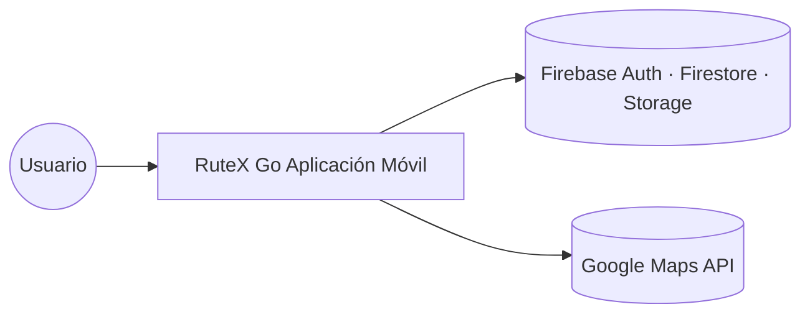
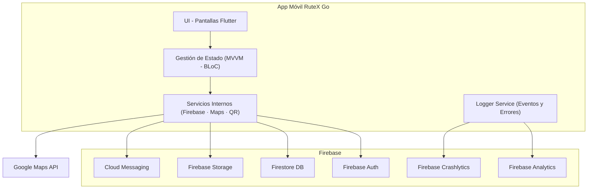
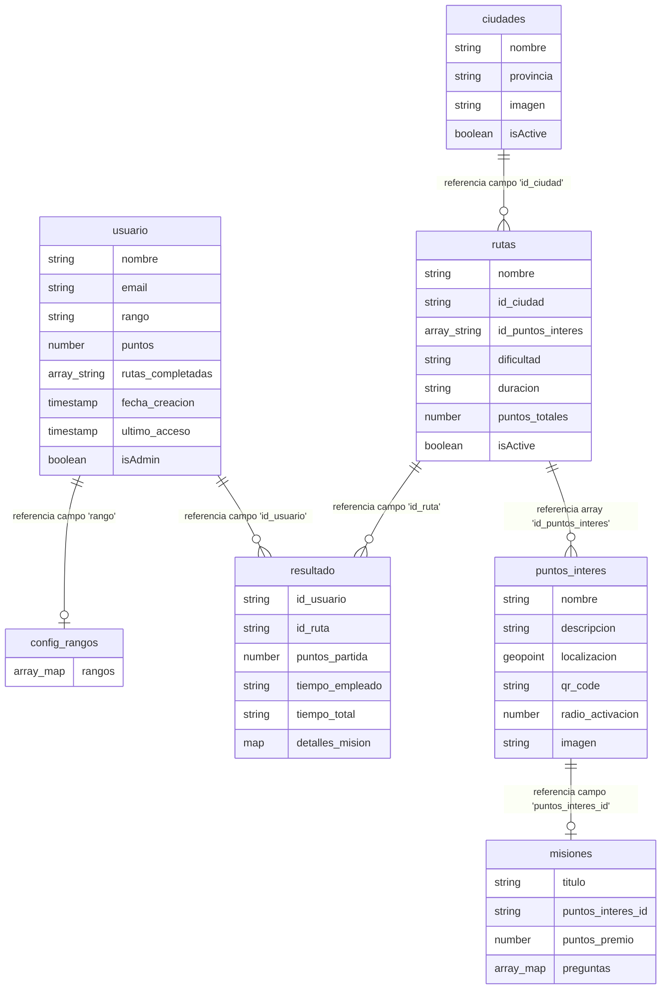
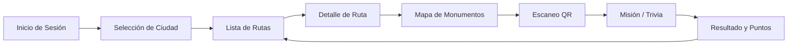

# RuteX Go – Documentación Técnica
**TurisTech Team – Proyecto DAM 2024/2025**  
**Stack principal:** Flutter · Firebase · Google Maps API

---

# 📑 Índice

1. [Introducción](#1-introducción)  
2. [Arquitectura](#2-arquitectura)  
   - 2.1 [Vista de Contexto (C1)](#21-vista-de-contexto-c1)  
   - 2.2 [Vista de Contenedores (C2)](#22-vista-de-contenedores-c2)  
   - 2.3 [Decisiones de Arquitectura (ADR)](#23-decisiones-de-arquitectura-adr)  
3. [Módulos Funcionales](#3-módulos-funcionales)  
4. [Modelo de Datos](#4-modelo-de-datos)  
5. [Integraciones y Dependencias](#5-integraciones-y-dependencias)  
6. [Requisitos No Funcionales (NFR)](#6-requisitos-no-funcionales-nfr)  
7. [Diseño UI/UX](#7-diseño-uiux)  
8. [Plan de Pruebas y KPIs](#8-plan-de-pruebas-y-kpis)  
9. [Conclusiones Técnicas](#9-conclusiones-técnicas)  
10. [Roadmap y Evolución del Sistema](#10-roadmap-y-evolución-del-sistema)

---

# 1. Introducción

RuteX Go es una aplicación móvil gamificada diseñada para transformar la experiencia turística en ciudades con un alto valor patrimonial. La app guía al usuario a través de rutas culturales, combina navegación mediante mapa con la validación de llegada a puntos de interés mediante códigos QR y ofrece misiones educativas que otorgan puntos y rangos dentro del sistema de gamificación.

El propósito de esta documentación es describir de forma clara y estructurada la arquitectura del proyecto, sus módulos funcionales, el modelo de datos utilizado, las integraciones que emplea, los requisitos no funcionales y el plan de pruebas realizado. Está orientada a evaluadores académicos y desarrolladores que requieran entender la base técnica del sistema.

## Objetivos Técnicos Principales

- Implementar una arquitectura modular, escalable y mantenible.  
- Utilizar Firebase como backend para autenticación, base de datos (**Cloud Firestore**) y almacenamiento.  
- Integrar Google Maps API para ayudar al usuario a orientarse durante las rutas.  
- Diseñar un modelo de datos flexible para permitir la expansión a nuevas ciudades y contenidos.  
- Garantizar un rendimiento estable y una validación de presencia física fiable mediante tecnología QR.  

RuteX Go se sustenta sobre **Firebase** como Backend-as-a-Service, lo que permite un desarrollo rápido y seguro, y sobre **Google Maps API**, que facilita la visualización del mapa y la ubicación aproximada del usuario durante las rutas.

---

# 2. Arquitectura

La arquitectura de RuteX Go está diseñada para ser ligera, escalable y fácil de mantener.  
El proyecto combina Flutter como framework de desarrollo móvil y Firebase como backend principal, junto con Google Maps API para funcionalidades de orientación en el mapa.

A continuación se describen las vistas arquitectónicas principales del sistema.

---

## 2.1 Vista de Contexto (C1)

Representa el sistema desde una perspectiva de alto nivel, mostrando cómo interactúan los usuarios y los servicios externos.



- **Usuario** → interactúa con la app móvil.
- **App móvil RuteX Go (Flutter)** → UI, lógica de presentación y orquestación.
- **Firebase** → Auth, Firestore, Storage, Messaging.
- **Google Maps API** → mapas, geolocalización y cálculo de distancias.

### 2.2 Vista de Contenedores (C2)

La vista C2 muestra los principales contenedores lógicos que forman el sistema, así como sus relaciones. Representa cómo se divide la aplicación internamente y qué servicios externos utiliza para funcionar.



**Descripción de los contenedores principales:**

- **App móvil RuteX Go**
  - **UI:** Interfaz desarrollada en Flutter centrada en la experiencia del turista.
  - **Gestión de Estado:** Implementación del patrón MVVM para desacoplar la vista de la lógica de datos.
  - **Servicios internos:** Capa de abstracción para el manejo de Cloud Firestore, Firebase Auth y el módulo de escaneo QR.
  - **Logger Service:** Módulo encargado de reportar eventos de usuario y fallos críticos de la aplicación.

- **Firebase**
  - **Auth:** Gestión segura de identidades (Login/Registro).
  - **Firestore:** Almacenamiento documental de usuarios, ciudades, rutas, puntos de interés y resultados.
  - **Storage:** Repositorio de imágenes para puntos de interés y portadas de ciudades.
  - **Analytics & Crashlytics:** Herramientas de monitoreo de rendimiento y comportamiento del usuario.

- **Google Maps API**
  - Proporciona las capas de mapas y la visualización de la posición del usuario en tiempo real durante el recorrido de las rutas.

---

### 2.3 Decisiones de Arquitectura (ADR)

### ADR-001 – Firebase como Backend-as-a-Service (BaaS)
Se ha seleccionado Firebase para gestionar la infraestructura serverless, permitiendo autenticación segura, almacenamiento y analíticas sin la necesidad de administrar servidores propios. Esta decisión reduce drásticamente el coste operativo y la complejidad del despliegue inicial.

### ADR-002 – Desarrollo Multiplataforma con Flutter
La elección de Flutter permite desarrollar interfaces modernas y consistentes para múltiples plataformas desde un único código base. Se reserva el uso de **Kotlin** exclusivamente para integraciones nativas que requieran acceso directo al hardware del dispositivo o SDKs específicos del sistema operativo que no estén cubiertos por plugins de Flutter.

### ADR-003 – Cloud Firestore como Base de Datos NoSQL
Se adopta Firestore por su modelo orientado a documentos, ideal para estructuras de datos dinámicas y consultas de baja latencia. Su capacidad de sincronización en tiempo real y la integración nativa de reglas de seguridad con Firebase Auth garantizan que los datos de los usuarios y las rutas estén protegidos y actualizados instantáneamente.

---

# 3. Módulos Funcionales

RuteX Go se estructura en una serie de módulos funcionales que trabajan de manera conjunta para ofrecer una experiencia turística gamificada. El GPS se utiliza únicamente para orientar al usuario en el mapa, mientras que la validación de llegada a los **puntos de interés** se realiza mediante códigos QR, garantizando precisión y fiabilidad en la validación física.

Los módulos principales son:

- **Autenticación:** Gestión de acceso y registro de usuarios.
- **Selección de Ciudad:** Filtrado dinámico de contenido según la ubicación de interés.
- **Rutas y Navegación:** Visualización de itinerarios y orientación mediante el mapa.
- **Escaneo QR:** Validación técnica de llegada al punto de interés.
- **Misiones y Trivias:** Lógica de gamificación y aprendizaje interactivo.
- **Resultados y Progresión:** Registro de historial de rutas y actualización del rango global del usuario.
- **Perfil del Usuario:** Visualización de estadísticas, puntos acumulados y logros.

---

## 3.1 Módulo de Autenticación
Gestionado íntegramente mediante el SDK de Firebase Authentication para garantizar un estándar de seguridad elevado.

* **Funciones:** Registro de usuarios, inicio de sesión seguro, recuperación de contraseña mediante flujo de email y manejo de errores (formatos inválidos, contraseñas débiles).
* **Persistencia:** Gestión automática del estado de la sesión y generación del documento de perfil en la colección users/{uid} tras el registro exitoso.
* **Dependencias:** firebase_auth, cloud_firestore.

## 3.2 Módulo de Selección de Ciudad
Actúa como el filtro principal de contenido, permitiendo que la aplicación escale geográficamente de forma sencilla.

* **Funciones:** Consulta en tiempo real de la colección cities en Firestore, visualización de tarjetas con imagen y nombre de la ciudad, y filtrado dinámico de rutas según el cityId seleccionado.
* **Escalabilidad:** Permite la incorporación de nuevas sedes turísticas simplemente añadiendo documentos a la base de datos sin necesidad de actualizar el código de la app.
* **Dependencias:** cloud_firestore, provider.

## 3.3 Módulo de Rutas y Navegación
Presenta los itinerarios culturales y supervisa el recorrido del usuario integrando la lógica de navegación.

* **Funciones:** Visualización de fichas técnicas (duración, dificultad, puntos totales), renderizado de marcadores interactivos en el mapa y seguimiento del progreso del usuario.
* **Uso del GPS:** Se emplea exclusivamente para mostrar la ubicación en tiempo real y ayudar a la orientación. No activa misiones de forma automática, cumpliendo con los requisitos de eficiencia energética (NFR-005).
* **Dependencias:** google_maps_flutter, geolocator.

## 3.4 Módulo de Validación (QR)
Este componente es el núcleo de seguridad que confirma la presencia física del usuario en el punto de interés.

* **Proceso de validación:** El usuario escanea el código físico; la app extrae el ID y lo contrasta con el poiId esperado en la secuencia de la ruta actual.
* **Ventajas:** Elimina el margen de error del GPS en zonas urbanas densas y evita la validación fraudulenta mediante aplicaciones de ubicación simulada (Mock Locations).
* **Dependencias:** mobile_scanner (hardware de cámara), cloud_firestore (validación lógica).

## 3.5 Módulo de Misiones e Interacción (Trivias)
Núcleo educativo y de gamificación que transforma la visita en una experiencia interactiva.

* **Estructura:** Cuestionarios de 3 preguntas con 4 opciones cada una, con corrección automática y feedback inmediato.
* **Sistema de puntos:** Se asigna puntuación base por acierto y un "Bonus de Excelencia" si se completa la misión sin errores.
* **Impacto en perfil:** Al finalizar, se realiza una operación atómica en Firestore para actualizar los puntos totales del usuario, su rango y la tabla de resultados.
* **Dependencias:** cloud_firestore.

## 3.6 Módulo de Perfil y Resultados
Panel centralizado donde el usuario consulta su evolución y el historial de sus expediciones.

* **Gestión de Perfil:** Visualización del rango global (Novato, Explorador, Legionario, etc.) calculado dinámicamente según el puntaje acumulado.
* **Historial de Rutas:** Listado detallado obtenido de la colección results, mostrando fechas de realización, puntos obtenidos y nivel de acierto en las trivias.
* **Dependencias:** cloud_firestore, intl (formateo de fechas y números).

---

# 4. Modelo de Datos

El modelo de datos de **RuteX Go** está construido sobre **Firebase Firestore**, una base de datos NoSQL orientada a documentos. Esta estructura está diseñada para minimizar las lecturas de red, permitiendo que la aplicación funcione de manera fluida y escalable.

Las colecciones principales son:

Las colecciones principales son:

- **`usuario`**: Almacena los perfiles de usuario, credenciales de administrador, puntos acumulados y el progreso global de rutas completadas.
- **`ciudades`**: Catálogo de las localidades disponibles donde se desarrollan las experiencias turísticas.
- **`rutas`**: Guías de los recorridos turísticos vinculadas a una ciudad, que agrupan diversos puntos de interés.
- **`puntos_interes`**: Ubicaciones físicas clave con información histórica, coordenadas geográficas y validación mediante códigos QR.
- **`misiones`**: Desafíos de tipo trivia (preguntas y respuestas) asociados a cada punto de interés para gamificar la visita.
- **`resultado`**: Historial detallado de las rutas finalizadas, incluyendo tiempos y puntuaciones obtenidas por sesión.
- **`config_rangos`**: Configuración del sistema de niveles y progresión basado en la puntuación del usuario.

---

## 4.1 Colección: `usuarios`

Almacena la información principal y el progreso acumulado de cada usuario registrado.

| Campo | Tipo | Descripción |
| :--- | :--- | :--- |
| nombre | string | Nombre completo del usuario. |
| email | string | Correo electrónico asociado a la cuenta. |
| rango | string | ID o referencia al título obtenido basado en puntos. |
| puntos | number | Total de puntos acumulados globalmente. |
| rutas_completadas | array<string> | Lista de identificadores de las rutas finalizadas. |
| fecha_creacion | timestamp | Fecha y hora de creación del perfil. |
| ultimo_acceso | timestamp | Registro del último acceso a la aplicación. |
| isAdmin | boolean | Indica si el usuario tiene privilegios de administrador. |

---

## 4.2 Colección: `ciudades`

Define las ciudades disponibles donde se pueden realizar rutas.

| Campo | Tipo | Descripción |
| :--- | :--- | :--- |
| nombre | string | Nombre de la ciudad (ej: "Mérida"). |
| provincia | string | Provincia a la que pertenece la ciudad. |
| imageURL | string(url) | Imagen representativa de la ciudad para la UI. |
| isActive | boolean | Determina si la ciudad es visible y seleccionable. |

---

## 4.3 Colección: `rutas`

Define las plantillas de los recorridos culturales en cada ciudad.

| Campo | Tipo | Descripción |
| :--- | :--- | :--- |
| dificultad | string | Nivel de dificultad de la ruta (ej: "Facil"). |
| duracion | string | Tiempo estimado para completar el recorrido. |
| id_ciudad | string | ID de referencia de la ciudad a la que pertenece la ruta. |
| id_puntos_interes | array<string> | Lista de IDs de los puntos de interés que componen la ruta. |
| isActive | boolean | Define si la ruta está disponible para los usuarios. |
| nombre | string | Título o nombre de la ruta (ej: "Espectáculos"). |
| puntos_totales | number | Suma total de puntos que se pueden obtener en la ruta. |

---

## 4.4 Colección: `puntos_interes`

Información específica sobre los lugares clave que el usuario debe visitar durante una ruta.

| Campo | Tipo | Descripción |
| :--- | :--- | :--- |
| descripcion | string | Reseña histórica o informativa detallada del lugar. |
| imagen | string | URL o referencia a la imagen del punto de interés. |
| localizacion | geopoint | Coordenadas geográficas (latitud y longitud) del punto. |
| nombre | string | Nombre oficial del monumento o lugar (ej: "Anfiteatro Romano"). |
| qr_code | string | Código identificador único para la validación mediante QR. |
| radio_activacion | number | Distancia en metros para activar el punto por proximidad. |

---

## 4.5 Colección: `misiones`

Contiene los desafíos tipo trivia asociados a cada punto de interés.

| Campo | Tipo | Descripción |
| :--- | :--- | :--- |
| puntos_premio | number | Cantidad de puntos otorgados al completar la misión. |
| puntos_interes_id | string | ID del punto de interés al que pertenece esta misión. |
| titulo | string | Título descriptivo del desafío. |
| preguntas | array<map> | Lista de preguntas con sus opciones y el índice de la respuesta correcta. |

### Estructura del objeto `preguntas` (dentro de `misiones`)

Cada elemento dentro del array `preguntas` es un objeto de tipo mapa que contiene los siguientes campos:

| Campo | Tipo | Descripción |
| :--- | :--- | :--- |
| pregunta_1 | string | El enunciado de la pregunta a mostrar al usuario. |
| respuesta_1 | string | Primera opción de respuesta (ej: "a) 25 a.C."). |
| respuesta_2 | string | Segunda opción de respuesta (ej: "b) 8 a.C."). |
| respuesta_3 | string | Tercera opción de respuesta (ej: "c) 16 a.C."). |
| indice_correcta | number | El índice numérico que identifica cuál de las respuestas es la correcta. |

---

## 4.6 Colección: `resultado`

Almacena el registro de las partidas finalizadas por los usuarios para generar el resumen histórico y estadísticas de juego.

| Campo | Tipo | Descripción |
| :--- | :--- | :--- |
| id_ruta | string | Identificador de la ruta que el usuario ha completado. |
| id_usuario | string | Identificador único del usuario que ha realizado la ruta. |
| puntos_partida | number | Cantidad de puntos obtenidos por el usuario en esa sesión específica. |
| tiempo_empleado | string | Tiempo real que el usuario ha tardado en completar el recorrido. |
| tiempo_total | string | Tiempo de referencia o duración estimada total de la ruta. |
| detalles_mision | map | Mapa que contiene el desglose técnico o información adicional de la partida. |

---

## 4.7 Colección: `config_rangos`

Define la jerarquía de niveles y los requisitos de puntuación para la progresión del usuario.

| Campo | Tipo | Descripción |
| :--- | :--- | :--- |
| rangos | array<map> | Lista de objetos que definen cada escalafón del sistema de niveles. |

### Estructura del objeto `rangos`

Cada elemento dentro del array representa un nivel alcanzable:

| Campo | Tipo | Descripción |
| :--- | :--- | :--- |
| nombre | string | Título del rango (ej: "Esclavo", "Ciudadano", "Legionario"). |
| puntos_necesarios | number | Cantidad mínima de puntos globales requerida para alcanzar este rango. |
| logo | string | URL o referencia al icono representativo del nivel. |

---

### 4.8 Diagrama de Referencias Lógicas

A continuación se detalla la estructura lógica de las colecciones y sus referencias, definiendo la organización y el tipado de la información almacenada en el sistema.



---

### 4.9 Disparadores de Datos y Validación (Triggers)

El flujo de datos representado en el diagrama anterior se dinamiza mediante dos mecanismos de validación clave que vinculan la base de datos con el entorno físico del usuario:

* **Validación por Geolocalización:** El campo `localizacion` (Geopoint) y el `radio_activacion` en la colección `puntos_interes` actúan como un disparador geoespacial. La aplicación compara en tiempo real la ubicación del dispositivo con las coordenadas almacenadas para habilitar el acceso a la misión correspondiente.
* **Validación por Código QR:** El campo `qr_code` sirve como un mecanismo de integridad presencial. Funciona como una clave de acceso que el usuario debe escanear para confirmar su llegada al punto físico, permitiendo que la aplicación realice una consulta a la colección `misiones` y presente la trivia asociada.

Estos disparadores aseguran que la persistencia en la colección `resultado` solo se produzca tras una interacción verificada con el patrimonio histórico, garantizando la veracidad de los puntos obtenidos.

---

# 5. Integraciones y Dependencias

RuteX Go utiliza una serie de servicios externos y paquetes que permiten implementar autenticación, base de datos, navegación por mapa y validación mediante códigos QR. Las integraciones están clasificadas según su relevancia dentro del producto mínimo viable (MVP).

---

## 5.1 Integraciones confirmadas para el MVP

### Firebase Authentication
Servicio encargado de gestionar la identidad de los usuarios de forma segura.
- **Uso:** Registro de nuevos usuarios, inicio de sesión y recuperación de contraseña.
- **Seguridad:** Permite gestionar autorizaciones sin necesidad de un backend propio, delegando el cifrado y la seguridad a la infraestructura de Google.

### Firestore (Firebase)
Base de datos NoSQL principal del proyecto.
- **Contenido:** Almacena información crítica como perfiles de usuarios, ciudades, rutas, monumentos (POI), misiones y resultados históricos.
- **Flexibilidad:** Su estructura basada en documentos facilita ampliaciones futuras del modelo de datos sin necesidad de migraciones de esquemas complejas.

### Google Maps API
Herramienta de apoyo visual para la orientación del turista durante las rutas.
- **Funciones:** Visualización del mapa urbano, ubicación aproximada del usuario y renderizado de marcadores de monumentos.
- **Criterio:** No se utiliza para validaciones lógicas de llegada, evitando errores por falta de precisión satelital.

### Lector de Códigos QR
Mecanismo principal para validar la presencia física del usuario en el monumento.
- **Proceso:** Escaneo del código, obtención del ID codificado, validación contra el monumento activo de la ruta y desbloqueo de la misión.
- **Ventajas:** Ofrece precisión total independientemente de la señal GPS y evita la manipulación de la ubicación mediante software de terceros.
- **Paquetes recomendados:** `mobile_scanner` o `qr_code_scanner`.


---

## 5.2 Integraciones recomendadas (futuras fases)

### Firebase Storage
Destinado al almacenamiento de activos multimedia de alta resolución.
- **Uso:** Imágenes detalladas de monumentos, ciudades y recursos visuales específicos del sistema.
- **Estado:** Opcional para el MVP (los recursos iniciales pueden servirse mediante URLs externas o assets locales).

### Firebase Cloud Messaging
Sistema de notificaciones push para mejorar la retención de usuarios.
- **Uso:** Avisos sobre nuevas rutas disponibles, recompensas obtenidas y eventos turísticos locales.

---

## 5.3 Integraciones futuras (post-MVP)

* **Google Directions API:** Implementación de navegación guiada paso a paso entre puntos de interés.
* **NFC / Beacons:** Validación automática de llegada por proximidad mediante sensores físicos.
* **Realidad Aumentada (ARCore / ARKit):** Visualización de contenido histórico digital superpuesto sobre los monumentos físicos.

---

## 5.4 Dependencias iniciales en Flutter

Para garantizar el funcionamiento de los módulos mencionados, el archivo `pubspec.yaml` incluirá las siguientes dependencias base:

```yaml
dependencies:
  flutter:
    sdk: flutter
  firebase_core: ^latest
  firebase_auth: ^latest
  cloud_firestore: ^latest
  google_maps_flutter: ^latest
  mobile_scanner: ^latest
  provider: ^latest
```

---

# 6. Requisitos No Funcionales (NFR)

Los Requisitos No Funcionales establecen las condiciones clave que deben cumplirse para garantizar que RuteX Go ofrezca un rendimiento estable, seguro y una experiencia de usuario adecuada.

Cada requisito está identificado mediante un código único:  
**NFR-001, NFR-002, …**

---

### NFR-001 — Tiempo de respuesta
La aplicación debe mantener tiempos de carga inferiores a **2–3 segundos** en:
- Pantallas principales  
- Lista de rutas  
- Mapa  
- Misiones  
- Perfil de usuario  

Esto asegura una experiencia fluida.

---

### NFR-002 — Seguridad en autenticación
El acceso al sistema debe gestionarse mediante **Firebase Authentication**.  
Las credenciales:
- No se almacenan en local  
- Se transmiten siempre cifradas  
- Están protegidas por el sistema de autenticación de Firebase  

---

### NFR-003 — Comunicaciones cifradas
Toda comunicación con servicios externos debe realizarse a través de:
- **HTTPS**

Esto garantiza confidencialidad e integridad en el intercambio de datos.

---

### NFR-004 — Interfaz intuitiva
La app debe mantener:
- Coherencia visual  
- Jerarquía clara de elementos  
- Navegación sencilla para cualquier usuario  

---

### NFR-005 — Navegación GPS estable
El sistema debe actualizar la posición del usuario aproximadamente cada **2–3 segundos**, siempre que la señal GPS lo permita, para:
- Mostrar ubicación actual  
- Mejorar la orientación en el mapa  

No se usa el GPS para validar llegada al monumento.

---

### NFR-006 — Registro de eventos
El sistema debe registrar en Firebase Analytics los siguientes eventos:
- Inicio de sesión  
- Selección de ruta  
- Monumentos validados  
- Misiones completadas  
- Errores relevantes  

Estos datos permiten mejorar futuras versiones del sistema.

---

### NFR-007 — Pruebas de calidad
La aplicación debe someterse a:
- Pruebas unitarias  
- Pruebas de integración  
- Pruebas funcionales  
- Pruebas de rendimiento  
- Pruebas de usabilidad  

---

### NFR-008 — Accesibilidad mínima
El diseño debe respetar criterios de accesibilidad como:
- Contraste adecuado  
- Tipografías legibles  
- Botones accesibles  

---

### NFR-009 — Consumo eficiente de recursos
La app debe minimizar el consumo de:
- Batería  
- CPU  
- Datos móviles  

Especialmente por el uso de GPS y Google Maps.

---

### NFR-010 — Disponibilidad y tolerancia a fallos
El sistema debe mantener funcionamiento aceptable ante:
- Pérdidas temporales de conexión  
- Errores en Firestore  
- Bajo rendimiento del dispositivo  

La aplicación debe almacenar en caché información esencial como:
- Ciudades  
- Rutas  
- Monumentos  

Esto permite consultar la información incluso sin conexión momentánea.

---

# 7. Diseño UI/UX y Prototipo Figma

El diseño de RuteX Go sigue una línea visual moderna y accesible centrada en la simplicidad, claridad y usabilidad.  
El objetivo principal es que cualquier usuario, incluso sin experiencia tecnológica, pueda navegar por la aplicación sin dificultades.

El prototipo completo del sistema está desarrollado en Figma.

---

## 7.1 Principios de Diseño

El diseño UI/UX se estructura sobre los siguientes principios:

- **Simplicidad:** Pantallas limpias, sin sobrecarga visual para evitar la fatiga del usuario.
- **Claridad:** Jerarquía bien definida en títulos, textos y botones de acción principal.
- **Coherencia:** Todos los módulos comparten la misma guía de estilos, paleta de colores e iconografía.
- **Accesibilidad:** Colores con buen contraste para lectura en exteriores, tipografías legibles y elementos de interacción de gran tamaño.
- **Gamificación:** El usuario percibe su progreso visualmente mediante barras de estado, cambio de rangos y puntos acumulados.

Estos principios permiten que la navegación sea intuitiva y agradable durante las rutas turísticas.

---

## 7.2 Sistema de Colores

La identidad visual toma inspiración de colores asociados a Extremadura y al turismo cultural.

| Uso | Color | Código |
|-----|--------|---------|
| Color principal | Verde oscuro | `#007A3D` |
| Color secundario | Verde claro | `#4CAF70` |
| Fondo | Blanco | `#FFFFFF` |
| Texto secundario | Gris neutro | `#7A8587` |
| Texto principal | Negro suave | `#2F3333` |
| Títulos destacados | Negro | `#0B0B0B` |

Se busca una combinación equilibrada entre profesionalidad y estética turística.

---

## 7.3 Tipografía

La tipografía elegida para toda la aplicación es **Montserrat**, por su legibilidad y estilo moderno.

| Uso | Tamaño | Peso |
|-----|--------|-------|
| H1 | 28 px | Bold |
| H2 | 22 px | SemiBold |
| Texto base | 16 px | Regular |
| Inputs / Secundario | 14 px | Regular |

---

## 7.4 Estilo Visual y Componentes

Los componentes mantienen una estética consistente en toda la interfaz para reforzar la identidad de marca y facilitar la interacción:

- Botones con esquinas redondeadas para un aspecto moderno y amigable.
- Tarjetas con sombra suave para generar profundidad y jerarquía.
- Iconos claros y minimalistas que facilitan el reconocimiento de funciones.
- Mapa integrado con marcadores personalizados según el tipo de monumento.
- Barra de navegación inferior simple para acceso rápido a las secciones clave.
- Tarjetas rectangulares para una organización limpia de rutas y misiones.

**Componentes destacados:**

- `PrimaryButton`: Botón de acción principal en verde oscuro.
- `SecondaryButton`: Botón para acciones secundarias o de cancelación.
- `RouteCard`: Tarjeta con imagen y detalles básicos de cada ruta.
- `MissionCard`: Contenedor para las trivias y preguntas educativas.
- `QRScannerButton`: Acceso directo y destacado al lector de códigos.
- `NavigationBar`: Menú persistente para Inicio, Mapa y Perfil.
- `RankingItem`: Elemento visual para mostrar la posición, puntos y rango del usuario.
- `MapMarker (custom)`: Iconografía personalizada sobre la API de Google Maps.

---

## 7.5 Flujo de Navegación

Este es el flujo principal del usuario dentro de la app:



El flujo garantiza que el usuario siempre sabe “cuál es el siguiente paso”.

---

## 7.6 Pantallas del Prototipo

Las pantallas definidas en Figma cubren todo el ecosistema de la aplicación, desde el primer contacto hasta el seguimiento de la progresión del usuario:

### 🔹 Autenticación
- Inicio de sesión: Acceso mediante credenciales.
- Registro: Creación de cuenta con validaciones de campos.
- Recuperación de contraseña: Flujo de envío de email para restablecimiento.

### 🔹 Selección de Ciudad
- Lista de ciudades activas: Catálogo visual de las ubicaciones disponibles.
- Vista previa: Tarjeta con imagen representativa y breve descripción histórica.

### 🔹 Rutas Disponibles
- Tarjetas informativas: Muestran duración estimada, nivel de dificultad y puntos totales a obtener.
- Orden de visita: Previsualización de los monumentos incluidos.

### 🔹 Detalle de Ruta
- Descripción: Contexto histórico de la ruta seleccionada.
- Lista ordenada: Secuencia lógica de monumentos a visitar.
- Botón de inicio: Activa el seguimiento de la ruta y la navegación.

### 🔹 Vista de Mapa
- Ubicación actual: Posicionamiento en tiempo real del usuario.
- Marcadores (POIs): Representación visual de los monumentos en el plano urbano.
- Acceso QR: Botón flotante destacado para iniciar la validación.

### 🔹 Escáner QR
- Cámara integrada: Interfaz de lectura en tiempo real.
- Validación: Comprobación automática del monumento actual.
- Manejo de errores: Feedback visual si el código es incorrecto o no corresponde al punto.

### 🔹 Misiones
- Interfaz de trivia: Tres preguntas por monumento con diseño limpio.
- Interacción: Selección de opciones y avance automático.
- Puntuación: Resumen inmediato de aciertos y bonus.

### 🔹 Perfil del Usuario
- Estadísticas: Visualización de puntos totales acumulados.
- Rango: Insignia y título actual (ej. Explorador).
- Historial: Listado de rutas finalizadas con éxito.

---

## 7.7 Enlace al Prototipo Figma

El prototipo completo puede consultarse aquí:

👉 **https://www.figma.com/design/e0CsJ3JseYF9CZ494aazFS/RuteX-Go?node-id=0-1**

Incluye:
- Mockups detallados  
- Prototipo navegable  
- Biblioteca de componentes  
- Guía de estilos  

---

# 8. Plan de Pruebas y KPIs

El plan de pruebas de RuteX Go tiene como objetivo asegurar que la aplicación funciona de forma estable, cumple los requisitos funcionales y no funcionales y ofrece una buena experiencia al usuario. El proceso incluye pruebas unitarias, de integración, funcionales, de rendimiento, de usabilidad y pruebas reales en entornos turísticos.

---

## 8.1 Objetivos del Plan de Pruebas

- Validar que todas las funcionalidades principales se comportan como se espera.  
- Detectar y corregir errores antes de la entrega del MVP.  
- Garantizar fluidez en el uso de la aplicación.  
- Evaluar métricas clave de rendimiento y usabilidad.  
- Verificar la estabilidad del sistema ante diferentes escenarios (conexión débil, GPS irregular, QR inválido, etc.).

---

## 8.2 Tipos de Pruebas

### 8.2.1 Pruebas Unitarias
Se centran en funciones pequeñas e independientes:

- Validación de respuestas de misiones  
- Cálculo de puntuaciones y aplicación de bonus  
- Carga de documentos individuales desde Firestore  
- Manejo de estados lógicos básicos  
- Formateo de fechas y puntos visualizados  

**Objetivo:** verificar que cada unidad del código funciona correctamente de manera aislada.

---

### 8.2.2 Pruebas de Integración
Verifican la interacción entre distintos módulos y servicios externos:

- Autenticación ↔ Firestore (creación de perfil post-registro)  
- Rutas ↔ Monumentos (carga de POIs vinculados)  
- Monumentos ↔ Misiones (activación de trivia por ID)  
- Misiones ↔ Perfil (actualización de puntos y rango)  
- Escaneo QR ↔ Validación de monumento (contraste de identificadores)  
- Mapa ↔ GPS (posicionamiento de la capa de usuario sobre Google Maps)  

**Objetivo:** asegurar que los componentes funcionan bien cuando colaboran entre sí.

---

### 8.2.3 Pruebas Funcionales (End-to-End)
Simulan el recorrido completo del usuario real:

1. Iniciar sesión o registrarse.  
2. Seleccionar una ciudad del catálogo.  
3. Seleccionar e iniciar una ruta específica.  
4. Orientarse mediante el mapa de monumentos.  
5. Llegar físicamente a un monumento.  
6. Escanear el código QR correspondiente.  
7. Completar la misión/trivia educativa.  
8. Obtener puntuación, actualizar el rango y avanzar al siguiente punto.  

**Objetivo:** validar que el flujo principal de la aplicación funciona sin interrupciones.

---

### 8.2.4 Pruebas de Usabilidad
Realizadas con usuarios piloto para evaluar la experiencia:

- Claridad de los textos, iconos y botones de acción.  
- Facilidad para comprender el flujo de navegación.  
- Tiempo medio empleado para completar las misiones.  
- Opinión general sobre la estética y el diseño visual.  

**Objetivo:** asegurar una experiencia de usuario intuitiva y accesible.

---

### 8.2.5 Pruebas de Rendimiento
Prueban que la app cumple con los Requisitos No Funcionales definidos:

- Tiempos de carga inferiores a 3 segundos en todas las vistas.  
- Consumo de batería optimizado durante el uso prolongado del GPS.  
- Renderizado fluido del mapa sin caídas de frames.  
- Activación y procesamiento del escáner QR sin retardos.  

**Objetivo:** garantizar un rendimiento óptimo y constante en dispositivos de diversas gamas.

---

### 8.2.6 Pruebas Piloto en Entorno Real
Realizadas específicamente en la ciudad de Mérida para validar el sistema en exteriores:

- **Puntos de control:** Teatro Romano, Templo de Diana, Alcazaba y zona centro.  
- **Escenarios de prueba:** Escaneo QR en condiciones de luz solar directa o sombras, precisión del GPS entre edificios históricos y rendimiento de la app con cobertura de datos móviles limitada (3G/4G).  

**Objetivo:** confirmar que el MVP es robusto en situaciones reales de uso turístico.

---

## 8.3 Estrategia General de Testing

La estrategia se divide en tres fases críticas para asegurar la calidad del software:

### 🟩 Fase 1 — Pruebas internas
- Verificación de módulos individuales y lógica de negocio.
- Revisión exhaustiva de la interfaz de usuario (UI) y navegación.
- Corrección continua durante el ciclo de desarrollo (metodología ágil).

### 🟦 Fase 2 — Pruebas con usuarios reales (piloto)
- Ejecución de pruebas en rutas turísticas reales bajo condiciones de campo.
- Recogida de opiniones cualitativas y registro de problemas técnicos detectados.
- Ajustes finales de diseño y optimización del flujo de usuario.

### 🟥 Fase 3 — Revisión final
- Validación estricta de todos los requisitos funcionales y no funcionales.
- Comprobación final de rendimiento y estrés en el servidor (Firestore).
- Generación de la documentación técnica y manuales finales.

---

## 8.4 KPIs (Indicadores Clave de Rendimiento)

Los KPIs permiten medir el éxito técnico y la aceptación por parte del usuario de forma cuantitativa.

### KPIs Técnicos
| KPI | Objetivo |
|-----|----------|
| Tiempo de carga | < 3 segundos |
| Fallos/crashes | < 1% de las sesiones |
| Precisión del GPS | Estable en entornos de exteriores |
| Latencia del escaneo QR | < 0.5 segundos tras el enfoque |

---

### KPIs de Usuario
| KPI | Objetivo |
|-----|----------|
| Misiones completadas | > 70% de usuarios piloto |
| Flujo intuitivo | > 80% navega sin ayuda externa |
| Satisfacción general | > 4/5 en encuestas de satisfacción |
| Tiempo medio para volver a rutas | < 2 segundos (transición fluida) |

---

### KPIs de Usabilidad
| KPI | Objetivo |
|-----|----------|
| Clics necesarios por acción | 1–3 clics máximo |
| Tiempo para completar una misión | < 2 minutos por monumento |
| Errores de QR | < 5% de intentos fallidos |

---

## 8.5 Herramientas de Testing

Para la ejecución de este plan, se utilizan herramientas líderes en el ecosistema móvil:

- **Flutter DevTools:** Inspección de widgets y análisis de rendimiento de frames.
- **Firebase Crashlytics:** Seguimiento y reporte de errores en tiempo real en dispositivos físicos.
- **Android Studio Profiler:** Análisis detallado del consumo de CPU, memoria RAM y batería.
- **Google Maps Logs:** Depuración de la carga de mapas y precisión de coordenadas.
- **Dispositivos reales:** Pruebas de campo en terminales con diversas versiones de Android/iOS.

---

## 8.6 Conclusión del Plan de Pruebas

El plan definido cubre todos los aspectos necesarios para garantizar:

- Un funcionamiento estable y seguro de la plataforma.
- Interacciones correctas entre los módulos de validación y gamificación.
- Una experiencia de usuario fluida y gratificante en el uso diario.
- El cumplimiento riguroso de los requisitos originales del proyecto.
- Una base técnica sólida para escalar el sistema en futuras versiones.

RuteX Go queda evaluada adecuadamente para su presentación y evolución en las próximas etapas del proyecto.

---

# 9. Conclusiones Técnicas

El desarrollo de RuteX Go ha permitido construir una arquitectura sólida basada en tecnologías actuales y adecuadas para un proyecto académico con visión realista. La combinación de Flutter, Firebase y Google Maps ofrece un equilibrio óptimo entre simplicidad, escalabilidad y velocidad de desarrollo.

Las decisiones técnicas adoptadas garantizan:

- **Base de datos flexible:** Preparada para crecer con nuevas ciudades y rutas de manera orgánica.
- **Seguridad nativa:** Un sistema de autenticación robusto sin necesidad de gestionar un backend propio.
- **Navegación clara:** Orientación efectiva que no compromete la batería ni depende de la precisión del GPS para la lógica de juego.
- **Fiabilidad en campo:** El uso de códigos QR garantiza la presencialidad del usuario, eliminando el fraude por ubicación simulada.
- **Modularidad:** Un sistema bien estructurado que facilita el mantenimiento y la actualización de componentes independientes.

La arquitectura está preparada para evolucionar en futuras fases, añadiendo funcionalidades avanzadas sin necesidad de reescribir el sistema base. La calidad del diseño UI/UX, junto con la planificación de pruebas, asegura que la experiencia del usuario sea coherente, fluida y atractiva.

RuteX Go se encuentra en una etapa sólida para continuar su crecimiento y convertirse en una plataforma turística gamificada de referencia en Extremadura.

---

# 10. Roadmap y Evolución del Sistema

La planificación del roadmap permite visualizar la evolución del proyecto más allá del MVP actual. RuteX Go está diseñado para crecer de forma modular, incorporando nuevas funcionalidades a medida que avanza su desarrollo académico.

---

## 10.1 Mejoras previstas a corto plazo

Estas mejoras se plantean como evolución directa para las próximas evaluaciones:

### 🔹 Firebase Storage
- Implementación para alojar imágenes y recursos multimedia de alta resolución de forma remota.
- Optimización del peso de la aplicación al no incluir todos los activos en el paquete local.

### 🔹 Notificaciones Push (Firebase Cloud Messaging)
- Envío de alertas sobre nuevas rutas añadidas al catálogo.
- Recordatorios de misiones pendientes para incentivar el retorno del usuario.

### 🔹 Sistema de Logros y Recompensas
- Desbloqueo de insignias (badges) visuales por hitos conseguidos.
- Logros temáticos basados en la época histórica de las rutas completadas.

### 🔹 Mejoras del Mapa
- Inclusión de capas de vista detallada (satélite/terreno).
- Trazado de líneas de ruta (polylines) entre monumentos para guiar el camino.

### 🔹 Panel de Administración
- Desarrollo de una interfaz web para la gestión de contenidos (ciudades, rutas y preguntas).
- Panel de estadísticas para el seguimiento del uso por parte de evaluadores y docentes.

---

## 10.2 Evolución a medio plazo

### 🔵 Google Directions API
Integración de navegación paso a paso con indicaciones de voz y tiempo estimado de llegada entre monumentos.

### 🔵 Funcionalidades Sociales
- Implementación de rankings competitivos semanales y mensuales.
- Posibilidad de seguir el progreso de amigos y compartir logros en redes sociales.

### 🔵 Ampliación Geográfica
- Expansión del catálogo a nuevas ciudades clave de Extremadura como Cáceres, Badajoz, Trujillo y Plasencia. La estructura de datos actual ya permite esta escalabilidad sin cambios en el código.

---

## 10.3 Evolución a largo plazo

### 🟣 Tecnologías de proximidad avanzadas
- **NFC:** Validación automática por contacto.
- **Beacons:** Detección de presencia por Bluetooth de baja energía para activar contenido sin intervención del usuario.
- Permiten validar la llegada de forma pasiva, complementando o sustituyendo el escaneo QR.

### 🟣 Realidad aumentada (AR)
- Recreación histórica digital sobre las ruinas o monumentos actuales.
- Elementos 3D interactivos que permitan visualizar el aspecto original de los edificios.
- Explicaciones visuales y guías virtuales superpuestas en la cámara del dispositivo.

### 🟣 Expansión multiplataforma
- Publicación oficial en la App Store (iOS) mediante el mismo código base de Flutter.
- Panel web de administración avanzado para la gestión de contenidos.
- Integración en kioscos turísticos digitales situados en puntos estratégicos de las ciudades.

---

## 10.4 Visión final del proyecto

La visión de RuteX Go es convertirse en una plataforma turística gamificada capaz de integrarse con instituciones, museos y comercios locales. Su estructura técnica permite:

- Escalar geográficamente a cualquier región del mundo.
- Integrar nuevas tecnologías emergentes de forma modular.
- Ampliar la experiencia educativa y cultural mediante contenido multimedia.
- Evolucionar desde un prototipo académico hacia un producto profesional de alto impacto.

---

## 10.5 Conclusión del Roadmap

El MVP actual sienta los cimientos necesarios para avanzar con seguridad hacia versiones más completas. La aplicación está lista para crecer tanto en complejidad técnica como en contenido, manteniendo siempre la filosofía principal:

**Un turismo cultural más interactivo, educativo y accesible.**

---


