# RuteX Go – Documentación Técnica

* **TurisTech Team**  
* **Curso Académico:** 2025-2026
* **Tutor/a del Proyecto:** María Francisca Roncero Holgado
* **Proyecto:** Desarrollo de Aplicaciones Multiplataformas
* **Stack principal:** Flutter · Firebase · Google Maps API

---

# 📑 Índice

- [1. Introducción](#1-introducción)
- [2. Requisitos del Sistema](#2-requisitos-del-sistema)
  - [2.1. Requisitos de Hardware](#21-requisitos-de-hardware)
  - [2.2. Requisitos de Software](#22-requisitos-de-software)
  - [2.3. Diagrama de Casos de Uso](#23-diagrama-de-casos-de-uso)
- [3. Instalación y Configuración](#3-instalación-y-configuración)
- [4. Arquitectura de la Aplicación](#4-arquitectura-de-la-aplicación)
  - [4.1. Arquitectura del Sistema (Modelo C4)](#41-arquitectura-del-sistema-modelo-c4)
  - [4.2. Diagrama de Flujo](#42-diagrama-de-flujo)
  - [4.3. Backend (Infraestructura Cloud)](#43-backend-infraestructura-cloud)
  - [4.4. Frontend (Arquitectura de Software)](#44-frontend-arquitectura-de-software)
  - [4.5. Diagramas de Secuencia](#45-diagramas-de-secuencia)
- [5. Base de Datos](#5-base-de-datos)
- [6. Seguridad y Permisos](#6-seguridad-y-permisos)
  - [6.1. Autenticación y Gestión de Identidades](#61-autenticación-y-gestión-de-identidades)
  - [6.2. Reglas de Seguridad de la Base de Datos (Cloud Firestore)](#62-reglas-de-seguridad-de-la-base-de-datos-cloud-firestore)
  - [6.3. Permisos de Hardware y Servicios Nativos](#63-permisos-de-hardware-y-servicios-nativos)
- [7. Pruebas Realizadas](#7-pruebas-realizadas)
- [8. Resolución de Problemas y Soluciones](#8-resolución-de-problemas-y-soluciones)
- [9. Bibliografía y Referencias Técnicas](#9-bibliografía-y-referencias-técnicas)

---

# 1. Introducción

RuteX Go es una aplicación móvil multiplataforma diseñada para la gestión y dinamización del turismo cultural mediante técnicas de gamificación. Su finalidad es ofrecer un sistema integral que permita la exploración de rutas históricas, la validación de visitas a monumentos y la participación en desafíos interactivos, transformando la experiencia del turista en un proceso de aprendizaje activo y lúdico. A continuación, se exponen los objetivos estratégicos y técnicos que se pretenden alcanzar con esta aplicación:

* **Digitalizar la experiencia turística:** Sustituir los soportes físicos tradicionales por una plataforma interactiva que centralice la información de monumentos, rutas y misiones en una única interfaz reactiva.
* **Implementar la validación presencial:** Garantizar que el progreso del usuario está vinculado a su presencia física mediante el uso de tecnologías de lectura de códigos QR y geolocalización, aportando rigor al sistema de juego.
* **Fomentar la gamificación cultural:** Proporcionar herramientas de progresión basadas en el rendimiento del usuario (trivias y retos), permitiendo la obtención de puntos y el ascenso en una jerarquía de rangos históricos.
* **Optimizar la gestión de contenidos:** Ofrecer una estructura de datos flexible que permita a los administradores del sistema actualizar rutas, puntos de interés y misiones en tiempo real sin necesidad de realizar nuevas compilaciones de software.
* **Garantizar la persistencia y ubicuidad:** Implementar un sistema de sincronización en la nube que permita al usuario acceder a su perfil, historial de rutas y logros alcanzados desde cualquier dispositivo con garantías de seguridad.
* **Ofrecer una interfaz de alta fidelidad:** Desarrollar una experiencia de usuario (UX) fluida y adaptada a entornos exteriores, priorizando la accesibilidad, el bajo consumo de recursos y la rapidez de respuesta en la carga de activos multimedia.

---

# 2. Requisitos del Sistema

Para garantizar el correcto despliegue, ejecución y mantenimiento de la plataforma RuteX Go, se han definido los siguientes requisitos técnicos. Estos parámetros aseguran la integridad del sistema y una respuesta óptima de la interfaz en condiciones de uso real.

## 2.1. Requisitos de Hardware

Para que la aplicación funcione de manera óptima, el dispositivo móvil debe cumplir las siguientes especificaciones técnicas:

| Componente | Especificación Mínima Requerida |
| :--- | :--- |
| **Cámara** | Cámara trasera con enfoque automático para garantizar la lectura de los códigos QR en los monumentos. |
| **Localización** | Sensor GPS activo para el seguimiento de las rutas y la detección de los puntos de interés. |
| **Memoria RAM** | Mínimo de 2 GB de memoria RAM para gestionar la carga de mapas y la persistencia de datos en segundo plano. |
| **Almacenamiento** | Al menos 100 MB libres para la instalación de la aplicación y el almacenamiento de datos temporales (caché). |
| **Conexión a Internet** | Conexión de datos (4G/5G) o Wi-Fi para sincronizar el progreso del usuario y consultar la base de datos en tiempo real. |

## 2.2. Requisitos de Software

El stack tecnológico y las versiones mínimas de compatibilidad para el entorno de ejecución son:

* **Sistemas Operativos compatibles:**
  * Android: Versión 8.0 (API Level 26) o superior.
  * iOS: Versión 14.0 o superior.
* **Entorno de Desarrollo e Infraestructura:**
  * Framework: Flutter 3.24.
  * Lenguaje: Dart 3.10.4.
  * Servicios Cloud (Firebase): Firebase Core, Auth, Cloud Firestore y Firebase Storage.
* **Librerías y Dependencias Críticas:**
  * Google Maps & Flutter Map: Renderización de cartografía interactiva.
  * Mobile Scanner: Procesamiento de visión artificial para códigos QR.
  * Geolocator: Gestión de servicios de ubicación y distancia.

## 2.3. Diagrama de Casos de Uso

Para modelar de forma visual el comportamiento funcional del sistema y delimitar con precisión las interacciones de los usuarios, se ha elaborado el Diagrama de Casos de Uso. Este modelo organiza las funcionalidades por bloques operativos y establece una **relación de herencia** entre los actores del sistema, garantizando una jerarquía clara de permisos y acciones.

### 2.3.1. Actores del Sistema y Jerarquía
El sistema identifica dos actores principales, cuya relación se define mediante un principio de herencia:

* **Usuario (Turista/Explorador):** Es el actor base que interactúa con la aplicación móvil. Realiza la exploración, el registro de progreso y la gamificación.
* **Administrador:** Actor con privilegios elevados. **Este actor hereda todas las funciones del usuario**, lo que le permite realizar tanto las acciones de exploración como las de gestión técnica y mantenimiento de contenidos en la plataforma.

### 2.3.2. Clasificación de Funcionalidades
Las funcionalidades del sistema se agrupan en los siguientes bloques operativos, reflejados en el diagrama:

1. **Autenticación:** Gestión del acceso al sistema mediante el registro, inicio de sesión (tradicional con correo o federado con Google) y recuperación de credenciales.
2. **Gestión de Perfil:** Visualización de estadísticas de progreso, niveles, logros obtenidos y edición de datos personales.
3. **Exploración de Rutas:** Consulta del catálogo cultural, filtrado por ciudades y selección de itinerarios temáticos.
4. **Núcleo de Misión (Gamificación):** Bloque interactivo que integra:
    * **Navegación:** Uso de mapas interactivos y geolocalización.
    * **Validación:** Escaneo de códigos QR y verificación GPS.
    * **Desafíos:** Resolución de *Quizzes* para la obtención de puntos (XP).
5. **Diario del Explorador:** Consulta del historial de rutas completadas y generación del documento PDF resumen.
6. **Administración (Acceso Exclusivo Admin):** Panel de control para la gestión técnica (CRUD) sobre ciudades, rutas, monumentos y banco de preguntas de la trivia.

#### Diagrama de Casos de Uso

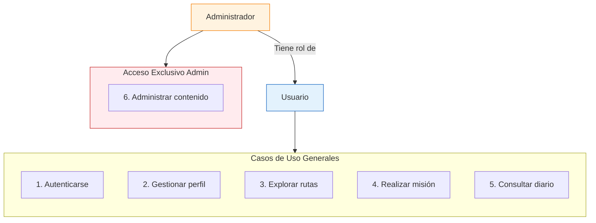

---

# 3. Instalación y Configuración

Para garantizar la replicabilidad del proyecto y un entorno de desarrollo estable, se deben seguir los pasos detallados a continuación:

1. **Preparación del SDK y Herramientas:**
   * Instalar el SDK de Flutter 3.24 y verificar la instalación mediante el comando `flutter doctor`.
   * Configurar un entorno de desarrollo integrado (IDE) como VS Code o Android Studio con los plugins oficiales de Dart y Flutter.

2. **Vinculación con Firebase (Backend):**
   * Acceder a la consola de Firebase y descargar los archivos de configuración específicos por plataforma: `google-services.json` para Android y `GoogleService-Info.plist` para iOS.
   * Ubicar dichos archivos en las carpetas raíz de cada plataforma (`/android/app` y `/ios/Runner`) para habilitar los servicios de Auth, Firestore y Storage.

3. **Configuración de Dependencias:**
   * Ejecutar el comando `flutter pub get` desde la raíz del proyecto para descargar e instalar las librerías críticas de mapas, escaneo QR y geolocalización.

---

# 4. Arquitectura de la Aplicación

La arquitectura de RuteX Go se basa en un modelo de computación distribuida que separa la persistencia de datos y la lógica de servidor de la interfaz de usuario. El sistema garantiza la integridad de la información mediante una sincronización asíncrona entre el cliente móvil y la infraestructura en la nube.

## 4.1. Arquitectura del Sistema (Modelo C4)

Para una mejor comprensión de la estructura de RuteX Go, se utiliza el modelo C4 para visualizar la arquitectura en diferentes niveles de detalle.

### 4.1.1. Arquitectura del Sistema (Modelo C4)

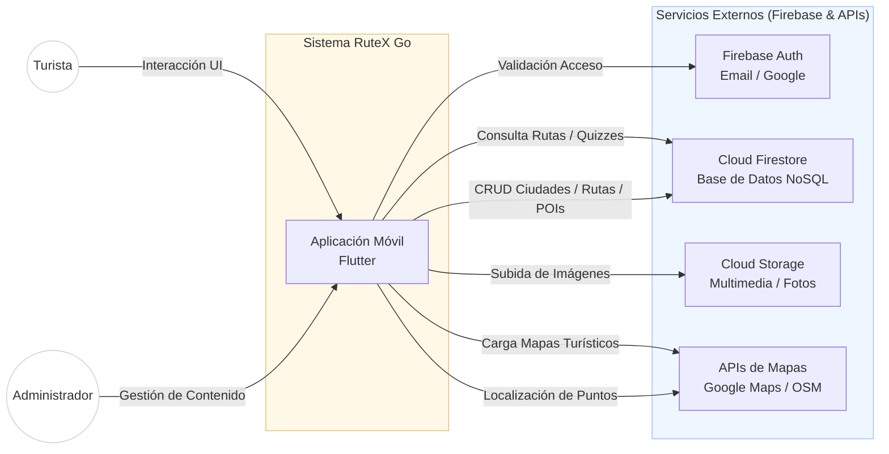

El Diagrama de Contexto define los límites del sistema RuteX Go y las entidades externas con las que interactúa. En este nivel de abstracción, la aplicación se comporta como un núcleo central que orquesta las siguientes relaciones:

* **Interacción de Usuarios:** El sistema diferencia entre el Turista, que consume las rutas y resuelve los desafíos, y el Administrador, encargado de la gestión de contenidos (CRUD de ciudades, rutas y misiones).
* **Servicios Cloud (Firebase):** La aplicación delega la seguridad en Firebase Auth, la persistencia de datos jerárquicos en Cloud Firestore y el almacenamiento de archivos binarios en Cloud Storage.
* **Proveedores Geográficos:** Se integra la API de Google Maps para la visualización del usuario y OpenStreetMap para las herramientas de gestión técnica, garantizando una geolocalización precisa de los puntos de interés.

### 4.1.2. Análisis de Contenedores y Flujos de Datos

El Diagrama de Contenedores (Nivel 2) detalla la organización interna de la solución y las tecnologías que permiten la comunicación entre el cliente móvil y el backend.

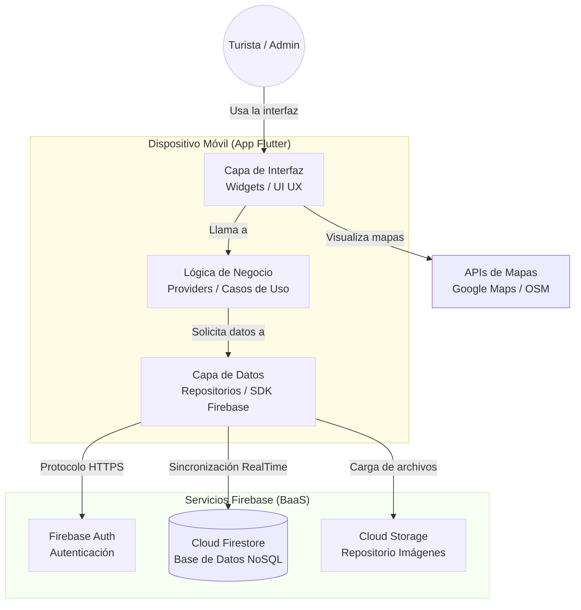

El Diagrama de Contenedores detalla la arquitectura interna del software y los protocolos de comunicación utilizados. El sistema se desglosa en los siguientes componentes tecnológicos:

* **Contenedor App Móvil:** Desarrollado con el SDK de Flutter, implementa una estructura de capas (UI, Lógica y Datos) que separa la interfaz reactiva de la lógica de negocio mediante gestores de estado como Providers.
* **Comunicación y Protocolos:** La transferencia de datos entre la aplicación y Firebase se realiza mediante el SDK de Firebase, utilizando protocolos HTTPS para peticiones atómicas y WebSockets (Streams) para la sincronización de la base de datos en tiempo real.
* **Infraestructura Externa:** El backend opera bajo un modelo serverless, donde Cloud Firestore gestiona la base de datos NoSQL y Cloud Storage sirve los activos multimedia bajo demanda, optimizando el rendimiento del dispositivo móvil.

## 4.2. Diagrama de Flujo

Para comprender el comportamiento dinámico de la aplicación y el recorrido secuencial que experimenta el usuario final (Turista), se ha desarrollado un Diagrama de Flujo global. Este modelo detalla los estados, las bifurcaciones lógicas y las validaciones de datos que realiza el software desde su inicialización hasta la finalización de un itinerario cultural.

### 4.2.1. Análisis del Flujo de Ejecución

El ciclo de navegación y la lógica de negocio representados en el diagrama se estructuran en las siguientes etapas secuenciales:

1. **Inicialización y Control de Acceso (Módulo Auth):** Al iniciar la aplicación (Inicio), el sistema ejecuta de manera automática una comprobación mediante el SDK de Firebase Auth (*¿Tiene sesión iniciada?*). Esta bifurcación divide el flujo en dos caminos:
   * **a. Flujo Alternativo (No autenticado):** El usuario es redirigido a la pantalla de Login, donde puede optar por el Registro, iniciar sesión de forma tradicional (Email/Contraseña) o mediante autenticación federada (Google). Una vez validado, avanza al menú principal.
   * **b. Flujo Principal (Usuario autenticado):** El sistema realiza un bypass transparente y carga directamente la interfaz de la pantalla principal (HomeScreen).
2. **Selección y Carga de Experiencias:** En el menú principal, el usuario navega jerárquicamente seleccionando una Ciudad y luego una Ruta cultural. Al confirmar la selección, la app despacha una petición asíncrona a Cloud Firestore para descargar el listado de monumentos y sus coordenadas geográficas.
3. **Navegación e Interacción Cartográfica:** Se despliega el Mapa interactivo basado en Google Maps. A partir de este momento, se inicia un bucle de monitorización en tiempo real apoyado en los servicios nativos de geolocalización:
   * **a.** El sistema comprueba constantemente la posición física del usuario (*¿Está cerca del monumento?*).
   * **b.** Si la respuesta es negativa, el mapa se sigue actualizando de forma pasiva.
   * **c.** Si el usuario entra en el radio de activación (Geofencing), el sistema rompe el bucle y activa el botón de Escanear QR.
4. **Proceso de Validación y Gamificación:** Al pulsar el botón, se despliega la interfaz de la cámara para capturar el código físico del monumento. El sistema evalúa el resultado (*¿Código QR correcto?*):
   * **a.** Si el código es erróneo o no corresponde al Punto de Interés (POI), la aplicación muestra un mensaje de error y permite reintentar el escaneo.
   * **b.** Si el código es correcto, se desbloquea el Quiz. El usuario responde a las preguntas planteadas y el backend procesa los resultados para actualizar su puntuación, nivel y progreso en la base de datos de Firestore.
5. **Finalización del Itinerario:** Tras completar el Quiz, el sistema evalúa si se han visitado todos los hitos históricos del recorrido (*¿Ruta finalizada?*). Si quedan monumentos pendientes, el flujo retorna a la pantalla del Mapa. En caso de haber completado la ruta al 100%, la app redirige al usuario a la pantalla de Ruta Completada, donde se ofrece la funcionalidad de Generar PDF ("Diario del Explorador") con el resumen de la aventura antes de finalizar el proceso (Fin).

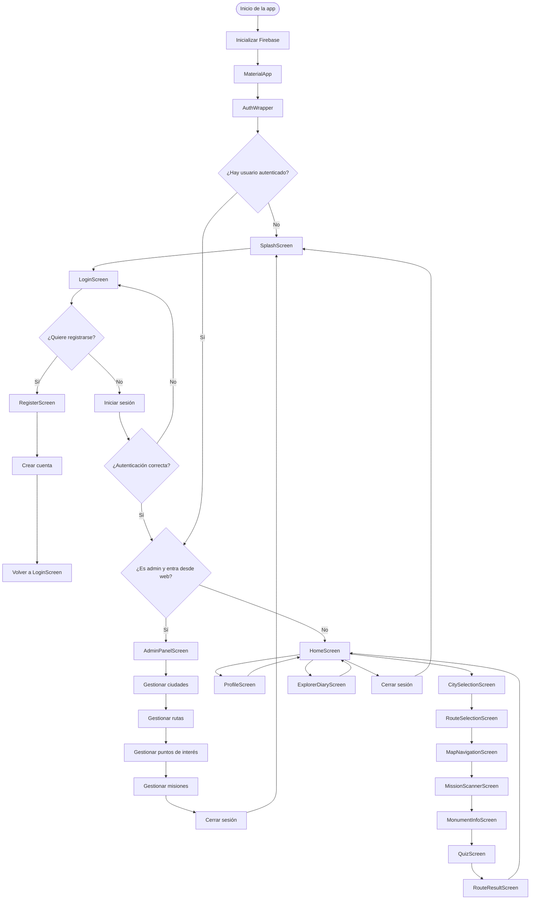

## 4.3. Backend (Infraestructura Cloud)

Para el backend del sistema se ha adoptado un modelo BaaS (Backend as a Service) mediante la plataforma Google Firebase. Esta configuración permite centralizar la seguridad y la lógica de datos sin la necesidad de gestionar servidores físicos. Los servicios fundamentales son:

* **Firebase Authentication:** Gestiona el sistema de identidades y el control de accesos. Implementa protocolos de seguridad para la persistencia de sesiones y asegura que cada usuario interactúe exclusivamente con sus registros de progreso.
* **Cloud Firestore:** Actúa como el núcleo de persistencia de datos. Se trata de una base de datos NoSQL orientada a documentos que permite la distribución de información en tiempo real. Su estructura jerárquica facilita la gestión de colecciones de rutas, misiones, perfiles de usuario, etc.
* **Cloud Storage:** Infraestructura de almacenamiento utilizada para el alojamiento de activos multimedia pesados (imágenes de monumentos y recursos gráficos), optimizando el tamaño del paquete binario de la aplicación.

## 4.4. Frontend (Arquitectura de Software)

La aplicación cliente se ha desarrollado con el SDK de Flutter, utilizando una arquitectura de software basada en los principios de Clean Architecture y un diseño Modular. Esta estructura garantiza el desacoplamiento entre la lógica de negocio y las implementaciones tecnológicas.

### 4.4.1. Estructura de Capas (Clean Architecture)

El código fuente se divide en tres niveles de abstracción con responsabilidades independientes:

* **Capa de Presentación:** Contiene la interfaz de usuario (Widgets) y la lógica de control visual. Utiliza el patrón de diseño Observer a través de la librería Provider para reaccionar a los cambios en el estado de los datos sin necesidad de recargar manualmente la interfaz.
* **Capa de Dominio:** Es la capa central del sistema. Define las Entidades (modelos de datos puros) y los Casos de Uso (Use Cases). Aquí reside la lógica de negocio crítica, como la validación de misiones y el cálculo de rangos históricos, siendo totalmente independiente de librerías externas o del framework.
* **Capa de Datos:** Implementa la comunicación con los servicios externos. Contiene los Repositorios y los DataSources que interactúan con las APIs de Firebase, además de los Mappers encargados de transformar los documentos JSON en objetos del dominio.

### 4.4.2. Patrón de Diseño Modular

La aplicación se organiza en módulos funcionales independientes que encapsulan su propia lógica y recursos. Este enfoque facilita la escalabilidad del proyecto:

* **Módulo Splash:** Gestiona el flujo de entrada inicial y la comprobación de estado de la sesión antes del acceso al contenido principal.
* **Módulo Auth:** Centraliza la lógica de autenticación. Incluye las interfaces y servicios para el registro (`register_screen`) e inicio de sesión (`login_screen`) vinculados a Firebase Auth.
* **Módulo Routes:** Administra el catálogo de experiencias. Incluye la selección de ciudades (`city_selection`) y la visualización de itinerarios disponibles (`route_selection`).
* **Módulo Mission:** Es el núcleo interactivo de la aplicación. Encapsula la lógica de navegación entre monumentos, el detalle de los mismos, el escáner de códigos QR y el sistema de cuestionarios (Quiz) con su correspondiente flujo de resultados.
* **Módulo Profile:** Gestiona la persistencia de los datos del usuario. Permite la visualización de la pantalla de inicio personalizada (`home_screen`) y el estado del perfil con sus estadísticas y rangos.
* **Módulo Admin Panel:** Implementa las herramientas de gestión interna para la administración de los recursos del sistema y la supervisión de datos de la plataforma.
* **Módulo Explorer_Diary:** Implementa las herramientas necesarias para la creación, maquetación e impresión en PDF del diario del explorador.

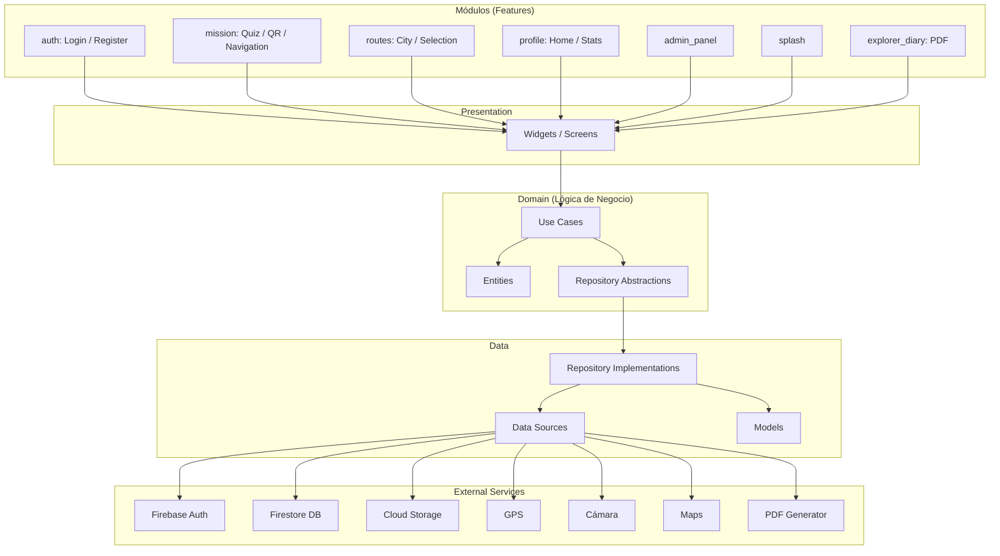

## 4.5. Diagramas de Secuencia

Debido a la arquitectura modular de RuteX Go y siguiendo los principios de la Separación de Responsabilidades (Clean Architecture), el comportamiento dinámico de la aplicación se analiza de forma independiente para cada uno de sus módulos funcionales. A continuación, se detalla la secuencia temporal de intercambio de mensajes entre el usuario, los componentes de la interfaz de usuario (Frontend), las capas de datos (Repositories) y los servicios externos (Backend e infraestructura Cloud).

### 4.5.1. Módulo de Autenticación (Auth Module)

El diagrama de la Ilustración 6 detalla los flujos lógicos de control de acceso (tradicional y federado), registro y recuperación de credenciales en RuteX Go.

1. **Inicio de Sesión (Correo y Contraseña / Google):**
   * **a. Petición:** El Usuario introduce sus datos en `LoginScreen` o pulsa "Iniciar sesión con Google". La vista captura las credenciales (o el token de Google) e invoca a `AuthUseCases` mediante `iniciarSesion()`, delegando la acción en `AuthRepository`.
   * **b. Validación:** El repositorio autentica la sesión en Firebase Auth mediante `signInWithEmailAndPassword()` o `signInWithCredential()` (para Google). Tras el éxito, consulta el rol del usuario en Firestore con `consultarRolUsuario()`.
   * **c. Resolución (alt):**
     * *[Usuario normal]:* Redirige y renderiza la pantalla principal (`HomeScreen`).
     * *[Administrador en web]:* Redirige al panel de gestión (`AdminPanelScreen`).
     * *[Error]:* Propaga la excepción y muestra un mensaje de fallo en la interfaz.

2. **Recuperación de Contraseña:**
   * **a.** El Usuario introduce su correo para restablecer la cuenta. `LoginScreen` envía la petición a través de las capas hasta ejecutar `sendPasswordResetEmail()` en Firebase Auth, despachando el correo de recuperación.

3. **Registro de Usuario:**
   * **a.** El Usuario envía el formulario de alta y `RegisterScreen` invoca `registrarUsuario()`. `AuthRepository` crea la identidad en Firebase Auth con `createUserWithEmailAndPassword()` e inmediatamente inicializa su perfil en Firestore mediante `crearPerfilUsuario()`.

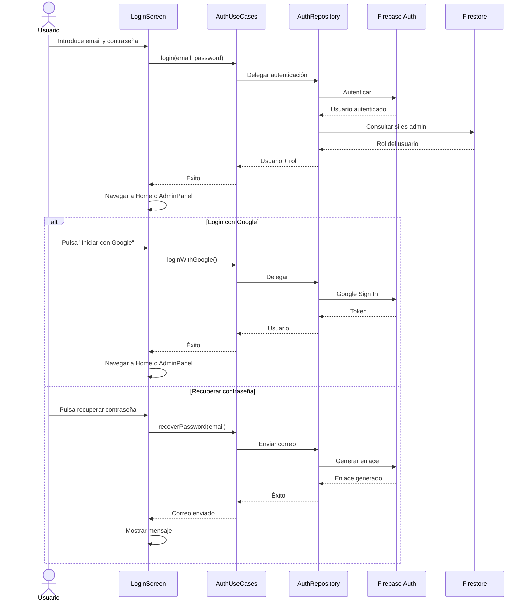

### 4.5.2. Módulo Perfil/Home

El diagrama de la Ilustración 7 detalla los flujos lógicos para la carga inicial de la interfaz, el mecanismo de tolerancia a fallos (Fallback) y las actualizaciones del perfil en RuteX Go.

1. **Carga Inicial del Home y Fallback (Caché):**
   * **a. Carga Inicial (alt):** El Usuario opens la app y `HomeScreen` solicita el estado de la sesión a `AuthUseCases`.
     * *[Usuario existe]:* `HomeScreen` pide la información a `ProfileUseCases`, quien delega en `ProfileRepository` para Consultar datos en Firestore. Tras recibir la respuesta, la vista guarda la información en `HomeDataCache` y ordena a `HomeContent` renderizar la interfaz online.
     * *[Usuario no existe]:* Se interrumpe el flujo y se redirige al actor a la pantalla de `LoginScreen`.
   * **b. Fallback (Carga desde Caché - alt):** Si la carga online falla, `HomeScreen` ejecuta Leer datos desde caché en `HomeDataCache`.
     * *[Existe caché]:* `HomeContent` renderiza los datos locales en modo offline.
     * *[No existe caché]:* La aplicación muestra un mensaje de error controlado al usuario en pantalla.

2. **Actualización de Perfil (Nombre y Avatar - alt):**
   * **a. Cambiar nombre de usuario:** El Usuario modifica el texto. `HomeScreen` invoca a `ProfileUseCases` (Actualizar nombre), este delega en `ProfileRepository` y el cambio se persiste de forma remota en Firestore (Guardar cambio en Firestore). Tras la configuración en cascada, la vista notifica el éxito.
   * **b. Seleccionar nueva imagen:** El Usuario elige un archivo. El flujo se repite de forma idéntica a través de las capas de caso de uso y repositorio para ejecutar Guardar imagen/avatar en Firestore, confirmando la actualización en la interfaz gráfica tras el éxito de la transacción.

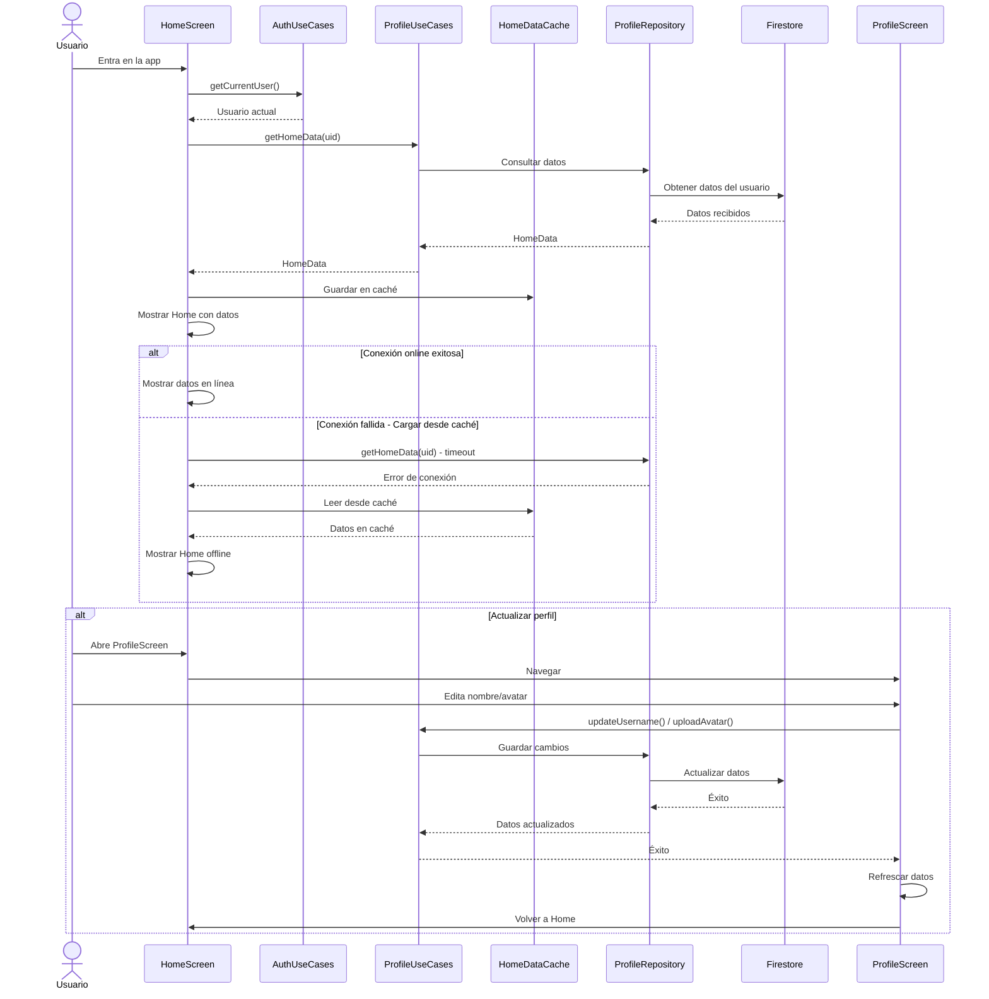

### 4.5.3. Módulo Rutas

El diagrama de la Ilustración 8 detalla la lógica secuencial dividida en cuatro fases esenciales para la exploración, consulta y validación de los itinerarios culturales en RuteX Go.

1. **Carga de Ciudades y Selección de Rutas:**
   * **a. Carga de ciudades:** El Usuario accede a la sección de selección de destinos en `CitySelectionScreen`. La vista solicita los datos a `RoutesUseCases` (Solicitar ciudades), quien delega en `RoutesRepository` para ejecutar un GET síncrono sobre la base de datos cloud Firestore (Consultar ciudades). Al retornar la lista estructurada, la pantalla pinta el catálogo disponible.
   * **b. Selección de ciudad:** El Usuario selecciona un destino y `RouteSelectionScreen` solicita los itinerarios asociados mediante `Solicitar rutas de la ciudad(idCiudad)`. El caso de uso recupera los documentos desde Firestore, procesa internamente la función *Calcular disponibilidad de rutas* y delega en el subcomponente `RouteSelectionContent` la acción de pintar las opciones válidas (Mostrar rutas disponibles).

2. **Consulta de Puntos de Interés y Validación:**
   * **a. Consulta de nombres de POI:** Para completar la información de las tarjetas de cada itinerario, `RouteSelectionScreen` dispara de forma automatizada el método `Solicitar nombres de puntos de interés(listaIds)`. La petición viaja por las capas de dominio y datos para consultar los nodos específicos en Firestore. Tras la respuesta del servidor, se ejecuta *Actualizar nombres* en la vista.
   * **b. Validación de disponibilidad de ruta:** Cuando el Usuario selecciona formalmente una ruta (`idRuta`), `RouteSelectionScreen` invoca de manera reactiva `Validar disponibilidad de ruta()`. La capa de dominio procesa de forma interna la subfunción *Validar horarios, requisitos y cupos disponibles*. Finalmente, el veredicto del sistema es enviado hacia `RouteSelectionContent` para *Mostrar estado de disponibilidad* en la interfaz gráfica del terminal.

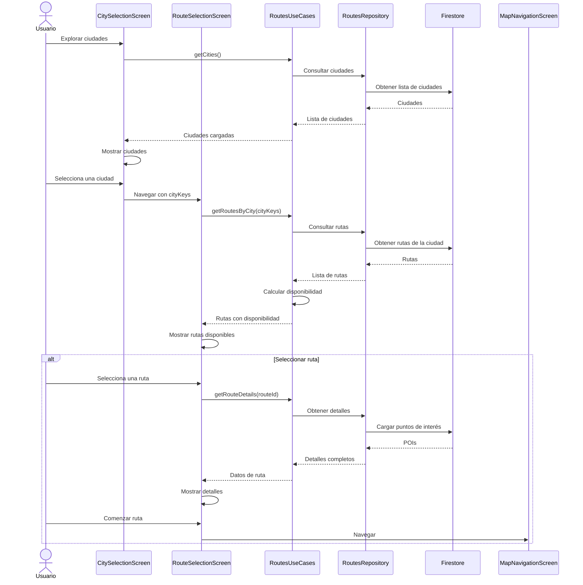

### 4.5.4. Módulos Misión/QR

El diagrama de la Ilustración 9 detalla el flujo dinámico de validación óptica mediante códigos QR, la consulta de misiones y la gestión de la lógica de gamificación en RuteX Go.

1. **Flujo Principal (Validación Exitosa y Progreso):**
   * **a. Escaneo:** El Usuario abre la funcionalidad en `MissionScannerScreen`. La vista activa el hardware mediante `MobileScanner` (Activar escaneo). Una vez capturada la lectura, se envía el identificador a `MissionUseCases` mediante `Validar y procesar QR()`.
   * **b. Consulta remota (alt [Punto existe]):** El caso de uso delega en `MissionRepository` para verificar el código en Firestore (Consultar punto de interés). Si el monumento es válido, el repositorio realiza una segunda consulta cruzada en la base de datos para extraer los retos lúdicos vinculados (Buscar misión asociada).
   * **c. Visualización y Gamificación (alt [Aplica quiz / pregunta]):** La app consolida la información y despliega `MonumentInfoScreen`. Si el hito contiene una evaluación activa, se navega automáticamente a `QuizScreen`. Al responder correctamente, `MissionUseCases` llama a `Guardar progreso de misión()` en el repositorio para persistir de forma asíncrona la recompensa en Firestore y finalmente redirigir al actor a `RouteResultScreen`.

2. **Flujos Alternativos de Control (alt):**
   * **a. [QR inválido]:** Si el código capturado no coincide con ningún registro del sistema, `MissionScannerScreen` intercepta la excepción, imprime en la interfaz el aviso "Mensaje: QR no válido" y ejecuta de forma automática la instrucción *Reanudar escaneo* para reiniciar el hardware de la cámara.
   * **b. [Punto ya completado]:** Si el usuario escanea un hito previamente superado, el sistema bloquea la entrega de nuevas recompensas, despliega el aviso "Mensaje: Punto ya completado" y redirige la navegación a `MonumentInfoScreen` operando exclusivamente en modo solo lectura.
   * **c. [Escanear otro QR]:** Si el usuario decide cancelar la acción actual o cambiar de objetivo en plena navegación, la vista invoca la instrucción de control *Escanear otro código* para purgar el estado temporal y saltar al paso inicial de activación del lector óptico.

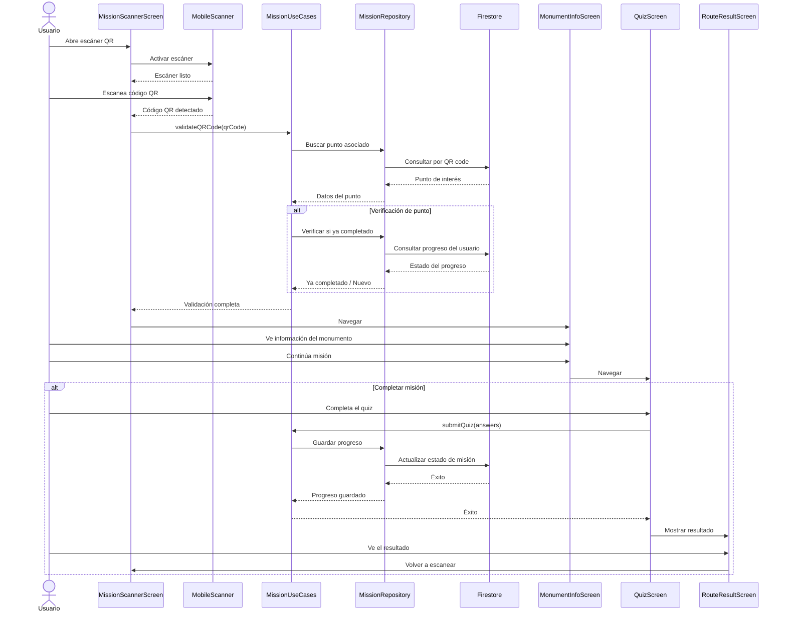

### 4.5.5. Módulo Diario del Explorador

El diagrama de la Ilustración 10 detalla la lógica secuencial para la consolidación de actividades culturales realizadas, la integración de recursos multimedia y la exportación del documento final en formato portable.

1. **Flujo Principal (Consulta, Selección y Compilación):**
   * **a. Carga e inicialización:** El Usuario abre la funcionalidad en `ExplorerDiaryScreen`. La vista obtiene la sesión activa mediante `AuthUseCases` (Obtener usuario actual) y solicita las actividades completadas a `DiaryUseCases` con `Solicitar rutas completadas`. El caso de uso delega en `DiaryRepository` para extraer los documentos remotos de Firestore (Consultar rutas completadas).
   * **b. Enriquecimiento del diario (alt [Añadir fotos]):** Tras recibir el historial y los datos del perfil desde `ProfileUseCases`, el Usuario selecciona los itinerarios a exportar. Si opta por adjuntar imágenes, se activa el hardware del sistema operativo a través de `ImagePicker` (Seleccionar fotos). Acto seguido, la vista ejecuta localmente la subfunción reflexiva *Preparar información para el PDF*.
   * **c. Generación y descarga:** `ExplorerDiaryScreen` envía los datos estructurados al componente de servicio `PdfGenerator` mediante *Generar PDF del diario*. Una vez compilado el archivo binario, la interfaz muestra la vista previa en el terminal. El Usuario pulsa el control de descarga e interactúa asíncronamente para recibir el archivo PDF descargado.

2. **Flujos Alternativos de Excepción (alt):**
   * **a. [A. Sin rutas completadas]:** Si la consulta inicial en la base de datos cloud retorna un registro vacío, el sistema interrumpe el flujo normal y la pantalla principal de la funcionalidad imprime el aviso informativo "Mensaje: No tienes rutas completadas todavía".
   * **b. [B. Límite de fotos excedido]:** Si el actor intenta adjuntar más recursos de los permitidos por el sistema (máximo 5), el proceso de selección óptica se bloquea y la aplicación le notifica en pantalla la restricción mediante "Mensaje: Límite de 5 fotos por ruta alcanzado".
   * **c. [C. Cancelar generación]:** Si en cualquier punto del proceso de maquetación el usuario decide anular la exportación, la vista destruye las variables de estado temporales, detiene las llamadas en cascada e invoca "Proceso cancelado y se mantiene en la pantalla actual".

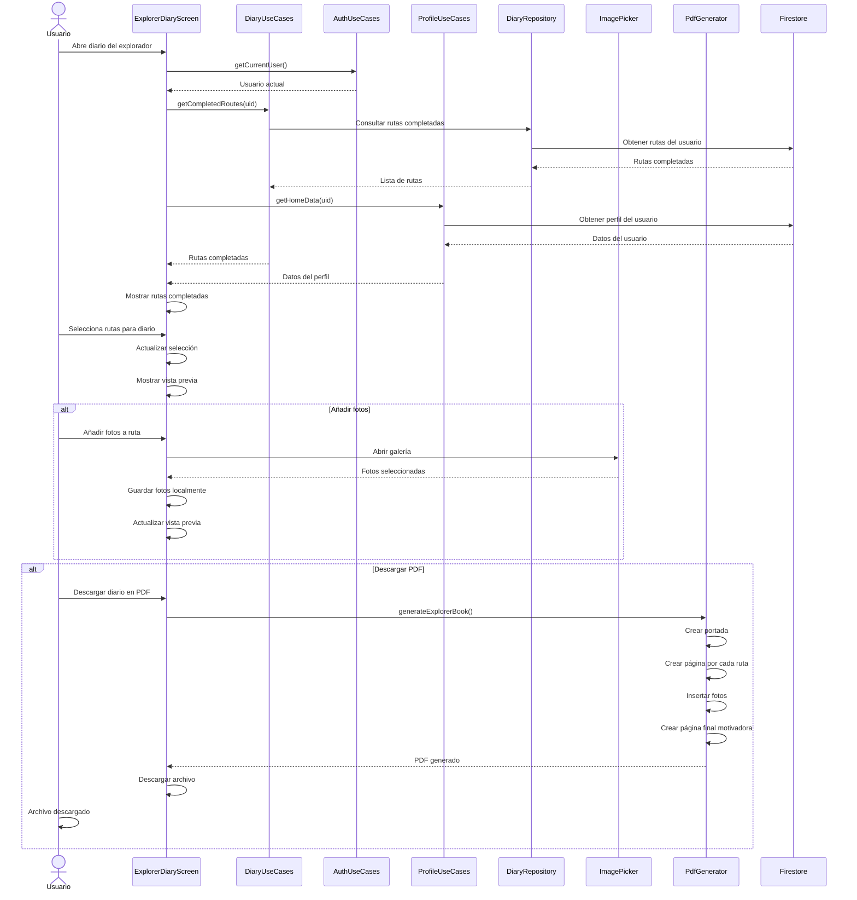

### 4.5.6. Módulo Panel de Administración

El diagrama de la Ilustración 11 detalla la secuencia de operaciones de gestión, consulta y mutación de datos (CRUD) efectuadas por el administrador sobre el catálogo del ecosistema.

1. **Carga de Datos:**
   * **a. Petición:** El Administrador realiza la acción "Accede al panel" sobre la interfaz `AdminPanelScreen`. La vista procesa el evento y solicita la información de la sección activa mediante `solicitaDatos(sección)` a `AdminUseCases`.
   * **b. Consolidación:** El caso de uso delega la consulta en `AdminRepository`, el cual invoca el método `obtenerDatosRemotos(sección)` en el proveedor de datos remotos `AdminRemoteDataSource`.
   * **c. Origen de Datos:** El data source procesa la solicitud atacando dos servicios en paralelo: realiza una lectura en la base de datos cloud Firestore (*Consulta datos en Firestore*) y extrae los recursos multimedia vinculados desde Firebase Storage (*Obtiene archivos/imágenes*). Una vez consolidados, los datos viajan de vuelta en cascada hasta que `AdminPanelScreen` renderiza los elementos con *Datos mostrados en la vista*.

2. **Operaciones de Mutación de Contenidos:**
   * **a. Crear o Editar Elemento:** El Administrador abre el formulario gestionado por el enrutador de vistas `AdminFormRouter` (Crea / edita elemento). Al enviar el formulario, este despacha el método *Envío de datos del formulario* a través del caso de uso. `AdminRepository` procesa el comando ejecutando *Guardar en origen* en el data source, el cual realiza concurrentemente la escritura documental en Firestore (Guardar datos en Firestore) y la subida de binarios en Firebase Storage (Subir archivos/imágenes). Tras recibir ambas confirmaciones, se refresca la interfaz con *Confirmación de guardado y actualización de vista*.
   * **b. Eliminar Elemento:** El Administrador acciona la remoción física o lógica de un registro. `AdminPanelScreen` transmite la orden mediante `Solicitar eliminación(id, tipo)` a través de las capas de dominio. El origen de datos unifica la baja eliminando simultáneamente el documento físico en Firestore (*Eliminar en Firestore*) y purgando sus dependencias multimedia en Firebase Storage (*Eliminar archivos asociados*), retornando el éxito para actualizar el estado visual de la pantalla.
   * **c. Subida Independiente de Archivos / Imágenes:** En flujos aislados de pre-carga, el administrador puede interactuar directamente seleccionando un archivo multimedia. La interfaz solicita la persistencia inmediata mediante `Solicitar subida de archivo(s)`. La orden recorre el repositorio hasta invocar *Subir a Firebase Storage* en el data source, devolviendo las URL(s) generada(s) por el servidor en la nube para su posterior asignación en los formularios del panel de control.

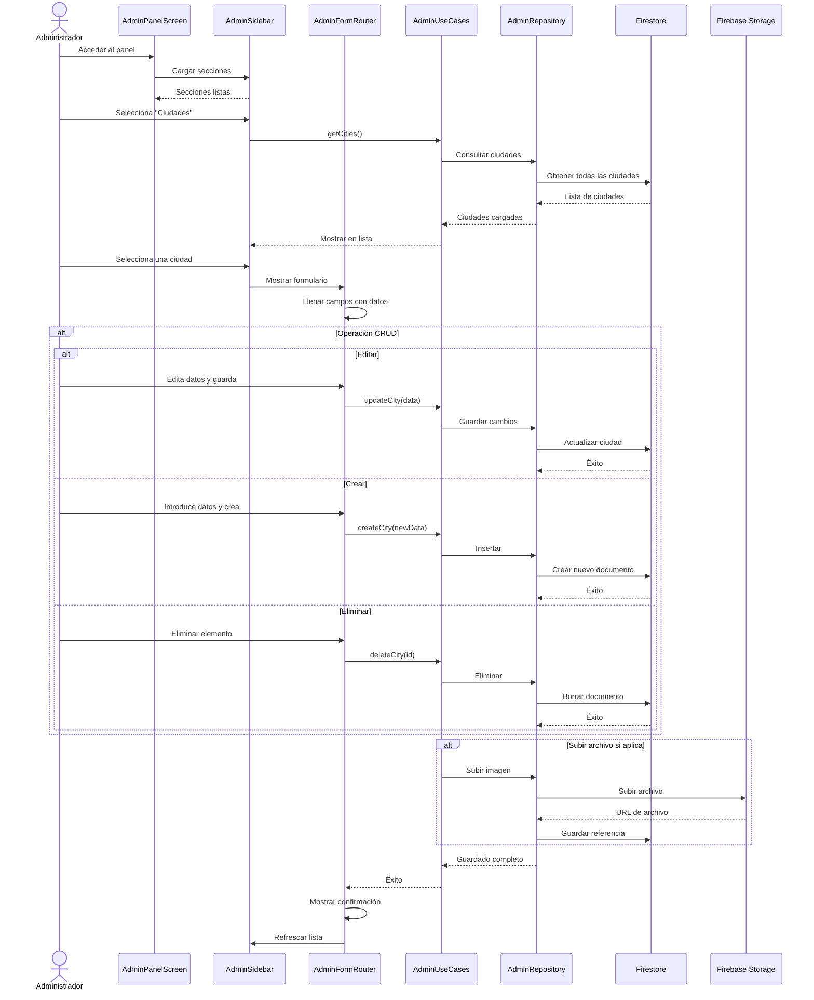

---

# 5. Base de Datos

Para el almacenamiento y persistencia de la información de RuteX Go, se ha seleccionado Cloud Firestore, una base de datos NoSQL orientada a documentos que organiza la información en colecciones y documentos estructurados en formato clave-valor. A continuación, se detalla el esquema de datos y el desglose de cada una de las colecciones que componen el ecosistema:

### Colección: usuarios
Es la colección principal para la gestión de jugadores. Cada documento utiliza como ID el uid de Firebase Authentication.
* **Campos:**
  * `avatar` (string): Ruta del archivo en Firebase Storage.
  * `email` (string): Correo electrónico de registro.
  * `fecha_creacion` (timestamp): Fecha y hora exacta del registro.
  * `isAdmin` (boolean): Flag de control para acceso al panel de administración.
  * `nombre` (string): Nombre real del turista.
  * `puntos` (int64): Puntuación acumulada por completar misiones.
  * `rango` (string): ID rango actual según su puntuación.
  * `rutas_completadas` (array): Lista de identificadores de las rutas finalizadas con éxito.
  * `uid` (string): Identificador único de usuario.
  * `ultimo_acceso` (timestamp): Registro de la última actividad en la app.
  * `usuario` (string): Nombre de usuario (username).

### Colección: config_rangos
Es la colección que actúa como motor de niveles. Contiene un documento con la configuración global de progresión.
* **Campos:**
  * `rangos` (array): Lista ordenada de objetos que definen la jerarquía:
    * `logo` (string): Ruta del archivo en Firebase Storage.
    * `nombre` (string): Etiqueta temática del nivel.
    * `puntos_necesarios` (int64): Puntuación mínima para alcanzar dicho nivel.

### Colección: Ciudades
Es la colección que almacena la información de las localidades integradas en la aplicación.
* **Campos:**
  * `imagen` (string): Ruta del archivo en Firebase Storage.
  * `isActive` (boolean): Flag de control para habilitar o deshabilitar la ciudad en la interfaz de usuario.
  * `nombre` (string): Nombre oficial de la localidad.
  * `provincia` (string): Provincia a la que pertenece la ciudad.

### Colección: Rutas
Es la colección que define los itinerarios turísticos disponibles, vinculando ciudades con sus respectivos puntos de interés.
* **Campos:**
  * `descripcion` (string): Resumen informativo sobre el recorrido y temática de la ruta.
  * `dificultad` (string): Nivel de esfuerzo estimado (ej: "Fácil").
  * `duracion` (string): Tiempo estimado para completar el recorrido (ej: "1 hora 30 minutos").
  * `id_ciudad` (string): Identificador único del documento de la ciudad a la que pertenece la ruta.
  * `id_puntos_interes` (array): Lista ordenada de identificadores que apuntan a los documentos de la colección puntos_interes.
  * `imagen` (string): Ruta de acceso al recurso visual en Firebase Storage.
  * `isActive` (boolean): Estado de disponibilidad de la ruta para los usuarios.
  * `nombre` (string): Título descriptivo de la ruta.
  * `puntos_totales` (int64): Cantidad de puntos que el usuario recibe al completar la ruta íntegramente.

### Colección: Puntos de Interes
Esta colección contiene la información detallada de cada monumento o parada técnica dentro de las rutas. Estos datos son fundamentales para la renderización del mapa y la validación de la llegada del usuario al destino físico.
* **Campos:**
  * `descripcion` (string): Información histórica y detalles arquitectónicos del monumento.
  * `imagen` (string): Ruta de acceso al recurso visual en Firebase Storage.
  * `localizacion` (geopoint): Coordenadas geográficas exactas (latitud y longitud) del punto.
  * `nombre` (string): Nombre oficial del monumento o sitio.
  * `qr_code` (string): Identificador único del código QR físico que el usuario debe escanear para validar su visita.
  * `radio_activacion` (int64): Radio de proximidad en metros para considerar que el usuario ha llegado al punto y habilitar la interacción.

### Colección: Misiones
Esta colección gestiona la lógica de los desafíos de tipo "Quiz" que se activan al visitar un punto de interés. Contiene el banco de preguntas y define las recompensas asociadas a cada desafío.
* **Campos:**
  * `preguntas` (array): Lista de objetos (maps) que contienen los reactivos del cuestionario:
    * `indice_correcta` (int64): Posición (índice) de la respuesta válida dentro del array de respuestas.
    * `pregunta_X` (string): Enunciado o texto de la pregunta.
    * `respuestas` (array): Opciones de respuesta disponibles para el usuario.
    * `punto_interes_id` (string): Identificador único del documento de la colección puntos_interes al que está vinculada esta misión.
    * `puntos_premio` (int64): Cantidad de puntos que se suman al perfil del usuario tras completar la misión con éxito.
    * `título` (string): Nombre descriptivo de la misión.

### DIAGRAMA DE MODELO DE DATOS

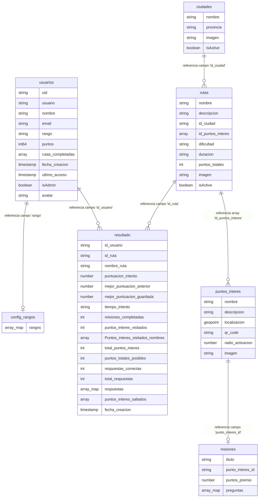

---

# 6. Seguridad y Permisos

El sistema RuteX Go implementa un modelo de seguridad robusto que actúa en diferentes niveles, desde la autenticación de la identidad del usuario hasta el control granular de acceso a la base de datos y el hardware del dispositivo.

## 6.1. Autenticación y Gestión de Identidades

La seguridad de acceso se delega en el servicio Firebase Authentication, que garantiza una gestión de sesiones cifrada y segura:

* **Proveedores de Identidad:** El sistema soporta el inicio de sesión mediante credenciales clásicas (Email/Password) y proveedores externos como Google Sign-In.
* **Identificadores Únicos (UID):** Cada usuario autenticado recibe un token único que vincula su sesión con su documento específico en la colección `usuarios`, impidiendo la suplantación de identidad.

## 6.2. Reglas de Seguridad de la Base de Datos (Cloud Firestore)

Para proteger la integridad de la información técnica (rutas, ciudades y misiones), se han configurado Security Rules en el backend que validan cada petición:

* **Acceso de Administrador:** Solo los usuarios que poseen el campo `isAdmin: true` en su perfil tienen permisos de escritura (Crear, Actualizar, Borrar) sobre las colecciones de contenido turístico.
* **Privacidad del Turista:** Las reglas restringen la escritura en la colección `resultado` para que un usuario solo pueda registrar sus propios progresos, prohibiendo el acceso a los datos de otros jugadores.

## 6.3. Permisos de Hardware y Servicios Nativos

Dado que la aplicación interactúa con componentes físicos, se implementa una gestión de permisos en tiempo de ejecución (Runtime Permissions):

* **Cámara:** El sistema solicita acceso explícito para el uso del módulo de visión artificial necesario en el escaneo de códigos QR.
* **Localización (GPS):** Se requiere el permiso de ubicación precisa para calcular la distancia entre el turista y el monumento, habilitando la misión solo cuando se encuentra dentro del `radio_activacion` definido y verificando que el usuario está realmente en el monumento mediante el escaneo del código QR.

---

# 7. Pruebas Realizadas

Este apartado describe los procedimientos estandarizados para validar las funcionalidades críticas de RuteX Go, asegurando que el flujo de gamificación y la lógica de proximidad operen según el diseño técnico.

## 7.1. Pruebas de Funcionalidades Críticas

| ID Escenario Crítico | Procedimiento de Verificación | Resultado Esperado |
| :--- | :--- | :--- |
| **TC-01:** Activación por Proximidad (Geofencing) | 1. Activar GPS y comenzar ruta 2. Desplazarse físicamente hasta entrar en el radio del monumento | Al detectar la ubicación, el sistema debe disparar automáticamente el mensaje de llegada y habilitar las opciones de "Escanear QR" o "Saltar punto" |
| **TC-02:** Sincronización de Puntos | 1. Responder Quiz correctamente 2. Consultar perfil de usuario 3. Verificar consola Firebase | El campo puntos en Firestore debe incrementarse de forma atómica y reflejarse inmediatamente en la UI del perfil |
| **TC-03:** Generación de Diario PDF | 1. Finalizar una ruta completa 2. Pulsar "Generar Diario" 3. Abrir archivo resultante | El PDF generado debe incluir los datos dinámicos de la sesión: nombre, estadísticas y fotos de los puntos visitados |
| **TC-04:** Restricción de Admin | 1. Loguearse con cuenta estándar 2. Intentar forzar la navegación al panel de administración | El sistema debe validar el campo `isAdmin` y denegar el acceso, manteniendo al usuario en la interfaz de turista |

## 7.2. Procedimientos de Pruebas Técnicas

Para realizar verificaciones de mantenimiento o tras actualizaciones del código, se deben seguir estos pasos:

1. **Verificación del Trigger de Localización:**
   * **Acción:** Utilizar un emulador con "Location Mock" o caminar físicamente hacia un monumento monitorizando los logs de la consola.
   * **Verificación:** El evento de entrada al Geofence debe disparar el componente UI de validación sin latencia perceptible. Si el usuario está fuera de rango, la interfaz debe permanecer en modo navegación estricta sin mostrar opciones de escaneo.

2. **Prueba de Integridad del Módulo PDF:**
   * **Acción:** Ejecutar la generación del diario en un dispositivo con poco almacenamiento disponible.
   * **Verificación:** El sistema debe gestionar el guardado temporal del archivo y permitir su visualización/compartición mediante las herramientas nativas del SO.

## 7.3. Informe de Resultados de Calidad

Tras las pruebas ejecutadas en la versión actual (v0.1.0):

* **Precisión del Trigger:** El aviso de llegada salta con un margen de error de ±3 metros respecto al geopoint almacenado.
* **Flujo de Usuario:** La opción de "Saltar prueba" garantiza que el usuario no se quede bloqueado en la ruta si hay problemas con el código QR físico.
* **Persistencia:** Todos los estados (visitado/saltado) se reflejan correctamente en el array de la colección `resultado` en menos de 1 segundo tras la acción.

---

# 8. Resolución de Problemas y Soluciones

En esta sección se detallan las incidencias técnicas más comunes que pueden surgir durante el uso de RuteX Go y los procedimientos recomendados para su resolución, con el fin de facilitar el mantenimiento preventivo y correctivo del sistema.

## 8.1. Incidencias de Hardware y Sensores

* **Fallo en el Escaneo de Códigos QR:**
    * **Causa:** Falta de permisos de cámara o condiciones lumínicas deficientes.
    * **Solución:** Verificar en los ajustes del sistema operativo que la aplicación tiene concedido el permiso de cámara. Asegurarse de que el lente esté limpio y el código QR bien iluminado.
* **Error en la Validación de Proximidad (GPS):**
    * **Causa:** El sensor GPS no está activo o se encuentra en modo de "Baja Precisión".
    * **Solución:** Comprobar que el GPS del dispositivo está encendido y configurado en "Alta Precisión". En zonas con edificios muy altos, el usuario debe desplazarse unos metros para mejorar la recepción de satélites.

## 8.2. Incidencias de Conectividad y Datos

* **La App no carga Ciudades o Rutas:**
    * **Causa:** Pérdida de conexión de datos (4G/5G) o Wi-Fi.
    * **Solución:** Verificar la conexión a internet. Dado que el backend depende de la sincronización en tiempo real con Firestore, se requiere una conexión estable para descargar el catálogo inicial.
* **Error de Autenticación / Cierre de Sesión Inesperado:**
    * **Causa:** Token de sesión de Firebase expirado o falta de sincronización con Firebase Auth.
    * **Solución:** Reiniciar la aplicación o cerrar sesión y volver a ingresar con las credenciales (Email o Google) para renovar el token de seguridad.

## 8.3. Rendimiento del Sistema

* **Lentitud en la Carga de Imágenes:**
    * **Causa:** Archivos multimedia pesados en zonas de baja cobertura o saturación de la memoria RAM.
    * **Solución:** La aplicación utiliza un sistema de caché (`Cached Network Image`), por lo que se recomienda esperar unos segundos a que el recurso se descargue de Cloud Storage; una vez en caché, la carga será instantánea.

---

# 9. Bibliografía y Referencias Técnicas

Para el desarrollo de la plataforma RuteX Go, se han consultado las siguientes fuentes técnicas y documentaciones oficiales que garantizan la viabilidad y el rigor del sistema:

## 9.1. Documentación oficial de Frameworks y Lenguajes
* **Flutter Documentation:** Guía de referencia para la construcción de interfaces reactivas, gestión del estado y despliegue multiplataforma en Android e iOS. Disponible en: [https://docs.flutter.dev/](https://docs.flutter.dev/).
* **Dart Language Guide:** Especificaciones técnicas para la implementación de lógica de negocio robusta y tipado fuerte. Disponible en: [https://dart.dev/guides](https://dart.dev/guides).

## 9.2. Infraestructura Cloud y Servicios Backend (BaaS)
* **Firebase Authentication:** Documentación sobre la implementación de flujos de autenticación segura y persistencia de sesiones mediante tokens de identidad. Disponible en: [https://firebase.google.com/docs/auth](https://firebase.google.com/docs/auth).
* **Cloud Firestore Documentation:** Modelado de datos NoSQL, estructuración de colecciones jerárquicas y optimización de reglas de seguridad en tiempo real. Disponible en: [https://firebase.google.com/docs/firestore](https://firebase.google.com/docs/firestore).
* **Firebase Storage Reference:** Almacenamiento y distribución eficiente de activos multimedia bajo demanda. Disponible en: [https://firebase.google.com/docs/storage](https://firebase.google.com/docs/storage).

## 9.3. Librerías y Paquetes del Ecosistema (Pub.dev)
* **Geolocator Plugin for Flutter:** Documentación técnica para la gestión de servicios nativos de ubicación, cálculo de distancias y consumo eficiente del sensor GPS. Disponible en: [https://pub.dev/packages/geolocator](https://pub.dev/packages/geolocator).
* **Mobile Scanner API:** Especificaciones para la integración de visión artificial y control nativo de la cámara del dispositivo para la lectura de códigos QR. Disponible en: [https://pub.dev/packages/mobile_scanner](https://pub.dev/packages/mobile_scanner).
* **Cached Network Image:** Implementación de sistemas de caché local para optimizar el rendimiento y la latencia en la carga de recursos gráficos remotos. Disponible en: [https://pub.dev/packages/cached_network_image](https://pub.dev/packages/cached_network_image).

---

